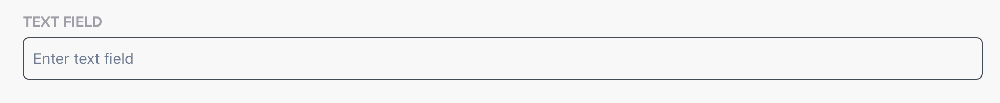

# Quick Start

Integrate Currents with Playwright to enable recording test results together with screenshots, videos, and traces, unlocking more effective troubleshooting, analytics and proactive monitoring.&#x20;

### Prerequisites  <a href="#prerequisites" id="prerequisites"></a>

* An account — [sign up](https://app.currents.dev/signup) for a free trial.
* NodeJS v14.0.0+
* Playwright v1.22.2+

## Setup Currents



#### Create a Project

When first signing in, you will be prompted to create a new organization and a project. You can change their names and settings anytime.

<div data-with-frame="true"><figure><figcaption></figcaption></figure></div>

Next, you'll see on-screen instructions with your newly created **Project ID** and **Record Key.**&#x20;

Select Playwright from the framework selection list.



#### Install @currents/playwright

Install our native Playwright reporter.

```bash
npm i -D @currents/playwright
```



#### Create currents.config.ts

Create `currents.config.ts` ( or `.mjs` / `.js` ) next to the `playwright.config.ts` file (usually in your root folder).


```typescript
import { CurrentsConfig } from "@currents/playwright";

const config: CurrentsConfig = {
  recordKey: process.env.CURRENTS_RECORD_KEY!,
  projectId: process.env.CURRENTS_PROJECT_ID!,
};

export default config;
```




#### Enable artifacts

Update `playwright.config.ts` to enable traces, videos and screenshots.

```json
use: {
    // ...
    trace: "on",
    video: "on",
    screenshot: "on",
}
```



#### Setup Currents Reporter

You have two options to integrate Currents into your test suite. You can either add our reporter to Playwright configuration and keep using your existing test command, or use our custom test runner `pwc`.

<details>

<summary><strong>Option 1: Add Currents Reporter </strong><em><strong>(recommended)</strong></em></summary>

You can add Currents reporter to `playwright.config.ts` and keep using `playwright test` command.&#x20;

```typescript
// playwright.config.ts
import { defineConfig, devices, PlaywrightTestConfig } from "@playwright/test";
import { currentsReporter } from "@currents/playwright";

export default defineConfig({
  // ...
  reporter: [currentsReporter()], // 👈🏻 add Currents reporter
})
```

* Run `npx playwright test` or your existing test command to start sending the results to Currents dashboard.
* The reporter reads the configuration from `currents.config.ts` file. See [currents-playwright](../resources/reporters/currents-playwright/ "mention") for more configuration options.

</details>

<details>

<summary><strong>Option 2: Run tests with the pwc command</strong></summary>

`pwc` is a lightweight command-line executable included in `@currents/playwright` npm package — it runs `playwright` with a predefined configuration.&#x20;


**Setup**

* Simply use `npx pwc` to run tests.&#x20;
* Update your `package.json` test command to execute `pwc` instead of  `playwright test`

```json
"scripts": {
  ...
  "test": "npx pwc",
},
```


**How it works**

* `pwc` reads the configuration from `currents.config.ts` file. See additional configuration options [configuration.md](../resources/reporters/currents-playwright/configuration.md "mention").
* `pwc` injects Currents reporter into Playwright configuration.
* You can also provide CLI configuration parameters, e.g. `npx pwc --key RECORD_KEY --project-id PROJECT_ID`

</details>



## Create your first run

After setting up Currents, run Plawyright to start seeing the results being [streamed in real-time](../guides/parallelization-guide/step-level-reporting.md) to Currents.&#x20;

A link to the recorded run will be available at the start of the execution:

```
> npx pwc --key XXX --project-id YYY

📦 Currents reporter: 1.12.0 recording to project WlKqJ0
🎭 Playwright: 1.52.0 5 tests in 1 project [chromium]
🔨 CI Build ID: auto:tzwgltasm
🌐 Run URL: https://app.currents.dev/run/cfc7ab8fcaaz10157

================================================================
```

Open the link to see the run details in the dashboard 🎉

<figure><figcaption><p>Example of a newly created run</p></figcaption></figure>


Ran into any errors? Check out our [troubleshooting-playwright.md](../guides/troubleshooting-playwright.md "mention") guide.


## Next Step

Once your Playwright project is set up and reporting locally, configure your CI pipeline.&#x20;

Running tests in CI is where you get consistent, repeatable feedback on every pull request and deployment, not just on your local machine.


[ci-setup](ci-setup/)



