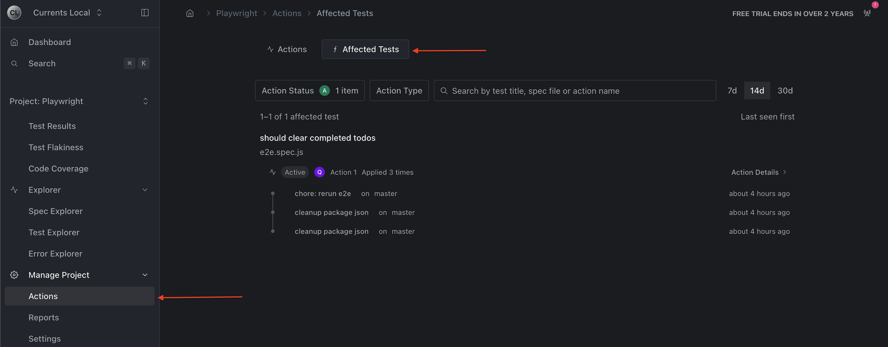

# Quick Start

Connect Playwright to Currents in a few minutes and start seeing runs, screenshots, videos, and traces in one place. This guide keeps the setup minimal so you can go from "tests run locally" to "results show up in Currents" without extra ceremony.

## Prerequisites  <a href="#prerequisites" id="prerequisites"></a>

* An account — [sign up](https://app.currents.dev/signup) for a free trial.
* NodeJS v14.0.0+
* Playwright v1.22.2+


Want to hand this off to AI? Copy the prompt below into Cursor, Claude, ChatGPT, or your editor assistant and let it wire up the basics for you.


```text
Your task is to update Playwright setup to report test results to Currents.dev

1. Install "@currents/playwright" package:

- as a development dependency
- using the project's package manager (npm, pnpm, yarn, etc...)

2. Update the Playwright configuration file (playwright.config.ts|js|mjs):

  - enable traces, videos and screenshots by updating the "use" property, e.g.:

  use: {
      trace: "on",
      video: "on",
      screenshot: "on",
  }

  - add Currents test reporter, keep any existing reporters. Example:

  // playwright.config.ts
  import { defineConfig, devices, PlaywrightTestConfig } from "@playwright/test";
  import { currentsReporter } from "@currents/playwright";

  export default defineConfig({
    // ...
    reporter: [currentsReporter()], // add Currents reporter
  });

3. Create a new "currents.config.ts" file next to the existing playwright.config.ts|js|mjs file.

- use the same extension
- add the content below

import { CurrentsConfig } from "@currents/playwright";

const config: CurrentsConfig = {
  recordKey: process.env.CURRENTS_RECORD_KEY!,
  projectId: "iDxgqa"
};

export default config;
```

## Setup Currents




### Create a Project

When you first sign in, create an organization and a project. You can rename both later, so keep moving.

<div data-with-frame="true"><figure><figcaption></figcaption></figure></div>

Next, Currents shows your `Project ID` and `Record Key`. Keep that page open for the next steps.

Select Playwright from the framework selection list.


Recommended screenshot: the onboarding screen with `Project ID` and `Record Key` visibly highlighted. This is the single most useful image in the guide because it helps users instantly map the config values to what they see in the app.





### Install @currents/playwright

Install the native Playwright reporter with your project's package manager.

```bash
npm i -D @currents/playwright
```

If you use `pnpm`, `yarn`, or `bun`, run the equivalent dev dependency install command instead.




### Create currents.config.ts

Create `currents.config.ts` next to `playwright.config.ts`, usually in the project root. If your Playwright config uses `.js` or `.mjs`, use that same extension for `currents.config`.



```typescript
import { CurrentsConfig } from "@currents/playwright";

const config: CurrentsConfig = {
  recordKey: process.env.CURRENTS_RECORD_KEY!,
  projectId: "iDxgqa",
};

export default config;
```



Use your real project ID from Currents. Keeping `recordKey` in an environment variable is the safest default.




### Enable artifacts

Update `playwright.config.ts` so every recorded run includes traces, videos, and screenshots.

```json
use: {
    // ...
    trace: "on",
    video: "on",
    screenshot: "on",
}
```

These artifacts are what make the dashboard feel useful on the first run, so it is worth enabling all three up front.




### Setup Currents Reporter

You have two ways to finish the integration. Most teams should start with the reporter because it keeps the existing Playwright command unchanged.

<details>

<summary>Option 1: Add Currents Reporter (recommended)</summary>

Add the Currents reporter to `playwright.config.ts` and keep using `playwright test`.

```typescript
// playwright.config.ts
import { defineConfig, devices, PlaywrightTestConfig } from "@playwright/test";
import { currentsReporter } from "@currents/playwright";

export default defineConfig({
  // ...
  reporter: [currentsReporter()], // 👈🏻 add Currents reporter
})
```

If you already have reporters configured, keep them and append `currentsReporter()` to the list.

* Run `npx playwright test` or your usual test command to start sending results to Currents.
* The reporter reads settings from `currents.config.ts`. See [currents-playwright](../resources/reporters/currents-playwright/ "mention") for more configuration options.

</details>

<details>

<summary>Option 2: Run tests with the pwc command</summary>

`pwc` is a lightweight command-line executable included in `@currents/playwright`. It runs Playwright with Currents wired in for you.

Setup

* Run `npx pwc`.
* Or update `package.json` to execute `pwc` instead of `playwright test`.

```json
"scripts": {
  ...
  "test": "npx pwc",
},
```

How it works

* `pwc` reads the configuration from `currents.config.ts` file. See additional configuration options [configuration.md](../resources/reporters/currents-playwright/configuration.md "mention").
* `pwc` injects Currents reporter into Playwright configuration.
* You can also provide CLI configuration parameters, e.g. `npx pwc --key RECORD_KEY --project-id PROJECT_ID`

</details>



## Create your first run

After setup, run Playwright and watch results get [streamed in real-time](../guides/parallelization-guide/step-level-reporting.md) to Currents.

A link to the recorded run will be available at the start of the execution:

```text
> npx pwc --key XXX --project-id YYY

📦 Currents reporter: 1.12.0 recording to project WlKqJ0
🎭 Playwright: 1.52.0 5 tests in 1 project [chromium]
🔨 CI Build ID: auto:tzwgltasm
🌐 Run URL: https://app.currents.dev/run/cfc7ab8fcaaz10157

================================================================
```

Open the link to see the run in the dashboard.

<figure><figcaption><p>Example of a newly created run</p></figcaption></figure>


Recommended screenshot: a fresh run page with the trace, video, and screenshot artifacts visible. This helps users immediately understand why they enabled artifacts in the earlier step.



Ran into any errors? Check out our [troubleshooting-playwright.md](../guides/troubleshooting-playwright.md "mention") guide.


## Next Step

Once your Playwright project is set up and reporting locally, configure your CI pipeline.&#x20;

Running tests in CI is where you get consistent, repeatable feedback on every pull request and deployment, not just on your local machine.


[ci-setup](ci-setup/)

