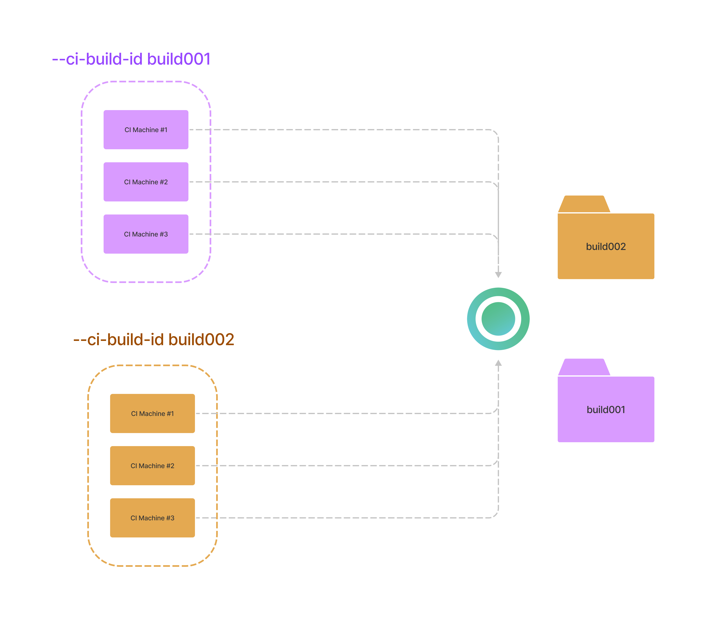
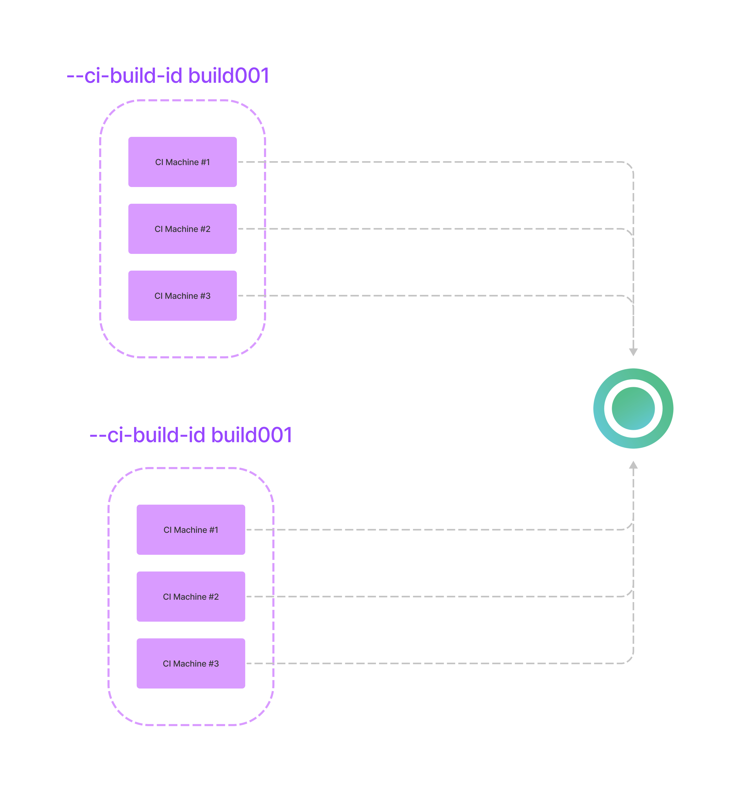

# CI Build ID


CI Build ID for Playwright and Cypress


## What is CI Build ID?

**CI Build ID** is a unique identifier used by Currents to collect test results. Think of it as a "folder" on a virtual hard drive. For example, when multiple CI machines run tests in parallel, their combined results will appear together if they use the same CI Build ID.

* results with `--ci-build-id build001` will go to `build001` "folder" (we call it a run)
* results with `--ci-build-id build002` will go to `build002` "folder"



## Creating a CI Build ID

You can choose between leveraging our auto-detection algorithm, or manually generating a CI Build ID.&#x20;

### Auto detection by Currents

Currents will automatically detect a CI Build ID for popular CI providers based on the presence of environment variables. Please refer to [#build-id-for-popular-ci-providers](ci-build-id.md#build-id-for-popular-ci-providers "mention") to see the environment variables used for each provider.&#x20;

Otherwise, if not explicitly provided, Currents will generate a random unique id.

### Explicit value

You can also specify CI Build ID explicitly.



With the CLI, you can use the `--ci-build-id` flag, for example:

```bash
pwc run --ci-build-id CI_BUILD_ID --key xxx --project-id yyy
```

```bash
currents run --ci-build-id $BRANCH_$BUILDID --parallel --record --key xxx 
```



Example on passing ciBuildId to Playwright Reporter configuration:

```javascript
// playwright.config.ts
import { currentsReporter } from '@currents/playwright';

//...
reporter: [
  currentsReporter({
    //... 
    ciBuildId: process.env.CURRENTS_CI_BUILD_ID
  }),
]
```



You can also set the `CURRENTS_CI_BUILD_ID` environment variable to provide an explicit CI Build ID value.



In order to manually construct a CI Build ID that is unique for each build (but similar across all the parallel machines) it is recommended to use your CI provider's environment variables that combine pipeline/workflow/build identifier and also an attempt number.

For example, for GitHub Actions:

```
--ci-build-id "${{ github.repository }}-${{ github.run_id }}-${{ github.run_attempt }}"
```

Refer to your CI provider documentation for the list of available environment variables.

## Parallelization

[cypress-parallelization.md](parallelization-guide/cypress-parallelization.md "mention") and [playwright-orchestration.md](parallelization-guide/pw-parallelization/playwright-orchestration.md "mention") allows running your tests in parallel. Collecting and combining the results from multiple machines requires to use the same CI Build ID.

#### Using unique CI Build ID in different builds

Imagine a CI pipeline running tests in parallel using multiple machines. Starting two builds with a **different CI Build ID** will create 2 distinct "Runs" in Currents dashboard.


The parallelization and reporting will happen for each build independently from the other. That is usually the desired situation - each build should have a unique CI Build ID.

#### Using the same CI Build ID in different builds

In contrast, consider a situation when 2 **different** builds use the **same** CI Build ID. That's an uncommon situation, but it's worth demonstrating for understanding the use of CI Build ID.



We created two different builds with the same CI Build ID. That will result in 6 machines reporting their results to the same run.

### Build ID for popular CI providers

Currents will try to automatically detect the CI provider by looking at the environment variables and picking the best combination.&#x20;

If the variables are not found, Currents will fall back to a simpler combination.

<table><thead><tr><th width="193">Provider</th><th width="317">Variables</th><th>Fallback</th></tr></thead><tbody><tr><td>AppVeyor</td><td><ul><li>APPVEYOR_PULL_REQUEST_HEAD_REPO_BRANCH</li><li>APPVEYOR_BUILD_NUMBER</li></ul></td><td><ul><li>APPVEYOR_BUILD_NUMBER</li></ul></td></tr><tr><td>Azure</td><td><ul><li>BUILD_BUILDID</li></ul></td><td></td></tr><tr><td>AWS Code Build</td><td><ul><li>CODEBUILD_BUILD_ID</li><li>CODEBUILD_SOURCE_VERSION</li></ul></td><td><ul><li>CODEBUILD_BUILD_ID</li></ul></td></tr><tr><td>Bamboo</td><td><ul><li>bamboo_buildKey</li><li>bamboo_buildNumber</li></ul></td><td><ul><li>bamboo_buildKey</li></ul></td></tr><tr><td>Bitbucket</td><td><ul><li>BITBUCKET_REPO_SLUG</li><li>BITBUCKET_BUILD_NUMBER</li></ul></td><td><ul><li>BITBUCKET_BUILD_NUMBER</li></ul></td></tr><tr><td>Buildkite</td><td><ul><li>BUILDKITE_BUILD_ID</li></ul></td><td></td></tr><tr><td>CircleCI</td><td><ul><li>CIRCLE_WORKFLOW_ID</li></ul></td><td><ul><li>CIRCLE_BUILD_NUM</li></ul></td></tr><tr><td>Codeship</td><td><ul><li>CI_REPO_NAME</li><li>CI_BUILD_ID</li></ul></td><td><ul><li>CI_BUILD_ID</li></ul></td></tr><tr><td>Concourse</td><td><ul><li>BUILD_ID</li><li>BUILD_NAME</li></ul></td><td><ul><li>BUILD_ID</li></ul></td></tr><tr><td>CodeFresh</td><td><ul><li>CF_BUILD_ID</li><li>CF_CURRENT_ATTEMPT</li></ul></td><td><ul><li>CF_BUILD_ID</li></ul></td></tr><tr><td>Drone</td><td><ul><li>DRONE_PULL_REQUEST</li><li>DRONE_BUILD_NUMBER</li></ul></td><td><ul><li>DRONE_BUILD_NUMBER</li></ul></td></tr><tr><td>GitHub Actions</td><td><ul><li>GITHUB_REPOSITORY</li><li>GITHUB_RUN_ID</li><li>GITHUB_RUN_ATTEMPT</li></ul></td><td><ul><li>GITHUB_RUN_ID</li></ul></td></tr><tr><td>GitLab</td><td><ul><li>CI_PIPELINE_ID</li></ul></td><td></td></tr><tr><td>GoCD</td><td><ul><li>GO_REVISION</li><li>GO_PIPELINE_COUNTER</li></ul></td><td><ul><li>GO_REVISION</li></ul></td></tr><tr><td>Google Cloud</td><td><ul><li>REPO_NAME</li><li>BUILD_ID</li></ul></td><td><ul><li>BUILD_ID</li></ul></td></tr><tr><td>Jenkins</td><td><ul><li>BUILD_NUMBER</li></ul></td><td></td></tr><tr><td>Semaphore</td><td><ul><li>SEMAPHORE_GIT_REPO_SLUG</li><li>SEMAPHORE_PIPELINE_ID</li></ul></td><td><ul><li>SEMAPHORE_PIPELINE_ID</li></ul></td></tr><tr><td>TeamFoundation</td><td><ul><li>BUILD_BUILDID</li><li>BUILD_BUILDNUMBER</li></ul></td><td><ul><li>BUILD_BUILDID</li></ul></td></tr><tr><td>Travis</td><td><p></p><ul><li>TRAVIS_REPO_SLUG</li><li>TRAVIS_BUILD_ID</li></ul></td><td><ul><li>TRAVIS_BUILD_ID</li></ul></td></tr><tr><td>Netlify</td><td><ul><li>BUILD_ID</li></ul></td><td></td></tr></tbody></table>

## FAQ

<details>

<summary>Why does each CI machine run all the tests?</summary>

One popular and confusing scenario is:

* the first build completes all the tests
* the second build uses the same CI Build ID and immediately finishes without running any test at all

That's because both builds use the same CI Build ID - the second build "joins" an already finished run that has no more tests to execute.

In most chances, each CI machine generates a different CI Build ID. Each unique CI Build ID creates a new run and executes all the tests. Please make sure that you provide the same CI Build ID across different  CI machines that are part of the same build.

</details>

<details>

<summary>Retrying a build doesn't run cypress tests at all</summary>

Most chances you're reusing a CI Build ID for a run that was already completed. In order to create a new run, please use a new, unique CI Build ID.

</details>

<details>

<summary>Retrying builds and CI Build ID</summary>

Imagine a situation

* You start a new build with CI Build ID **build-001**
  * Build completes and reports all the results to Currents Dashboard
  * Currents marks build-001 as "finished" and all the files as completed
* You restart the build (attempt B), but keep the same CI build ID **build-001**
  * Currents considers **build-001** as already completed
  * Currents won't accept new results for **build-001**, because all the results were already reported&#x20;
  * Currents will not send any new files for Cypress orchestration, because build-001 already ran all the spec files on the first attempt

To resolve this ambiguity, we need to have a different CI build ID for each rerun.

Most CI providers provide a different set of environment variables for different attempts and  Currents dashboard can identify it automatically - it will create an entirely new run for retries.

You can also construct an explicit CI Build ID when retrying a build, for example, for GitHub Actions:

```
"${{ github.repository }}-${{ github.run_id }}-${{ github.run_attempt }}"
```

If you are generating CI Build ID manually, please make sure to include the retry/attempt identifier.&#x20;

Please refer to your CI tool documentation to explore what environment variables are available for composing a valid CI Build ID.

</details>

<details>

<summary>Using commit SHA as CI Build ID</summary>

Using commit SHA as a CI Build ID is a valid approach and can work for many setups. However, please be aware that rerunning a build with the same commit SHA can result in a duplicate CI Build ID and prevent orchestration and reporting (see [#faq-retrying-builds-and-ci-build-id](ci-build-id.md#faq-retrying-builds-and-ci-build-id "mention"))

</details>

<details>

<summary>Retrying a build only for failed tests</summary>


TL;DR Currents Dashboard will always run all the tests using the available machines, even for reruns. That's due to the architectural limitations of load balancing.

Some CI providers (e.g. GitLab, GitHub) allow reruns only for the failed containers. Invoking such a rerun will result in:

* a unique CI Build ID would be generated
* it will create a completely new run within the dashboard
* the dashboard will load balance all the specs among all the available containers

So, you end up running all the tests using a just subset of available containers.

We have been experimenting with alternative load-balancing strategies that would allow seamless reruns. Please reach out to our customer support if you want to get updates regarding the progress.

**Please note:** GitLab does not provide a "rerun identifier" within its CI environment. See the WIP [discussion](https://gitlab.com/gitlab-org/gitlab/-/issues/195618#note\_1139938057).

</details>

