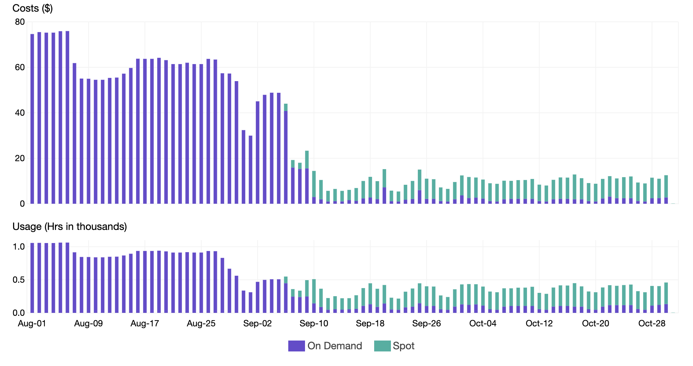

# Cloud Spot Instances

An additional benefit of using Currents for balancing tests is the ability to automatically redrive tests from one machine to another.


* Get familiar with [playwright-orchestration.md](playwright-orchestration.md "mention")
* Requires `@currents/playwright@1.3.0+`


### Cost Efficiency of Spot Instances

Many cloud providers have an option to use [Spot Instances](https://aws.amazon.com/ec2/spot/) for running workloads. Using Spot Instances can cost up to 90% lower, compared to the traditionally allocated resources.

<figure><figcaption><p>Cost optimization with Spot Instances. Source: https://aws.amazon.com/blogs/containers/cost-optimization-for-kubernetes-on-aws/</p></figcaption></figure>

However, spot instances can be terminated at any time, which can cause the loss of the test results.&#x20;

Currents Orchestration can automatically reassign the tests from to-be-terminated instance to another machine. This way, the execution can continue without manual intervention.

### How it works

Imagine a scenario when you have two machines running a testing suite consisting of two spec files.&#x20;

* Machine A - running specA
* Machine B - running specB

When a spot instance is just about to be terminated (let's say Machine A),  Currents will identify the affected spec files and reassign them a different machine.&#x20;

<figure><figcaption><p>Reassigning tests in case of spot instance termination</p></figcaption></figure>

### Setup and Configuration


Only tests orchestrated with `pwc-p` or `pwc-p run` can be dynamically reassigned. Read more about [playwright-orchestration.md](playwright-orchestration.md "mention").


Starting from version `1.3.0` of `@currents/playwright` set `--pwc-reset-signal` CLI parameter:

```
pwc-p run .... --pwc-reset-signal SIGUSR1|SIGUSR2
```

When specified, `pwc-p run` starts listening to POSIX signal (`SIGUSR1` or `SIGUSR2`). After receiving the signal, it sends a request to Currents servers to reassign the affected tests to healthy machines. Currents updates the run status accordingly.

Upon receiving the signal, expect log lines similar to:

```
🚥 Received SIGUSR1
🚥 Resetting tests: machineId: <id>, runId: <run-id>
🚥 Success resetting tests: machineId: <id>, runId: <run-id>
```


It is your responsibility to capture the eviction notice, detect the PID and send the signal to `pwc-p` process before an eviction.&#x20;

* `usr1` normally activates the Node.js debugger, but this ability is disabled when we listen on usr1
* `usr2` normally treated as a exit in Node.js, so if you pass it WITHOUT turning on our listener, you will immediately kill the process
* You must send the signal to the `pwc-p run` process — **not the npx or wrapper process**. The parent process will behave as noted above and not pass the signal down to our process.


Refer to the following documentation for capturing the eviction notice for various cloud providers:

* [AWS - Spot Instance interruption notice](https://docs.aws.amazon.com/AWSEC2/latest/UserGuide/spot-instance-termination-notices.html)
* [Azure - Simulate Spot Virtual Machine eviction](https://learn.microsoft.com/en-ca/azure/virtual-machines/windows/spot-powershell#simulate-an-eviction)
* [GCP - Spot VM preemption process](https://cloud.google.com/compute/docs/instances/spot#preemption-process)
