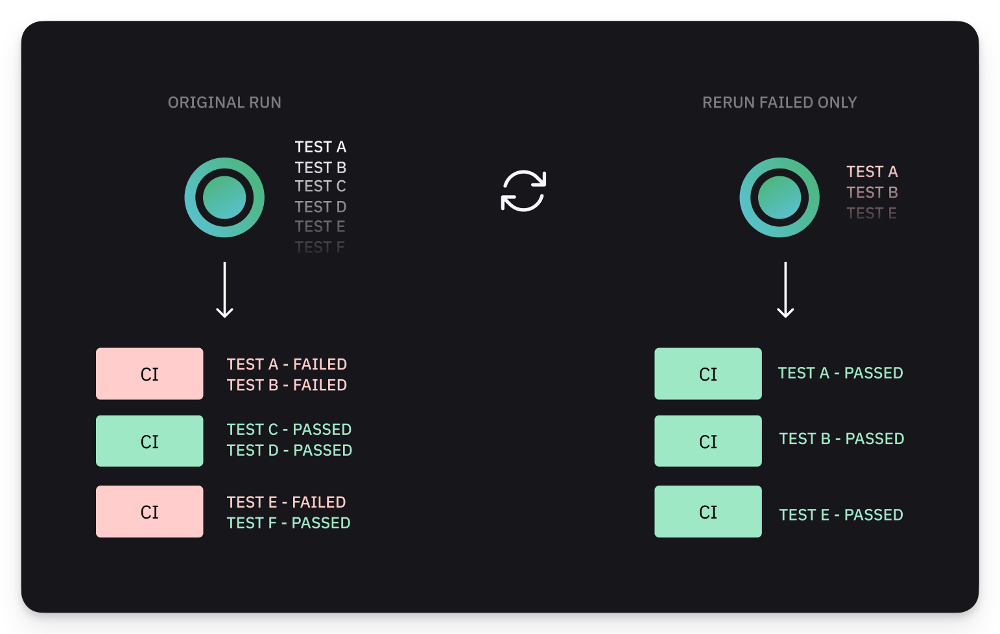

# Re-run Only Failed Tests — Orchestrated runs


Failed orchestrated reruns require **Rerun All Jobs** in the CI provider, not **Rerun Failed Only**.


Orchestrated runs work differently from native Playwright sharding. Currents assigns tests to **all available machines**. When retrying, use **Rerun All Jobs** to let Currents redistribute the failed tests across all available containers for optimal parallel execution.

<figure><figcaption>
Rerunning Failed Only Playwright Tests using Currents Orchestration
</figcaption></figure>

Step-by-step guides and examples:

* [**GitHub Actions**](../../getting-started/ci-setup/github-actions/re-run-failed-only-tests-orchestrated.md)
* [**GitLab CI**](../../getting-started/ci-setup/gitlab/re-run-failed-only-tests.md)
* [**Jenkins Pipeline**](../../getting-started/ci-setup/jenkins.md#using-last-failed-flag-with-shards-and-orchestration)
