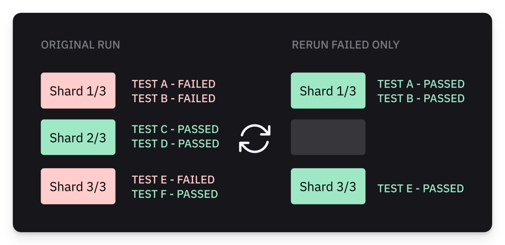

# Re-run Only Failed Tests

Starting from version [1.44](https://playwright.dev/docs/release-notes?ref=playwrightsolutions.com#version-144) Playwright supports [running only the failed test from the last run](https://playwrightsolutions.com/how-to-run-failures-only-from-the-last-playwright-run/) using `--last-failed` CLI flag. For example:

```
playwright test --last-failed
```

<figure><figcaption><p>Rerunning Failed Only Playwright Tests</p></figcaption></figure>

While this feature works well for local environments, using it in CI with Playwright shards or Currents Orchestration is not straightforward.&#x20;

We have created a set of tools that simplify rerunning only the failed Playwright tests in CI, including sharded parallel CI runs and runs created by Currents Orchestration.&#x20;

Follow the guide that matches how you run tests in CI:

* [Sharded runs](re-run-only-failed-tests-sharded.md "mention") — fixed shard count and native Playwright `--shard` parallelism
* [Orchestrated runs](re-run-only-failed-tests-orchestrated.md "mention") — Currents assigns tests dynamically across runners
