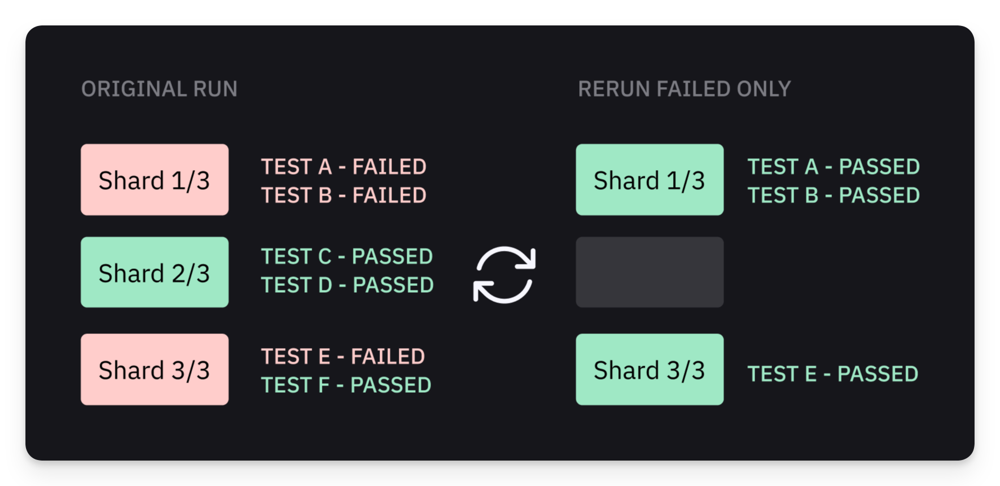

# Re-run Only Failed Tests

Starting from version [1.44](https://playwright.dev/docs/release-notes?ref=playwrightsolutions.com#version-144) Playwright supports [running only the failed test from the last run](https://playwrightsolutions.com/how-to-run-failures-only-from-the-last-playwright-run/) using `--last-failed` CLI flag. For example:

```
playwright test --last-failed
```


`@playwright/test@1.50+`  has an improved support of `--last-failed` on CI, we recommend upgrading the package version accordingly.


<figure><figcaption><p>Rerunning Failed Only Playwright Tests</p></figcaption></figure>

While this feature works well for local environments, using it in CI with Playwright shards or Currents Orchestration is not straightforward.&#x20;

We have created a set of tools that simplify rerunning only the failed Playwright tests in CI, including sharded parallel CI runs and runs created by Currents Orchestration.&#x20;


Tests that randomly fail and then pass without any change are considered flaky (see [flaky-tests.md](../../dashboard/tests/flaky-tests.md "mention")). Even if tests pass after a rerun, it is recommended to explore the failures and eliminate the flakiness.


### Re-run Only Failed Tests: Playwright Shards

The suggested templates do not require maintaining complex CI configurations and scripts - they are compatible with popular CI providers and can be used even without Currents reporter.

<details>

<summary>GitHub Actions</summary>

See our step-by-step guide [Broken link](/broken/pages/OBf6fxBvHtXcnh50eEgQ#re-run-only-failed-tests-in-github-actions "mention")

</details>

<details>

<summary>GitLab CI</summary>

See our step-by-step guide to [Setting up retries of failed job with GitLab CI](../../getting-started/ci-setup/gitlab/playwright-gitlab-ci-cd.md#playwright-sharding)

</details>

<details>

<summary>Jenkins Pipeline</summary>

See our step-by-step guide to [Setting up retries of failed job with Jenkins Pipeline](/broken/pages/4LoOSvPTa9mW7D6zFRyO#using-last-failed-flag-with-shards-and-orchestration)

</details>

### Re-run Failed Playwright Tests: Currents Orchestration


When rerunning failed orchestrated runs, select "Rerun All Jobs" instead of "Rerun Failed Only"


Orchestrated runs are conceptually different from the native playwright sharding. Currents assigns the tests dynamically to **all the available machines -** i.e. the more machines are available, the better (also, there's no need to provide the overall number of CI machines in advance).

<figure><figcaption><p>Rerunning Failed Only Playwright Tests using Currents Orchestration</p></figcaption></figure>

That's why when rerunning failed orchestrated CI runs, you'd select "Rerun All Jobs" instead of "Rerun Failed Only":

* The CI provider will spin up all the containers
* Currents will dynamically assign the failed tests to all the available containers
* More available containers will run the tests in parallel faster

<details>

<summary>GitHub Actions</summary>

See our step-by-step guide  [re-run-failed-only-tests.md](../../getting-started/ci-setup/github-actions/re-run-failed-only-tests.md "mention")

</details>

<details>

<summary>GitLab CI</summary>

See our step-by-step guide [re-run-failed-only-tests.md](../../getting-started/ci-setup/gitlab/re-run-failed-only-tests.md "mention")

</details>

<details>

<summary>Jenkins Pipeline</summary>

See our step-by-step guide to [Setting up retries of failed job with Jenkins Pipeline](https://docs.currents.dev/getting-started/ci-setup/jenkins#using-last-failed-flag-with-shards-and-orchestration)

</details>
