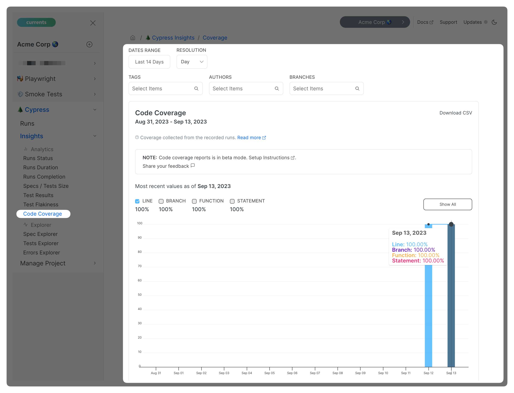
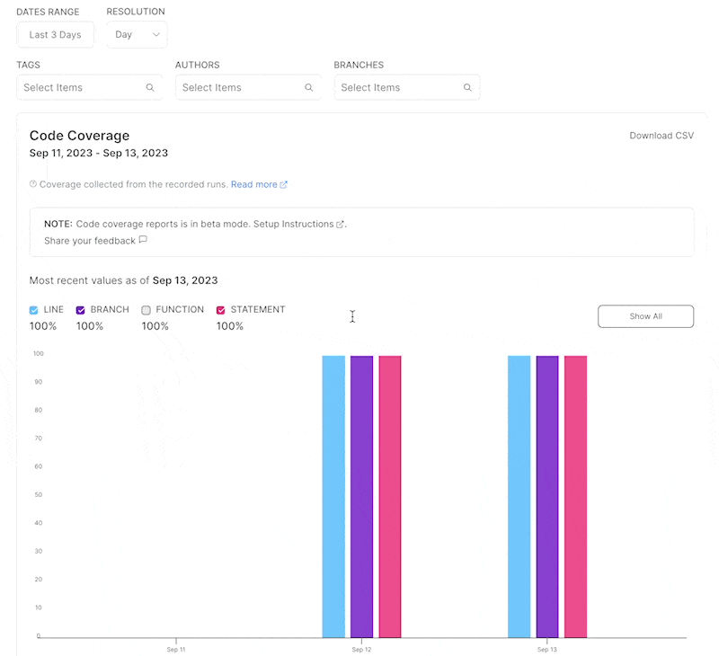

# Coverage

Code coverage is a popular technique for measuring what parts of the source code have been executed while running test. It is commonly used to determine how thoroughly a test suite exercises a particular codebase.

[Playwright](https://playwright.dev/docs/api/class-coverage) and [Cypress](https://docs.cypress.io/guides/tooling/code-coverage) both support collecting code coverage information from the underlying application. When running tests in a distributed and parallel CI environment, we collect coverage data from multiple CI containers, merge the resulting reports, and store them in Currents.

### Code Coverage Overview

To collect code coverage information, you need to add extra functionality to the source code that allows tracking which parts of the code are being executed during a test run. This process is known as instrumenting the code. By instrumenting the code, you can automatically augment it with markers and counters that allow you to calculate what parts of the code (and how often) were accessed during a test run. The most popular tools used for code instrumentation are [Istanbul](https://istanbul.js.org/) and [v8](https://v8.dev/blog/javascript-code-coverage).

Traditionally, code coverage metrics include line coverage, branch coverage, function coverage, and statement coverage.

* Line coverage measures the percentage of lines of code that have been called
* Branch coverage measures the percentage of if/else code branches that have been checked
* Function coverage measures the percentage of a program's functions that have been called
* Statement coverage measures the percentage of a program's statements that have been called


Read more about [Code Coverage metrics meaning](https://en.wikipedia.org/wiki/Code\_coverage)


Generating code coverage for parallelized CI runs requires:

* **Generating** coverage reports on each parallel container (or shard)
* **Reporting** the individual reports to Currents
* **Merging** the collected reports, processing and aggregating the results


Overview of enabling coverage reports for Cypress and Playwright


### Code Coverage for Playwright


`@currents/playwright` v1.7.0+ is required to enable Coverage



See a working [example GitHub repository](https://github.com/currents-dev/currents-playwright-coverage-example) with NextJS


To enable code coverage for Playwright, follow these steps:



### Instrument your code with Instanbul and Babel

Install `babel-plugin-istanbul`

```sh
npm i -D babel-plugin-istanbul
```

Update (or create) `babel.config.js`

```js
module.exports = {
  presets: ["next/babel"],
  plugins: ["istanbul"],
};
```



### Extend the test method


```ts
   import {
     CurrentsFixtures,
     CurrentsWorkerFixtures,
     fixtures,
   } from "@currents/playwright";
   import { test as base } from "@playwright/test";
   
   export const test = base.extend<CurrentsFixtures, CurrentsWorkerFixtures>({
     ...fixtures.baseFixtures,
     ...fixtures.coverageFixtures,
   });
```



See [currents-playwright-fixtures.md](../resources/reporters/currents-playwright/currents-playwright-fixtures.md "mention") for more information on extending test and using the fixtures.




### Update tests to use new test method

Import and use the extended `test` for every test case that should produce coverage data.

```ts
import { expect } from "@playwright/test";
import { test } from "./myTest.ts";
```



### Browse coverage metrics

Create a run (see [you-first-playwright-run.md](../getting-started/playwright/you-first-playwright-run.md "mention")) to report coverage metrics to Currents.

Learn more about the metrics at [#browsing-coverage-metrics](coverage.md#browsing-coverage-metrics "mention")



Note: Coverage for Playwright only works with Istanbul at the moment.

### Code Coverage for Cypress


TL;DR

See a working [example GitHub repository](https://github.com/currents-dev/cypress-cloud/tree/main/examples/coverage)&#x20;

* Install `cypress-cloud` version `1.9.5+`&#x20;
* Install and configure Cypress Code coverage plugin as described [here](https://docs.cypress.io/guides/tooling/code-coverage)&#x20;
* Run `cypress-cloud` with `--experimental-coverage-recording` CLI flag enabled


Enabling code coverage for Cypress involves the following steps:

* Instrumenting the code and generating the coverage report (done by `cypress` runner together with Istanbul or any other coverage tool)
* Uploading the report to Currents for processing (done by `cypress-cloud` package)

#### Instrumenting the code

Instrumenting the code and generating reports is well described in the detailed [guide](https://docs.cypress.io/guides/tooling/code-coverage).

In short:

* Install and configure the official [@cypress/code-coverage](https://www.npmjs.com/package/@cypress/code-coverage) plugin together with the `@cypress/code-coverage/support` support file (the plugin is developed and maintained by the Cypress.io team)
* Add [code instrumentation](https://github.com/cypress-io/code-coverage#instrument-your-application) - for example, by using `@cypress/code-coverage/use-babelrc` for on-the-fly instrumentation

#### Uploading the reports to Currents

* If you haven’t yet, [install `cypress-cloud`](https://github.com/currents-dev/cypress-cloud#setup); make sure to add `cypress-cloud/plugin` **after** `@cypress/code-coverage`
* **Optional:** provide custom location for generated reports:
  * `cypress-cloud` expects to find the coverage reports at their default location at `<projectRoot>/.nyc_output/out.json`
  * **Y**ou can provide a custom location by setting `env.coverageFile` in `cypress.config.{jt}s`

**Example `cypress.config.ts` file**

```tsx
// cypress.config.ts
import coveragePlugin from "@cypress/code-coverage/task";
import coverageInstrumenter from "@cypress/code-coverage/use-babelrc";

import { cloudPlugin } from "cypress-cloud/plugin";

import { defineConfig } from "cypress";

export default defineConfig({
  e2e: {
    async setupNodeEvents(on, config) {
      // enable on-the-file instrumentation
      on("file:preprocessor", coverageInstrumenter);
      // enable coverage plugin to generate a report
      const tempConfig = coveragePlugin(on, config);
      // enable cypress-cloud plugin
      return await cloudPlugin(on, tempConfig);
    },
    baseUrl: "<http://localhost:8888>",
    supportFile: "cypress/support/e2e.js",
    specPattern: "cypress/**/*.cy.js",
    env: {
      // @cypress/code-coverage config
      // exclude test files from the reports
      codeCoverage: {
        exclude: ["cypress/**/*.*"],
      },
      // ⭐️ instruct cypress-cloud on the location of the generated report
      coverageFile: "./.nyc_output/out.json",
    },
  },
});
```

**Example Cypress `support.ts` file**

```tsx
import "@cypress/code-coverage/support";
import "cypress-cloud/support";
```

#### Run `cypress-cloud` with coverage enabled

Running `cypress-cloud` with `--experimental-coverage-recording` flag will activate the collection of the coverage reports and send them to Currents for processing.

The script will discover the reports at the configured location `./.nyc_output/out.json` by default, or an explicit location defined in `env.coverageFile` of `cypress.config.{jt}s`

Example:


```bash
npx cypress-cloud run --parallel --record --key <record_key> --ci-build-id <ci-build-id>  --experimental-coverage-recording
```


### Browsing Coverage Metrics

Currents will process, aggregate and store the coverage information for each recorded run. In case of parallelized CI runs, Currents will combine the results from all the containers and generate a merged report.


Only coverage reports from fully completed runs are accepted

A run is fully completed if we collect results for all spec files and tests. Cancelled and timed-out runs are not fully completed, thus Currents would ignore the coverage information generated by those runs.


<figure><figcaption><p>Example of an Aggregated Coverage Report</p></figcaption></figure>

#### Coverage Metrics

Coverage reports contain metrics for **each individual file** as well as **combined cross-file totals.**

Our initial release only displays the **total cross-file coverage percentage:**

* Total cross-file line coverage percentage
* Total cross-file branch coverage percentage
* Total cross-file function coverage percentage
* Total cross-file statement coverage percentage

<table data-full-width="false"><thead><tr><th>Metric</th><th>Line</th><th>Branch</th><th>Function</th><th>Statement</th></tr></thead><tbody><tr><td>Total items discovered</td><td>hidden</td><td>hidden</td><td>hidden</td><td>hidden</td></tr><tr><td>Covered items</td><td>hidden</td><td>hidden</td><td>hidden</td><td>hidden</td></tr><tr><td>Skipped items</td><td>hidden</td><td>hidden</td><td>hidden</td><td>hidden</td></tr><tr><td>Coverage percentage</td><td>✅</td><td>✅</td><td>✅</td><td>✅</td></tr></tbody></table>


Please contact us if you need to see additional coverage metrics


<figure><figcaption><p>Switching Aggregated Coverage Metrics</p></figcaption></figure>

#### Coverage Aggregation Details

In Currents, the hierarchy of data is organized as follows:

* **Project**: The top-level container where all the results are hosted
  * **Run**: An instance of executing tests against the code in a project. Multiple runs can belong to a single project.
    * **Group**: A subset of a run, grouping specific tests together. Each run can have multiple groups.

When presenting the aggregated coverage report, we follow the next steps:

* Get all the runs recorded during the selected period with the current filters (tags, branches) applied
* Calculate the average value for the coverage metrics for all groups within a run
* Calculate the average value for the aggregated time period (day, week or month)
