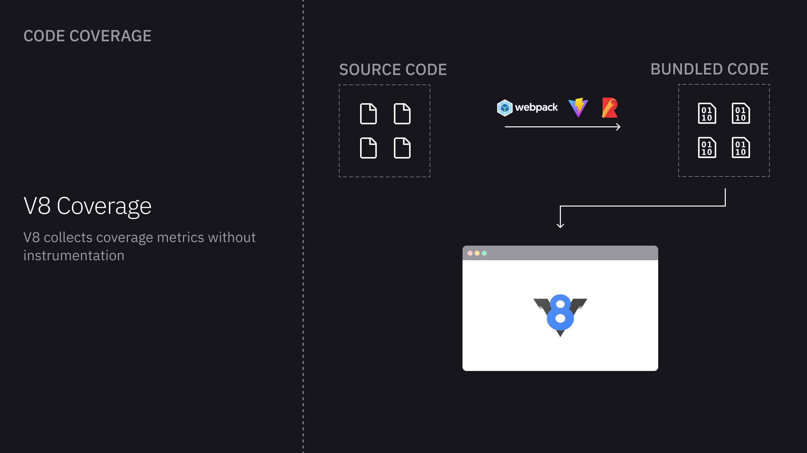
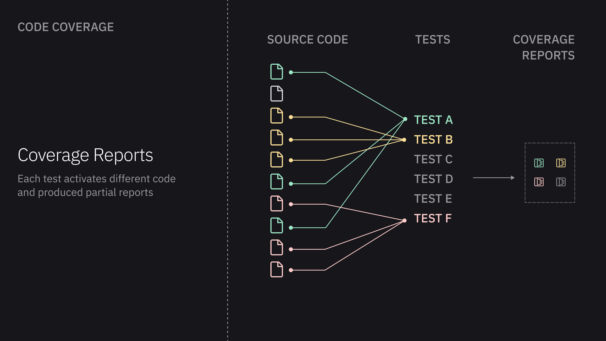
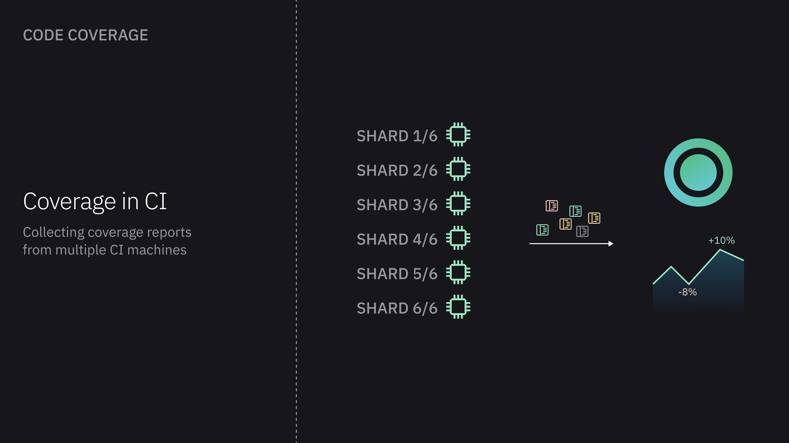

# Code Coverage

Code coverage is a popular technique for measuring what parts of the source code have been executed while running tests. It is commonly used to determine how thoroughly a test suite exercises a particular codebase.

[Playwright](https://playwright.dev/docs/api/class-coverage) and [Cypress](https://docs.cypress.io/guides/tooling/code-coverage) both support collecting code coverage from the underlying application. When running tests in a distributed and parallel CI environment, Currents collects coverage metrics from distributed, parallel tests; merges the individual coverage reports, and presents coverage information in Currents web dashboard.

### Coverage for Web Applications

When running browser-based end-to-end or component tests, we can talk about various types of "coverage".

**Code coverage**

Code coverage measures what parts of the source code were executed and how often. Code coverage metrics are related to code abstracts - lines of code, `if` statements (branches), functions and so on.

**Functional UI coverage**

Functional UI coverage determines how well software's functional requirements are tested, such as navigation and user interactions. It measures what end-user workflows have been tested and if the software performs as expected.


This guide focuses on Code Coverage, specifically - on how to report Code Coverage to Currents when using Playwright and Cypress testing frameworks.


### Generating Code Coverage

**Code instrumentation**

The frontend source code goes through a transpilation before being loaded into a browser. It can be a manual build / bundling stage that you manage yourself (using tools like webpack, esbuild, rollup, swc etc.) or a build step of a popular frontend framework like vite, nextjs, remix, svelte, angular.

During the build phase we instrument the compiled code - for example, increment a counter before function invocations or before entering an `if` statement. Running the instrumented code activates the counters and that's how we measure the coverage.

<figure><figcaption>
Instrumenting code for collecting code coverage
</figcaption></figure>

Instrumentation is the traditional way to generate coverage metrics on different browsers and JS engines.

[Instanbul ](https://istanbul.js.org/)is a popular ecosystem of coverage-related tools - it is widely used to instrument code and generate coverage reports.

**V8 Code Coverage**

An alternative approach is to use the built-in capabilities of Javascript engines. For example, NodeJS and chromium-based browsers use V8, which collects coverage metrics while executing JS code.

<figure><figcaption>
V8 collects code coverage without instrumentation
</figcaption></figure>

There's no need to instrument the code in V8 - one can get the metrics by sending a series of [API calls](https://chromedevtools.github.io/devtools-protocol/tot/Profiler/#method-startPreciseCoverage). It is common to transform the output of V8 coverage report to other popular formats.

### Recording Coverage Fragments

Web automation tools like Cypress, Selenium or Playwright run your application in a browser. The tests navigate to various routes, interact with the page components - every interaction activates certain parts of the code and populates the coverage information.

Each individual test creates partial coverage report. At the end of each test, we need to collect the those fragments and merge them to create a complete snapshot of what parts of the source code are "covered" by your testing suite.

<figure><figcaption>
Recording and merging coverage fragmented reports 
</figcaption></figure>

### Coverage Metrics

Code coverage metrics include line coverage, branch coverage, function coverage, and statement coverage.

* **Line coverage** measures the percentage of lines of code that have been called
* **Branch coverage** measures the percentage of if/else code branches that have been checked
* **Function coverage** measures the percentage of a program's functions that have been called
* **Statement coverage** measures the percentage of a program's statements that have been called


Read more about [Code Coverage metrics meaning](https://en.wikipedia.org/wiki/Code_coverage)


### Code Coverage in CI

As your test suite grows and you start running tests in CI, often in parallel, you need to start maintaining the merging of coverage reports from multiple containers or shards, identifying changes in coverage metrics and tracing changes.

Currents simplifies this process by:

* Collecting coverage reports from distributed CI machines
* Handling test retries and interrupted runs accurately
* Uploading raw coverage reports for processing in the background
* Tracking coverage metrics over time, with support for filtering by tags, git metadata, and more

<figure><figcaption>
Collecting, merging and making sense of distributed coverage reports
</figcaption></figure>

### Coverage Metrics in Currents


* The current version only shows aggregated **cross-file coverage metrics.**
* Only finished runs contribute to coverage reports. A run is finished if it reported results for all spec files and tests. Cancelled and timed-out runs are not considered finished, thus Currents will ignore their coverage reports.


Currents collects, aggregates and stores the coverage information for recorded runs together with the associated metadata like git commit info or tags. After enabling code coverage for your testing suite, you'll be able to browse the code coverage details for individual runs, as well as explore trends and aggregated coverage metrics.

<figure><figcaption>
Run-specific code coverage details
</figcaption></figure>

<figure><figcaption>
Cross-run aggregated coverage metrics
</figcaption></figure>
