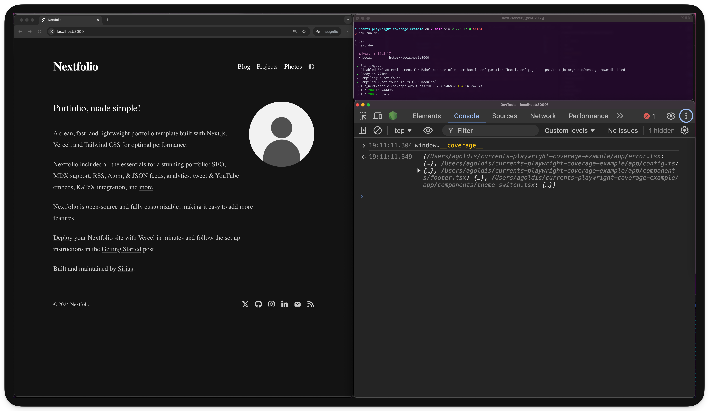
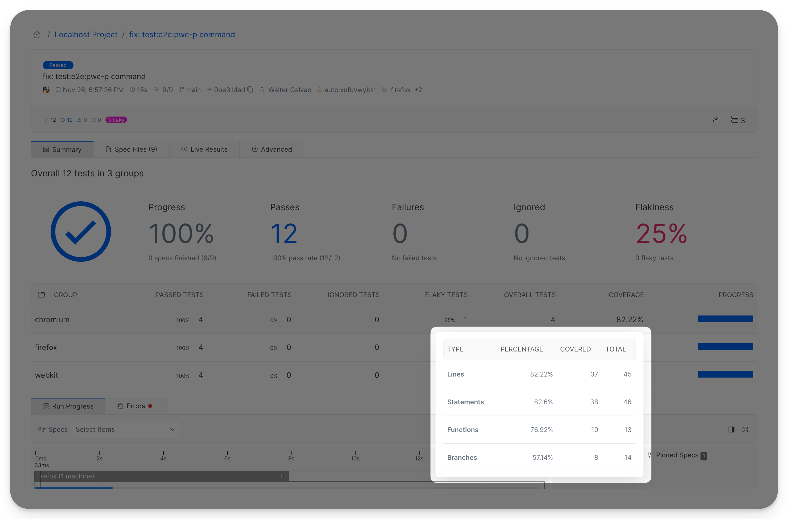

# Code Coverage for Playwright

## Intro

This guide teaches how to report Playwright Code Coverage to Currents. If you are looking for information about how Code Coverage works, or what is Currents, head to the pages below.


[.](./)



[..](../../)


## Report code coverage to Currents

Reporting code coverage to Currents as part of running your Playwright tests consist of 3 steps:

1. Setting up the project
2. Instrumenting the code
3. Configuring Playwright coverage fixtures
4. Updating the tests code

### Setting up the Currents reporter


* Follow the [feature request](https://currents.featurebase.app/p/v8-coverage-reports-for-playwright) to get notified when we enable V8 coverage reports
* Check out the [example GitHub repository](https://github.com/currents-dev/currents-playwright-coverage-example)&#x20;



Requires`@currents/playwright` v1.7.0+


Install and configure Currents reporter following [you-first-playwright-run.md](../../getting-started/playwright/you-first-playwright-run.md "mention"). Make sure that [currents-playwright](../../resources/reporters/currents-playwright/ "mention") reporter is configured with the right [record-key.md](../record-key.md "mention") and **Project ID**.&#x20;

By default Currents reporter uploads all discovered coverage reports, you can include only certain Playwright projects by setting the coverage `projects` option, when using the reporter


```typescript
import {
  CurrentsConfig,
  CurrentsFixtures,
  currentsReporter,
  CurrentsWorkerFixtures,
} from "@currents/playwright";
import { defineConfig, PlaywrightTestConfig } from "@playwright/test";

const currentsConfig: CurrentsConfig = {
  recordKey: "xxx",
  projectId: "yyy",
  coverage: {
    projects: ['projectA', 'projectB],
  },
};

const config = defineConfig<CurrentsFixtures, CurrentsWorkerFixtures>({
  use: {
    ...
    currentsConfigOptions: currentsConfig,
  },

  reporter: [currentsReporter(currentsConfig)],
  ...
});

export default config;
```


or setting the `--pwc-coverage projectA,projectB` when using the `pwc` CLI command

```bash
npx pwc --key <record-key> --project-id <project-id> --pwc-coverage projectA,projectB
```

To check other configuration options run `pwc` command with the `--help` flag.

### Instrumenting the code

Use the table below for enabling Istanbul instrumentation for your framework / bundler.

<table><thead><tr><th width="158">Bundler</th><th>Plugin</th></tr></thead><tbody><tr><td>webpack</td><td><a href="https://github.com/istanbuljs/babel-plugin-istanbul">babel-plugin-istanbul</a></td></tr><tr><td>vite</td><td><a href="https://github.com/ifaxity/vite-plugin-istanbul">vite-plugin-istanbul</a></td></tr><tr><td>rollup</td><td><a href="https://github.com/artberri/rollup-plugin-istanbul">rollup-plugin-istanbul</a></td></tr><tr><td>swc</td><td><a href="https://github.com/kwonoj/swc-plugin-coverage-instrument">swc-plugin-coverage-instrument</a> (experimental)</td></tr><tr><td>esbuild</td><td><a href="https://www.npmjs.com/package/esbuild-plugin-istanbul">esbuild-plugin-instanbul</a></td></tr></tbody></table>

Once enabled, you'd be able to see `window.__coverage__` object in your browser's console when opening your webapp. Don't hesitate to contact Currents Support if you need help with instrumenting your code.

### Playwright Fixtures for Code Coverage

`@currents/playwright` provides a set of [Playwright fixtures](https://playwright.dev/docs/test-fixtures) that simplify extraction and collection of coverage reports.&#x20;


It is a good practice to [extend](https://playwright.dev/docs/api/class-test#test-extend) the default Playwright `test` method, for example to enable [Page Object Model](https://playwright.dev/docs/pom), [sharing a state](https://playwright.dev/docs/test-fixtures#worker-scoped-fixtures) between multiple tests etc.  See [playwright-fixtures.md](../../resources/reporters/currents-playwright/playwright-fixtures.md "mention") for more information.



```ts
   import {
     CurrentsFixtures,
     CurrentsWorkerFixtures,
     fixtures,
   } from "@currents/playwright";
   import { test as base } from "@playwright/test";
   
   export const test = base.extend<CurrentsFixtures, CurrentsWorkerFixtures>({
     ...fixtures.baseFixtures,
     ...fixtures.coverageFixtures,
   });
```


If you are using custom fixtures, please refer to [Combining Currents fixtures with existing custom fixtures](../../resources/reporters/currents-playwright/playwright-fixtures.md#combine-currents-fixtures-with-existing-custom-fixtures) to ensure they are set up correctly.

### Update tests to use new test method

Import and use the extended `test` for every test case to enable automatic collection of coverage reports

```ts
import { expect } from "@playwright/test";
import { test } from "./base.ts";
```

After completing this step and running the tests, Currents reporter will automatically merge and upload for post-processing the coverage reports. There's no need to run explicit upload commands.

### NextJS + Babel Example&#x20;

We will be using the [example GitHub repository](https://github.com/currents-dev/currents-playwright-coverage-example) to configure code coverage reporting for NextJS + babel.

Install `babel-plugin-istanbul`

```sh
npm i -D babel-plugin-istanbul
```

Update (or create) `babel.config.js`


```js
module.exports = {
  presets: ["next/babel"],
  plugins: ["istanbul"],
};
```


After completing this step, your app's code is instrumented. Running `npm run dev` and opening your browser will activate the underlying code coverage methods and you'll see coverage information in `window.__coverage__` object.

<figure><figcaption><p>Exploring window.__coverage__ object</p></figcaption></figure>

Note that Playwright tests use the extended `test.extend` command with Currents coverage fixtures. Running Playwright tests `npm run test` will activate a pre-configured Currents reporter and will send the code coverage information together with the rest of the results:

<figure><figcaption></figcaption></figure>
