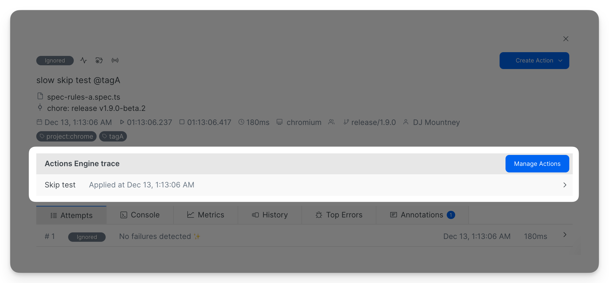

# Using Currents Actions


* Users with **Admin** role can create and modify actions.&#x20;
* Users with **Member** role can browse actions in read-only mode.


Access the Actions Management view via **Menu > Manage Project > Actions** to browse, create and modify actions.

### Action State

An action can be in one of the following states:

* Active - the action is active and it will apply based on its conditions;
* Expired - the action has expired and isn't applicable anymore;
* Disabled - the action was disabled by a user.

By default only **Active** actions are visible, change the visibility filter to see additional items.

<figure><figcaption>
Actions Management View
</figcaption></figure>

### Creating a new Action

Click **Create Action** to open action creation modal. Enter the action details:

* **Name** - human readable name
* **Description** - verbose explanation of the action intent
* **Expiration date and time** - the action will be marked as Expired and will not apply after the specified date
* **Condition** - set of conditions (filters) that a test must satisfy to activate an action. Refer to [conditions.md](reference/conditions.md "mention") reference documentation
* **Actions** - set of actions that will apply if a test matches the conditions. Refer [actions.md](reference/actions.md "mention") reference documentation

<figure><figcaption>
Action Creation Form
</figcaption></figure>

Users with Admin role can **Disable** or **Edit** an action after its creation.&#x20;

<figure><figcaption>
Action Edit History
</figcaption></figure>

### Action Creation Shortcut

When browsing test results you can create new actions using the inline Create Action shortcut. Clicking one of the predefined actions will open action creation form pre-populated with the current test details.

<figure><figcaption>
Using inline action creation shortcut
</figcaption></figure>

### Action Traceability

If a test was affected by an action, it will display Actions Engine trace. Clicking on a trace item takes users to the associated Action definition.

<figure><figcaption></figcaption></figure>

