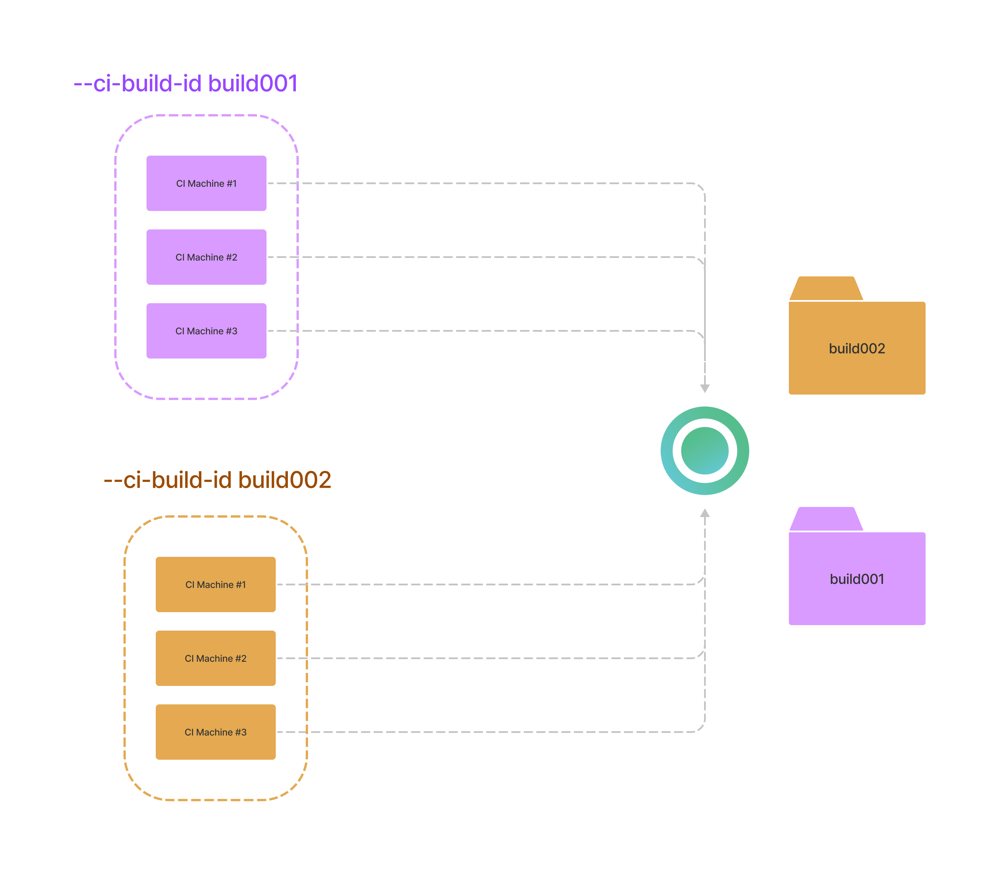

# CI Build ID

### What is CI Build ID?

**CI Build ID** is a unique build identifier used by Currents to distinguish parallel cypress and playwright test runs one from another. Multiple CI machines using the same CI Build ID will belong to the same test run.

Currents use CI build ID for Cypress and Playwright tests in order to identify and distinguish results belonging to different builds, and also to enable orchestration for Cypress builds.

### CI Build ID and parallelization

#### Using unique CI Build ID in different builds

Imagine a CI pipeline running tests in parallel using 3 machines. Starting two builds with **different CI Build ID** will result in creating 2 distinct "Runs" in Currents dashboard.



The parallelization will happen for each build independently from the other. That is usually the desired situation - each build should provide a unique CI Build ID.

#### Using the same CI Build ID in different builds

In contrast, consider a situation when 2 **different** builds use the **same** CI Build ID. That's a very uncommon situation, but it's worth demonstrating for understanding the use of CI Build ID.


Even though we have created two different builds, they share the same CI Build ID. That will result in 6 machines executing the same parallelized set of tests. All the spec files will be distributed between those machines.

One popular and confusing scenario is:

* the first build completes all the tests
* the second build uses the same CI Build ID and immediately finishes without running any test at all

That's because both builds use the same CI Build ID - the second build "joins" an already finished run that has no more tests to execute.

### Generating a unique CI Build ID

Currents Dashboard generates CI Build ID automatically for popular CI environments, based on [environment variables](https://github.com/cypress-io/cypress/blob/develop/packages/server/lib/util/ci\_provider.js#L133:L133).

However, you can specify CI Build ID explicitly using `--ci-build-id` flag, for example:

```bash
currents run --ci-build-id $BRANCH_$BUILDID --parallel --record --key xxx 
```

In order to manually construct a CI Build ID that is unique for each build (but similar across all the participating machines) it is recommended to use your CI provider's environment variables that combine pipeline/job/build identifier and also an attempt number.

For example, for GitHub Actions:

```
"${{ github.repository }}-${{ github.run_id }}-${{ github.run_attempt }}"
```

Here's a list of popular providers and the environment variables that can be used to construct CI Build ID.

| CI Provider    | Env Variable                                    |
| -------------- | ----------------------------------------------- |
| AWS CodeBuild  | CODEBUILD\_INITIATOR                            |
| Bitbucket      | BITBUCKET\_BUILD\_NUMBER                        |
| GitHub Actions | <p>RUN_ID +</p><p>RUN_ATTEMPT</p>               |
| CircleCI       | <p>CIRCLE_WORKFLOW_ID +<br>CIRCLE_BUILD_NUM</p> |
| GitLab         | CI\_PIPELINE\_ID                                |
| Jenkins        | BUILD\_NUMBER                                   |
| Travis         | TRAVIS\_BUILD\_ID                               |


Refer to your CI provider documentation for the list of available environment variables. Also, see the [official cypress documentation on CI Build ID.](https://docs.cypress.io/guides/guides/parallelization#CI-Build-ID-environment-variables-by-provider)

### FAQ: Why does each CI machine run all the tests?

In most chances, each CI machine generates a different CI Build ID. Each unique CI Build ID creates a new run and executes all the tests. Please make sure that you provide the same CI Build ID across different  CI machines that are part of the same build.

### FAQ: Retrying a build doesn't run cypress tests at all

Most chances you're reusing a CI Build ID for a run that was already completed. In order to create a new run, please use a new, unique CI Build ID.

### FAQ: Retrying builds and CI Build ID

Imagine a situation

* You start a new build with CI Build ID **build-001**
  * Build completes and reports all the results to Currents Dashboard
  * Currents marks build-001 as "finished" and all the files as completed
* You restart the build (attempt B), but keep the same CI build ID **build-001**
  * Currents considers **build-001** as already completed
  * Currents won't accept new results for **build-001**, because all the results were already reported&#x20;
  * Currents will not send any new files for Cypress orchestration, because build-001 already ran all the spec files on the first attempt

To resolve this ambiguity, we need to have a different CI build ID for each rerun.

Most CI providers provide a different set of environment variables for different attempts and  Currents dashboard can identify it automatically - it will create an entirely new run for retries.

You can also construct an explicit CI Build ID when retrying a build, for example, for GitHub Actions:

```
"${{ github.repository }}-${{ github.run_id }}-${{ github.run_attempt }}"
```

If you are generating CI Build ID manually, please make sure to include the retry/attempt identifier.&#x20;

Please refer to your CI tool documentation to explore what environment variables are available for composing a valid CI Build ID.

### FAQ: Using commit SHA as CI Build ID

Using commit SHA as a CI Build ID is a valid approach and can work for many setups. However, please be aware that rerunning a build with the same commit SHA can result in a duplicate CI Build ID and prevent orchestration and reporting (see [#faq-retrying-builds-and-ci-build-id](cypress-ci-build-id.md#faq-retrying-builds-and-ci-build-id "mention"))

### FAQ: Retrying a build only for failed tests

TL;DR Currents Dashboard will always run all the tests using the available machines, even for reruns. That's due to the architectural limitations of load balancing.

Some CI providers (e.g. GitLab, GitHub) allow reruns only for the failed containers. Invoking such a rerun will result in:

* a unique CI Build ID would be generated
* it will create a completely new run within the dashboard
* the dashboard will load balance all the specs among all the available containers

So, you end up running all the tests using a just subset of available containers.

We have been experimenting with alternative load-balancing strategies that would allow seamless reruns. Please reach out to our customer support if you want to get updates regarding the progress.


**Please note:** GitLab does not provide a "rerun identifier" within its CI environment. See the WIP [discussion](https://gitlab.com/gitlab-org/gitlab/-/issues/195618#note\_1139938057).

