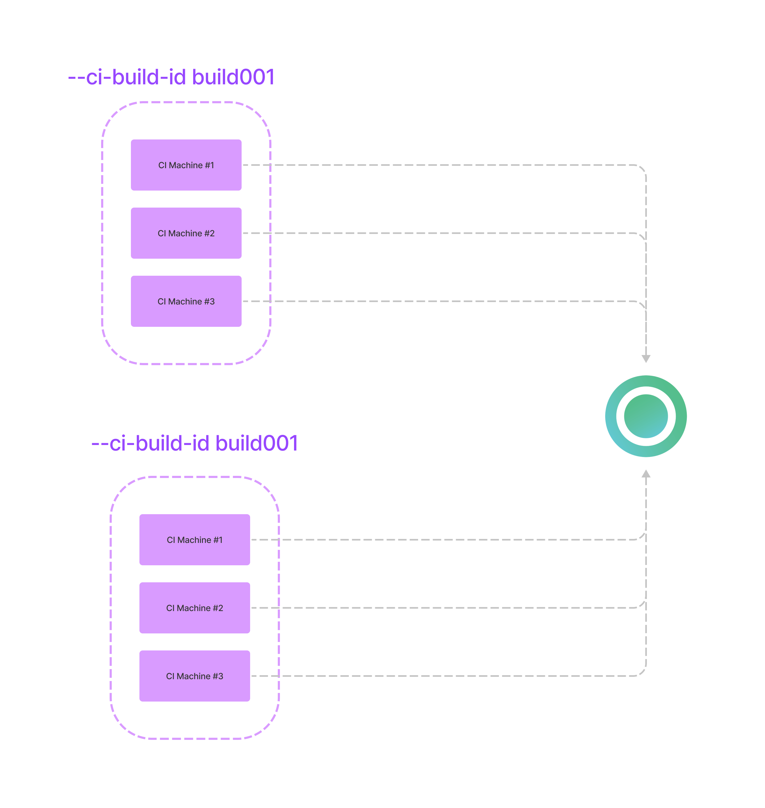

# Cypress CI Build ID

### What is Cypress CI Build ID?

CI Build ID is a unique build identifier used by Currents to distinguish parallel cypress test runs one from another. Multiple CI machines using the same CI Build ID will belong to the same test run.

### How is CI Build ID used?

#### Using unique CI Build ID in different builds

Imagine having a CI pipeline that runs cypress tests in parallel using 3 machines. Starting two instances of the pipeline (builds) that use different CI Build ID will result in creating 2 distinct "Runs" in Currents dashboard.


The parallelization will happen for each build independently from the another. That is usually the desired situation - each build should provide a unique CI Build ID.

#### Using the same CI Build ID in different builds

In contrast, consider a situation when 2 **different** CI builds use the **same** CI Build ID. That's very uncommon situation, but it's worth demonstrating for understanding the use of CI Build ID.



Event though we have created two different CI builds, they share the same CI Build ID. That will result in 6 machines executing the same parallelized run of cypress tests. All the spec files will be distributed between those machines.

One popular scenario that brings of confusion is:

* the first build completes all the tests
* the second build uses the same CI Build ID and immediately finishes without running any test at all

That's because both builds reuse of the same CI Build ID - the second build "joins" already finished run that has no more tests to execute.

### How to generate a unique CI Build ID?

Cypress runner calculates CI Build ID automatically for popular CI environments, based on [environment variables](https://github.com/cypress-io/cypress/blob/develop/packages/server/lib/util/ci\_provider.js#L133:L133).

You can specify CI Build ID using `--ci-build-id` flag, for example:

```bash
currents run --ci-build-id $BRANCH_$BUILDID --parallel --record --key xxx 
```

In order to manually construct a CI Build ID that is unique for each build (but similar across all the machines within the same build) it is recommended use your CI providers environment variables.

A typical CI Build ID is an environment variable (or combination of variables), representing your build uniquely, for example, for GitHub Actions:

```
"${{ github.repository }}-${{ github.run_id }}-${{ github.run_attempt }}"
```

Here's a list of popular providers and the environment variables that can be used to construct CI Build ID.

| CI Provider    | Env Variable                                    |
| -------------- | ----------------------------------------------- |
| AWS CodeBuild  | CODEBUILD\_INITIATOR                            |
| Bitbucket      | BITBUCKET\_BUILD\_NUMBER                        |
| GitHub Actions | <p>RUN_ID +</p><p>RUN_ATTEMPT</p>               |
| CircleCI       | <p>CIRCLE_WORKFLOW_ID +<br>CIRCLE_BUILD_NUM</p> |
| GitLab         | CI\_PIPELINE\_ID                                |
| Jenkins        | BUILD\_NUMBER                                   |
| Travis         | TRAVIS\_BUILD\_ID                               |


Refer to your CI provider documentation for the list of available environment variables. Also see the [official cypress documentation on CI Build ID.](https://docs.cypress.io/guides/guides/parallelization#CI-Build-ID-environment-variables-by-provider)

### Why each CI machine run all the cypress tests?

Most chances each CI machine generates a different CI Build ID. Each unique CI Build ID creates a new run and executes all the tests. Please make sure that you provide the same CI Build ID across different  CI machines.

### Why retrying a build run no cypress tests at all?

Most chances you're reusing a CI Build ID for a run that was already completed. In order to create a new run, please use a new, unique CI Build ID.

### How retrying a build affects CI Build ID?

Most CI providers generate a completely new build when retrying a failed build - that generate a new set of environment variables, which are different from the original build attempt. That naturally works with Currents dashboard and creates a completely new run for retries.

You can also construct an explicit CI Build ID when retrying a build, for example, for GitHub Actions:

```
"${{ github.repository }}-${{ github.run_id }}-${{ github.run_attempt }}"
```

Keep in mind that you will need to generate a new CI Build ID when retrying a build - refer to your CI tool documentation to explore what environment variable are available for composing a valid CI Build ID.


Some CI providers (e.g. GitLab) behave differently:

* retrying does not start a new build, it reruns only failed containers
* no environment variable representing "retries" is available at runtime

That makes "retrying" builds problematic and custom workarounds are required.


