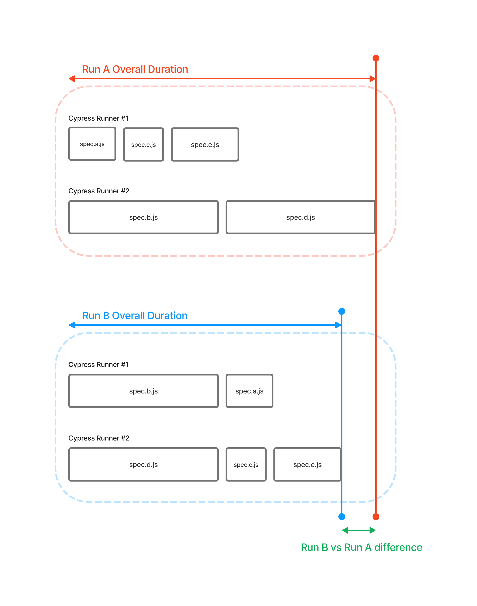

# Load Balancing

Running your cypress tests suite in parallel on multiple machines can greatly reduce the overall duration. You can further optimize the speed of parallel cypress tests by optimally sorting based on their expected duration. In some cases it's worth to prioritize tests based on a different heuristic - for example, run test with highest failure or [flakiness rate](../tests/flaky-tests.md).

Orchestration services like Currents Dashboard use historical data to optimize the execution order of cypress tests and utilize different strategies for ordering the execution.

### Optimal sorting by expected duration

The default Currents dashboard  orchestration strategy cypress tests is sorting by expected duration. Consider the example of 2 cypress runners, executing a suite consisting of 5 cypress spec files.

* <mark style="color:red;">Run A</mark> doesn't utilize any kind of sorting - longer spec files can be assigned to the same machine, therefore cypress runner #1 will be idle and overall duration is longer comparing to <mark style="color:blue;">Run B</mark>
* <mark style="color:blue;">Run B</mark> utilizes optimal sorting - longer spec files run first, as the result the tests are getting distributed more equally between the runners and overall run duration is less compared to <mark style="color:red;">Run A</mark>.

By ordering cypress spec files according to their expected duration and optimizing the distribution of the files between cypress runners (CI machines), we can greatly reduce the overall duration of runs and complete our cypress tests suite faster.

Typically cypress tests are running as part of your CI pipeline, having this kind of optimization reduces the overall duration of cypress runs and saves valuable time, reduces CI machines utilization and allows developers to get feedback faster.

For larger teams with a significant amount of cypress tests, the cumulative gains of reducing the duration of cypress tests can be significant.&#x20;
