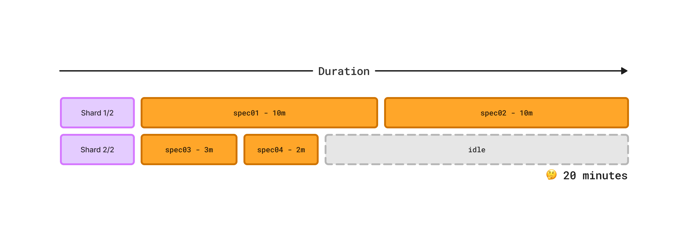
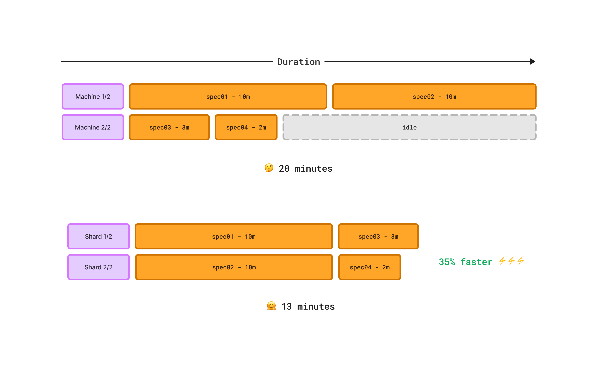
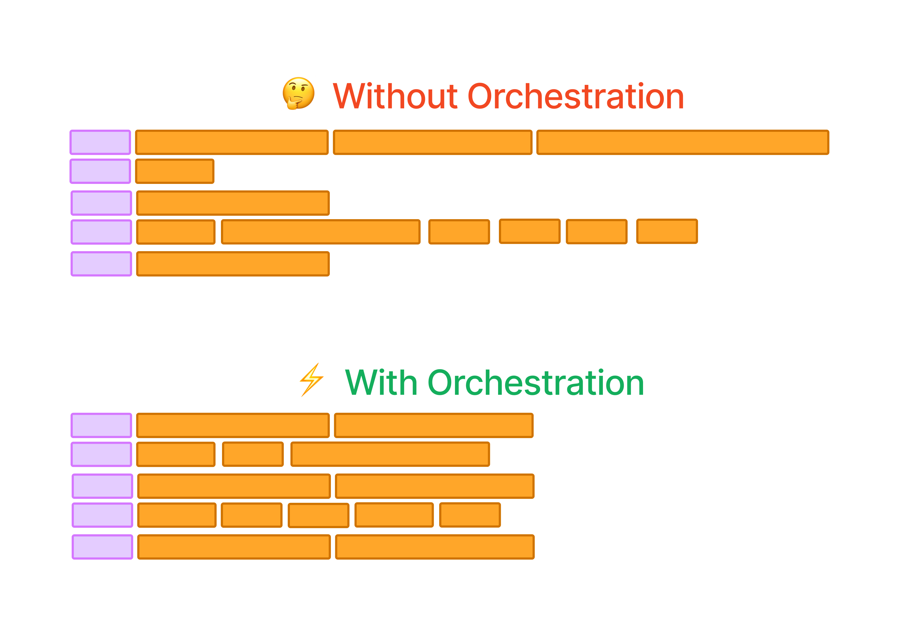

# Playwright Orchestration

Orchestration for Playwright can help to decrease the duration of Playwright tests in CI pipelines. We've seen up to 40% decrease in CI runs duration, compared to the traditional [playwright-sharding.md](playwright-sharding.md "mention").

### Playwright Orchestration vs Sharding

There are various approaches to running playwright tests in parallel on CI. Let's try to understand the differences.

#### Playwright Sharding

Sharding is natively supported by Playwright, for example, if you have want to run the tests in parallel on two machines, you would run the following command on each:

* `machine #1: playwright test --shard 1/2`
* `machine #2: playwright test --shard 2/2`

Playwright will use the internal heuristic to split the tests between the available shards, so that each machine runs a different set of tests. The traditional Playwright sharding method splits spec files between available shards (machines) based on filenames. It often leads to unbalanced workloads because spec files execution time can vary significantly.

Take, for example, a testing suite consisting of 4 spec files with the following durations:

* `spec01`: 10 minutes
* `spec02`: 10 minutes
* `spec03`: 3 minutes
* `spec04`: 2 minutes

With 2 machines, traditional sharding might distribute the files as follows, leading to an inefficient total execution time of 20 minutes due to one shard being heavily loaded while the other finishes quickly:

* Shard 1: `spec01`, `spec02` (20 minutes total)
* Shard 2: `spec03`, `spec04` (5 minutes total)

<figure><figcaption><p>Native Playwright sharding assigns spec files to shards without considering their duration</p></figcaption></figure>

This imbalance means that some shards may end up processing only long-running spec files, while others quickly finish with shorter tests, leading to idle resources.

#### Playwright Orchestration

An alternative approach to sharding is orchestration - i.e. using an external service to act as an "orchestrator" and instruct each machine what tests to run. The "orchestrator" can make decisions on how to split the tests between the available machines based on various criteria - for example,

* balancing tests in the most optimal way - e.g. reducing duration, prioritizing certain tests
* dynamically changing assigned tests based on the available machines
* rerouting tests from crashed CI containers to healthy containers (see spot instances use case below)

The most popular problem is reducing CI duration and utilizing the CI resources effectively, so let's focus on it.&#x20;

An optimal assignment would consider the duration of spec files and can significantly improve the efficiency of test execution. By balancing the workload across CI machines based on their expected durations, you minimize overall execution time and make better use of resources.

&#x20;For the earlier example:

* Shard 1: `spec01` (10 minutes) and `spec03` (3 minutes), totaling 13 minutes.
* Shard 2: `spec02` (10 minutes) and `spec04` (2 minutes), also totaling 12 minutes.

<figure><figcaption><p>An optimal balancing of spec files allows to speed up CI execution</p></figcaption></figure>

The difference in execution time 13 vs 20 minutes, which is a 35% improvement. Read more about [load-balancing.md](../load-balancing.md "mention").

#### Optimal Tests Balancing with Playwright Orchestration <a href="#optimal-tests-balancing-with-playwright-orchestration" id="optimal-tests-balancing-with-playwright-orchestration"></a>

Playwright Orchestration by Currents automates the process of achieving a balanced distribution of spec files based on their expected duration. Here are the key benefits:

* ✅ No need to manually update CI configuration when changing the number of shards - Currents automatically assigns the spec files to all available CI machines.
* ✅ No need to change spec files' names to achieve a better balance between the shards.
* ✅ No need to manually track spec files duration and adjust the sharding configuration.
* ✅ No complex configuration or setup - simply use the pwc-p command (included in `@currents/playwright`) to run your tests.

This approach has enabled us to reduce the execution time of CI Playwright tests by **up to 40% for several of our customers**, with minimal changes to their existing CI configurations.

<figure><figcaption><p>Currents Orchestration balances the spec files between the shards based on their duration</p></figcaption></figure>

The Playwright's Orchestration has various strategies. The assignment of a spec file can account for other factors like expected duration and flakiness rate.&#x20;

For example, Currents can prioritize the spec files more likely to fail. Combined with the [Fail Fast Strategy](https://currents.dev/readme/guides/fail-fast-strategy), Currents will halt the execution across all the shards if a certain number of failures is detected. Learn more about it on [Load Balancing.](https://docs.currents.dev/guides/load-balancing)

### How to enable Playwright Orchestration?


Beware of the [#limitations-and-nuances](playwright-orchestration.md#limitations-and-nuances "mention")


To enable Playwrigth Orchestration, you need to have an account with Currents:

* Create an account at [https://app.currents.dev](https://app.currents.dev)
* Get **Project ID** and [record-key.md](../../record-key.md "mention")

After creating an account, install the most recent version of `@currents/playwright.`&#x20;

The package has a CLI tool `pwc-p,` which is a small wrapper that implements Playwright Orchestration:

* it scans the testing suite
* it establishes an orchestration session with Currents servers
* it runs Playwright, executing spec files in the optimal order
* the results are recorded to Currents for troubleshooting and analysis

For example:

```bash
npm i @currents/playwright
npx pwc-p --key <record-key> --project-id <project-id> --ci-build-id <ci-build-id>
```


There's no need to define  shards, make sure to remove `--shard` flag. Currents will assign the tests to all the available machines automatically.&#x20;



If you are not already familiar, read more about [ci-build-id.md](../../ci-build-id.md "mention") .


A successfully created orchestration will print an output similar to this:

```bash
$ npx pwc-p --key **redacted** --project-id **redacted** --ci-build-id `date +%s`  -c ./or8n/playwright.config.ts
🚀 Starting orchestration session...
📦 Currents reporter: 1.1.2 recording CI build 1712134904 for project JJzd65, orchestration id 260264cfa16950ab4dc98d5c54333136
🎭 Playwright: 1.42.1 5 tests in 1 project [chromium]

🌐 Executing orchestrated task: [chromium] spec-or8n-e.spec.ts
🌐 Run URL: https://app.currents.dev/run/9b93659915fe653f
# ...start executing the tests in an optimal order.
```

`pwc-p` accepts additional playwright arguments and flags (see [currents-playwright](../../../resources/reporters/currents-playwright/ "mention"))  for example:

```bash
# Add additional playwright arguments and flags:
pwc-p --key <record-key> --project-id <id> --ci-build-id <build-id> -- --workers 2 --timeout 10000
```

### Dynamically switching tests between machines&#x20;

An additional benefit of an external service like Currents for balancing tests is the ability to automatically reassign tests tests from one machine to another, depencing on certain conditions.

For example - many cloud providers have an option to use [Spot Instances](https://aws.amazon.com/ec2/spot/) for running workloads. Using Spot Instances can cost up to 90% lower, compared to the traditionally allocated resources.

Read more [ci-tests-on-spot-instances.md](ci-tests-on-spot-instances.md "mention").

### Using additional reporters

Additional reporters can be provided as a cli flag on the command line.&#x20;

```bash
# passing additional reporters:
pwc-p --key <record-key> --project-id <id> --ci-build-id <build-id> --reporter="./myreporter/my-awesome-reporter.ts"
```

Reporters that output files may require additional configuration to avoid overwriting file output due to a new playwright process being run for each spec when using orchestration. Using the `blob` reporter is one way to gather all the local results and merge them for your reporter.

```bash
# The PWTEST_BLOB_DO_NOT_REMOVE env variable is needed 
# to preserve the `blob-report` directory between orchestrated spec runs
PWTEST_BLOB_DO_NOT_REMOVE=1 pwc-p --key <record-key> --project-id <id> --ci-build-id <build-id> --reporter blob
```

You can generate other reports by passing the blob results to the merge-reports command.

```bash
npx playwright merge-reports --reporter=html ./blob-report
```

Check an [example of Github Actions setup here.](https://github.com/currents-dev/playwright-gh-actions-demo/blob/main/.github/workflows/test-or8n.yml)

### Limitations and Nuances

* Orchestration is only effective for suites with relatively large number of **spec files** (not tests)
* Orchestration works on a **file level** - i.e. it balances spec files (rather than tests) between the available machines
* Orchestration runs one spec file at a time on each machine - it is recommended to enable [`fullyParallel`](fully-parallel-mode.md) mode to fully utilize the available CPUs

Beware of the following limitations

* [**Playwright Project dependencies**](https://playwright.dev/docs/test-projects#dependencies) are not currently supported - i.e. if you have projects that depend one on another, orchestration will not consider the dependencies. As a workaround, run the projects in the desired order explicitly by defining separate CI steps with `--project <name>` [specification.](https://playwright.dev/docs/test-projects#run-projects)&#x20;
* [**Global Setup and Teardown**](https://playwright.dev/docs/test-global-setup-teardown). An orchestrated execution will run a playwright command for each individual file of your testing suite. Beware, that the global setup or teardown routines will run for each spec file, accordingly.&#x20;
* **Rerunning a failed CI** execution requires generating a new [ci-build-id.md](../../ci-build-id.md "mention") also a rerun will include all the tests - not only the failed ones.&#x20;
*   Playwright's `--last-failed` [flag](https://playwright.dev/docs/test-cli#reference) reruns the failed tests using the results from  `last-run.json` file (generated automatically by Playwright). When running in CI using `--last-failed` becomes tricky:

    * sharded runs contain only a subset of test results, rather than the the results of the whole run
    * orchestrated runs execute one spec file at a time, hence it will generate a new file for every spec file

    If you want to rerun only the failed test you would need to collect the failed results from multiple machines (and files), alternatively you can use [api](../../../resources/api/ "mention") to get all the failures at once.
* The `pwc-p` command overrides any reporters specified in your configuration. To use additional reporters they need to be [provided on the command line](playwright-orchestration.md#using-additional-reporters).&#x20;
