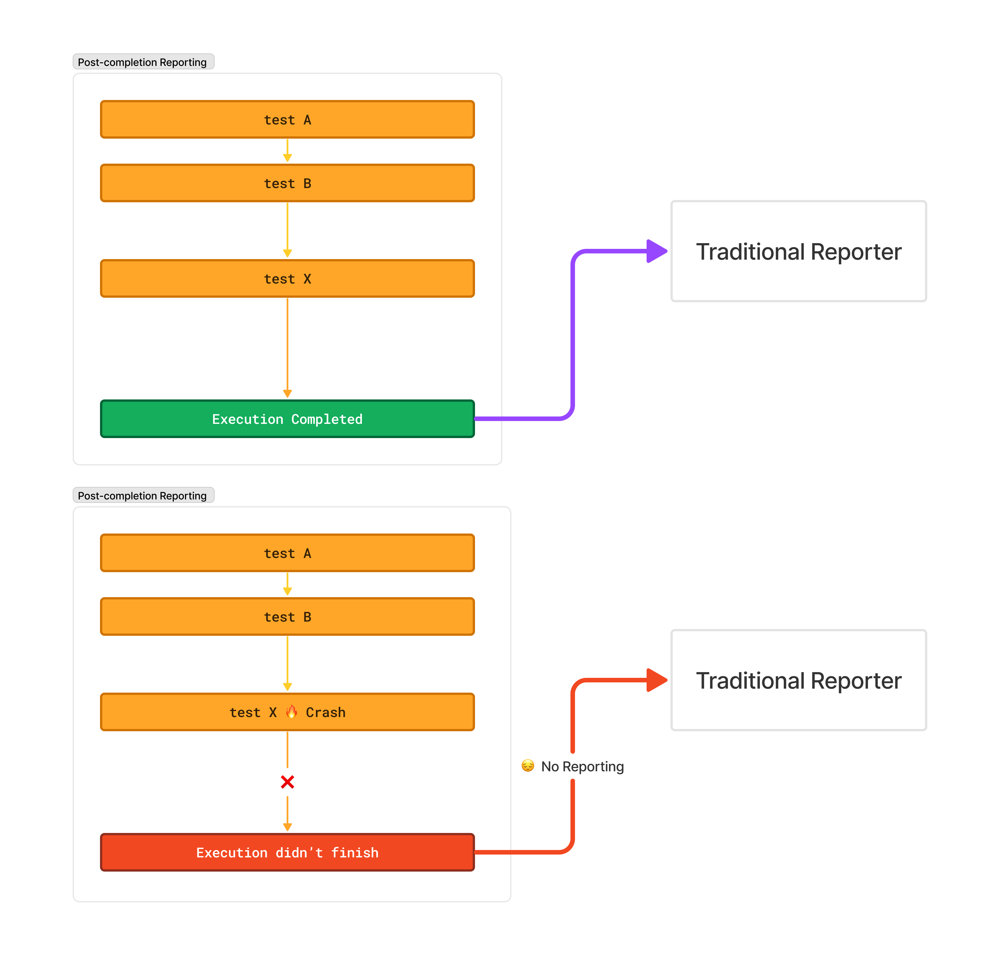

# Step-Level Reporting

Traditionally, Playwright reporters generate results **after** the run completion, when all the results are ready. This approach works well when executions are successful. However, when an execution fails to complete, no results are reported at all.

For example, imagine running a spec file with 10 tests on a CI machine. Nine tests can be completed successfully, but the last test can cause a crash. If we report after completion, no results will be reported at all, even for the nine finished tests.

<figure><figcaption>
Failure to finish test execution can result in no results reported at all
</figcaption></figure>

This problem affects not only the test results per se but also the generating and uploading of artifacts like traces, screenshots, and videos. We observed this issue occurring in different scenarios, ranging from infrastructure issues to Playwright bugs.

We wanted to provide a crash-resilient solution that would help debug failed CI tests and provide as much information as possible as soon as it is available. The Currents reporter **streams the results for each individual step**, including step-level lifecycle events (e.g., step started, step ended), as soon as they're available. So, even if an execution crashes, Currents will capture the last step that caused the failure.

In addition, Currents uploads the generated artifacts to cloud storage as soon as they are available, so you can access them even if the execution crashes.

<figure><figcaption>
Streaming step-level results in Currents reporter for Playwright tests
</figcaption></figure>

In addition to being resilient to crashes, collecting data about individual steps allows Currents to present detailed information via its web interface. The results are stored in cloud storage, providing easy access to the entire team during Playwright tests execution. Think of it as a light version of Playwright traces that are available immediately and are not dependent on the test completion or the successful upload of a trace file.

Such detailed information unlocks more insights, like step-level analytics and performance analysis.

<figure><figcaption>
Streaming step-level results in Currents reporter for Playwright tests
</figcaption></figure>

It's important to note that step-level reporting is available because the Playwright team and other contributors have designed and provided the necessary APIs to capture the lifecycle events of the test execution.
