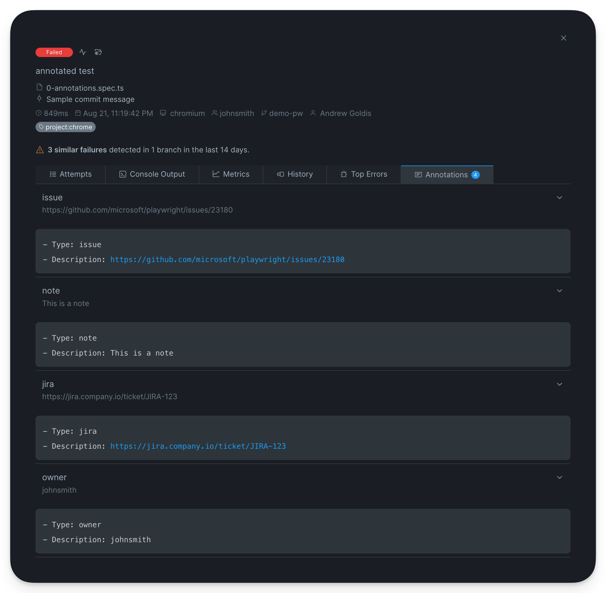
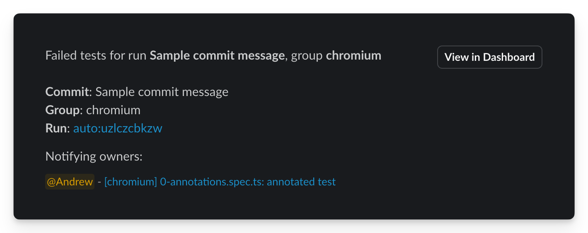

# Playwright Annotations

[Playwright Annotations](https://playwright.dev/docs/test-annotations) is a flexible way to add additional information about tests, like:

* ownership information
* metadata
* links to external resources (Jira ticket, GitHub issue)
* notes

Together with [playwright-tags.md](playwright-tags.md "mention") it allows augmenting your testing suite more data for easier managing, better reporting and improved integration.&#x20;

You can add an annotation to a test by setting `annotations` object to `test` definition or invoking `testInfo.annotations.push` , for example

```typescript
test("annotated test", {
    annotation: {
      type: "issue",
      description: "https://github.com/microsoft/playwright/issues/23180",
    },
}, async ({ page }, testInfo) => {
  testInfo.annotations.push({
    type: "note",
    description: "This is a note",
  });

  testInfo.annotations.push({
    type: "jira",
    description: "https://jira.company.io/ticket/JIRA-123",
  });

  testInfo.annotations.push({
    type: "owner",
    description: "johnsmith",
  });
});
```

Currents displays the annotations for recorded tests:

<figure><figcaption><p>Playwright annotations in Currents</p></figcaption></figure>

### Test Owners

While Currents displays all the annotations related to a test, some annotation have a special meaning, for example - test owner.

To designate an owner of a test, add annotation with `type: owner`, for example:

```
testInfo.annotations.push({
  type: "owner",
  description: "johnsmith",
});
```

The value will appear in various areas of the dashboard so that your team can quickly identify the who owns the test.

<figure><figcaption><p>Showing test owner using annotations in Currents </p></figcaption></figure>

#### Slack notification for Test Owners

Currents will mention the test owners when their tests fail via Slack (if Slack integration is enabled). Currents will send the list of failed tests together with the associated owners - if the owner field value container their [Slack username](https://www.highviewapps.com/kb/how-do-i-find-my-slack-username/), they will activate the "mention" notification.

* Add Slack username, like `johnsmith` to notify individual users
* Add `<!channel>` to notify the whole channel associated with the Slack integration (equivalent to typing `@channel` in Slack UI)

You can specify multiple owners using comma-separated value, for example `user1, user2`

<figure><figcaption><p>Using Slack to activate Slack notifications</p></figcaption></figure>
