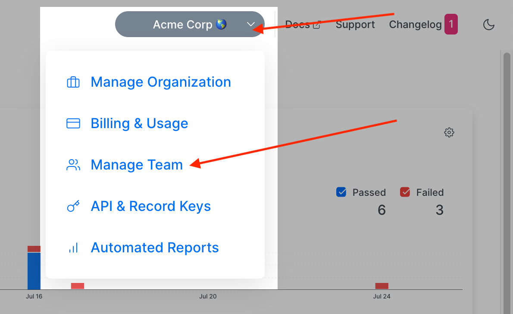

# Playwright Annotations


Requires `@currents/playwright` 1.5.0+


[Playwright Annotations](https://playwright.dev/docs/test-annotations) is a flexible way to add additional information about tests, like:

* ownership information
* metadata
* links to external resources (Jira ticket, GitHub issue)
* notes

Together with [playwright-tags.md](playwright-tags.md "mention") it allows augmenting your testing suite with metadata for easier managing, better reporting and improved integrations.&#x20;

You can add an annotation to a test by adding `annotations` object to `test` definition or invoking `testInfo.annotations.push`, for example

```typescript
test("annotated test", {
    annotation: {
      type: "issue",
      description: "https://github.com/microsoft/playwright/issues/23180",
    },
}, async ({ page }, testInfo) => {
  testInfo.annotations.push({
    type: "note",
    description: "This is a note",
  });

  testInfo.annotations.push({
    type: "jira",
    description: "https://jira.company.io/ticket/JIRA-123",
  });

  testInfo.annotations.push({
    type: "owner",
    description: "johnsmith",
  });
});
```

Currents displays the annotations for recorded tests:

<figure><figcaption><p>Playwright annotations in Currents</p></figcaption></figure>

Currents will apply the following rules when parsing annotations:

* types: `skip, fixme, fail` are reserved by Playwright
* `32` max distinct annotations per test, extra annotations will be truncated (sortedby the order of appearance)
* `type` field is limited to `256` characters, the values will be trimmed and truncated to the max length
* `description` field is limited to `2048` characters, the values will be trimmed and truncated to the max length
* If `type` field is empty after trimming, the annotation will be ignored
* fields with the same `type` will be merged - their description will be merged into one field, separated by comma

### Test Owner Annotation

While Currents displays all the annotations related to a test, some annotation have a special meaning, for example - test owner.

To designate an owner of a test, add annotation with `type: owner`, for example:

```
testInfo.annotations.push({
  type: "owner",
  description: "johnsmith",
});
```

The value will appear in various areas of the dashboard so that your team can quickly identify the who owns the test.

<figure><figcaption><p>Showing test owner using annotations in Currents </p></figcaption></figure>

### Slack Notifications Annotation

Annotation of type `notify:slack` activates Slack mentions for failed tests - when Currents detects a failed test with `notify:slack` annotation, it will trigger Slack notification according to the following convention:

* `type: "notify:slack", description: "user:userId"` - will notify user with the corresponding `userId, userId` can be either a [Slack UserId or Slack Username](https://stackoverflow.com/questions/40940327/what-is-the-simplest-way-to-find-a-slack-team-id-and-a-channel-id)
* `type: "notify:slack", description: "team:teamId"` - will notify team with the corresponding `teamId`, (see  how to retrieve [Slack Team](https://stackoverflow.com/questions/40940327/what-is-the-simplest-way-to-find-a-slack-team-id-and-a-channel-id) id)

You can combine the values to activate multiple notifications, for example:

```json
{
  "type": "notify:slack",
  "description": "user:U01RWNBFGER, team:S07JCUP81EG"
}
```

For example, the following annotations will define **test owner** and activate **slack notifications**:

```javascript
test(
    "my failed test",
    {
      annotation: [
        {
          type: "owner", // This shows the user in the dashboard
          description: "Miguel Langarano",
        },
        {
          type: "notify:slack", // This notifies the user in Slack
          description: "user:U01RWNBFGER",
        },
        {
          type: "notify:slack", // This notifies a group in Slack
          description: "team:T01S60385HA",
        },
      ],
    },
    async ({ page }) => {
      expect(true).toBe(false);
    }
);

```

<figure><figcaption><p>Test owner shown in Currents dashboard</p></figcaption></figure>

<figure><figcaption><p>Slack notification to specific user and group in Slack</p></figcaption></figure>
