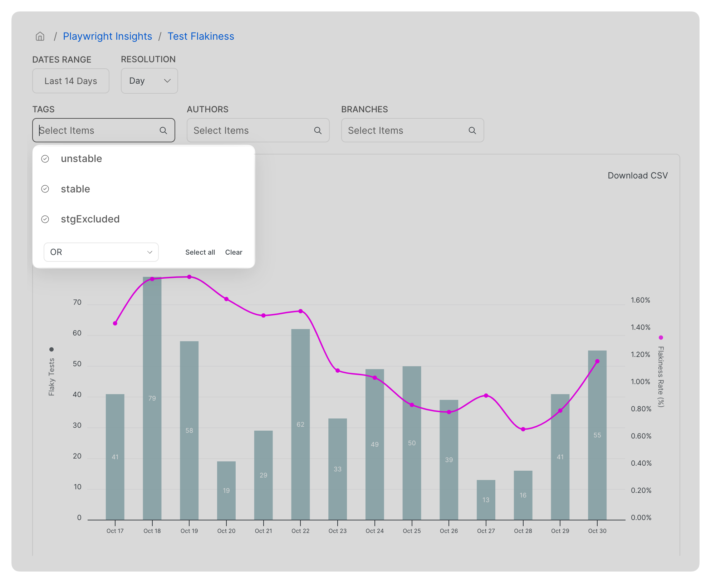
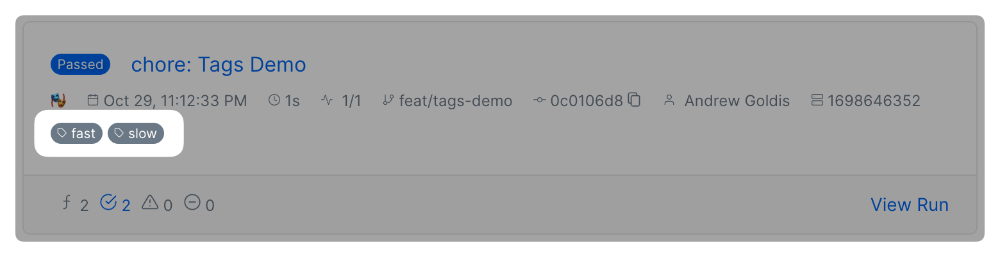
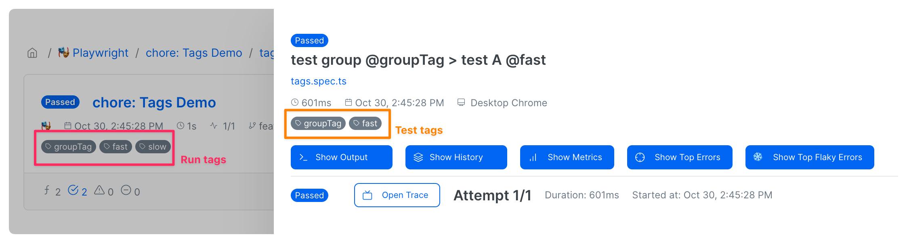
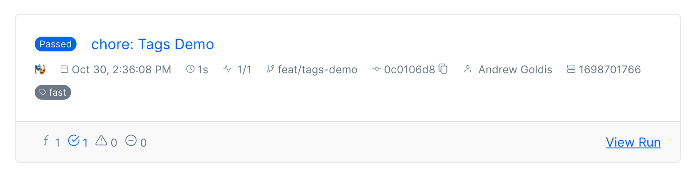
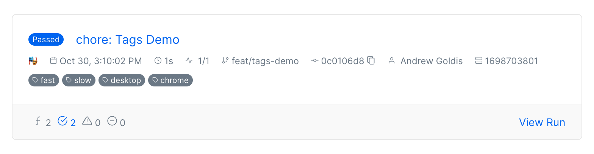
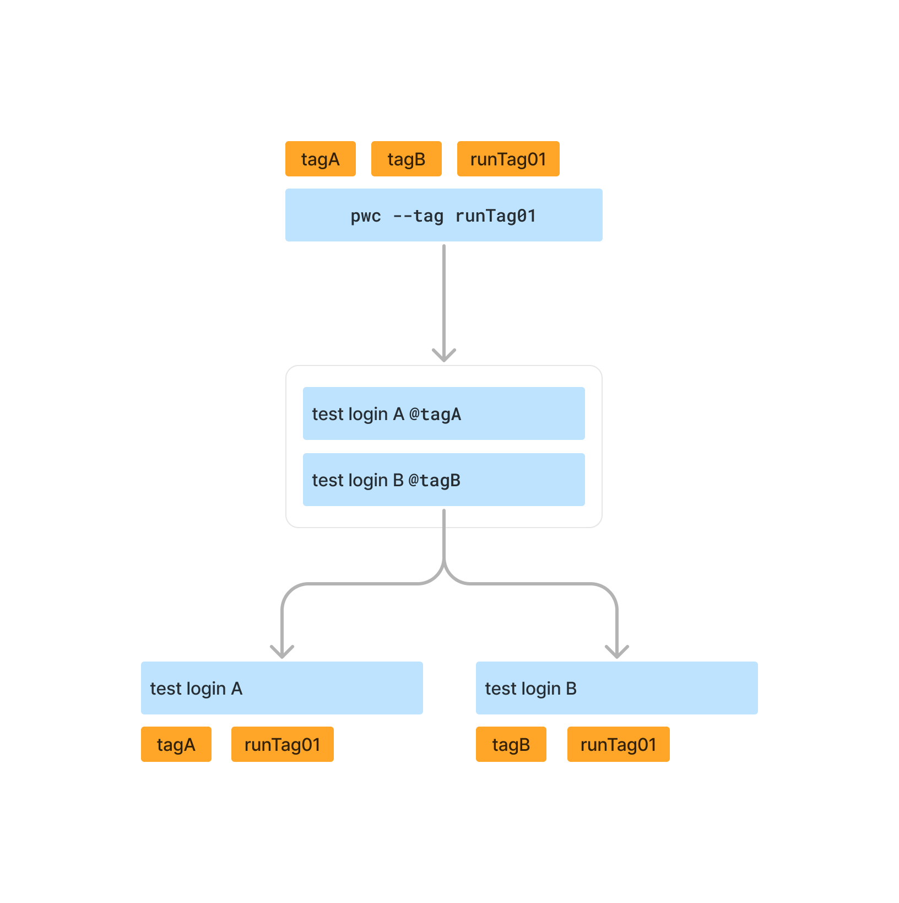

# Playwright Tags


**Note**

* Run-level tagging is available in [currents-playwright](../resources/reporters/currents-playwright/ "mention") version **0.7.0+**
* Project-level and test-level tagging is available in [currents-playwright](../resources/reporters/currents-playwright/ "mention") version **0.10.0+**



A tag is limited to 128 characters


Using tags is a common technique for better classifying recorded test results and getting relevant insights about the test suite. Here are several examples of how software teams use tags:

* manage ownership - e.g. use the team name as a tag
* categorize product features  - e.g. tagging `onboarding` flow tests
* manage tests lifecycle - e.g. tag newly introduced tests as `ustable`&#x20;

The tags are available for producing meaningful reports, exploring metrics, narrowing down Slack notifications, filtering the results, API responses and more.

<figure><figcaption><p>Example of using Tags for narrowing down Flakiness chart in Currents Dashboard</p></figcaption></figure>

### Playwright Tags


[currents-playwright](../resources/reporters/currents-playwright/ "mention") version **0.10.0+** is required for test title tags


#### Test title tags

Currents parses the test titles and recognizes the conventional [Playwright Tags](https://playwright.dev/docs/test-annotations#tag-tests) that appear in test definitions. For example, recording the results of the following tests to Currents:

```typescript
test('Test login page @fast', async ({ page }) => {
  // ...
});

test('Test full report @slow', async ({ page }) => {
  // ...
});
```

...will create a run with tags: **`fast`** and **`slow`**

<figure><figcaption><p>Example of Currents run created with tags @fast and @slow</p></figcaption></figure>

#### Test group tags

Tagging a test group (`test.describe`) will "apply" the tag to every included individual test, as well as to the created run. For example, given the following test definition:

```typescript
test.describe("test group @groupTag", () => { // 👈🏻 note the test group tag

  test('Test login page @fast', async ({ page }) => {
    // ...
  });
  test('Test full report @slow', async ({ page }) => {
    // ...
  });
})
```

Currents will assign the following tags to the created items:

| Item                                            | Tags                       |
| ----------------------------------------------- | -------------------------- |
| Run                                             | `groupTag`, `fast`, `slow` |
| <pre><code>Test login page @fast
</code></pre>  | `groupTag`, `fast`         |
| <pre><code>Test full report @slow
</code></pre> | `groupTag`, `slow`         |

<figure><figcaption><p>Example of a run created with various tags when tagging a test group</p></figcaption></figure>

#### Tags with `--grep` applied

If certain tags are excluded from the execution, for example by using `--grep` CLI option, only the included tests (and their tags) will be used for tagging.

```
$ npx playwright test --grep @fast
```

<figure><figcaption><p>Applying tags when certain tests are excluded using --grep CLI option</p></figcaption></figure>

#### Removing tags from test titles

It is often desired to ignore the tags included in the test title to have a consistent view of the test history or preserve the metrics.&#x20;

For example, let's say you have a test named `Test login page @slow` , eventually, you add another tag and the test title becomes `Test login page @slow @login`. However, adding the tag will change the test name - as a result, the history of previous executions and metrics will be lost.&#x20;

To remove the tags from the recorded test titles, add `--pwc-remove-title-tags` CLI option or  `removeTitleTags` reporter configuration. Activating the removal will strip the tags from test titles (including test group names) when recording to Currents dashboard.&#x20;

In the example above, `Test login page @slow` and `Test login page @slow @login` will be recorded as `Test login page` and tags `slow` + `login` will be attached to the test recording.

#### Disabling parsing test title tags

You can disable parsing test title tags altogether by adding `--pwc-disable-title-tags` CLI option. See  [currents-playwright](../resources/reporters/currents-playwright/ "mention") for additional configuration options, available in versions `0.11.0+` .

### Run-level Tags


[currents-playwright](../resources/reporters/currents-playwright/ "mention") version **0.7.0+** is required to use run-level tags


In addition to encoding tags in test titles, you can explicitly tag the whole run (or a playwright project). There are multiple ways to explicitly tag a run.

#### Tagging a run using `pwc` CLI option

If you're using `pwc` executable script to run the tests, use `--tag` CLI option:

```
npx pwc --tag tagA,tagB --tag tagC
```

You can provide a comma-separated list of tags, provide multiple `--tag` options, or use both.&#x20;

#### Tagging a run using Reporter configuration

You can tag playwright execution by providing a list of `tag` values to Currents Reporter in your `playwright.config.ts` file. For example:

```typescript
import { currentsReporter } from '@currents/playwright';

// ...
reporter: [
  currentsReporter({
    ciBuildId: process.env.CURRENTS_CI_BUILD_ID,
    recordKey: process.env.CURRENTS_RECORD_KEY,
    projectId: process.env.CURRENTS_PROJECT_ID,
    tag: ["runTagA", "runTagB"],
  }),
  /* other reporters, if exist, e.g.:
  ["html"]
  */
]
```

#### Tagging a run using `CURRENTS_TAG` environment variable

You can tag playwright execution by setting the `CURRENTS_TAG` environment variable value to a comma-separated list of tags, for example, with [currents-playwright](../resources/reporters/currents-playwright/ "mention") reporter configured:

```
CURRENTS_TAG=tagA,tagB npx playwright run ...
```

#### Precedence of configuration options

If there are multiple definitions of run-level tags, Currents will pick the tags as follows:

* Use comma-separated tags of `CURRENTS_TAG` environment variable, if provided; otherwise
* Use `--tag` CLI option values, if provided; otherwise
* Use reporter configuration values, if provided; otherwise
* add no run tags

### Project-level Tags


[currents-playwright](../resources/reporters/currents-playwright/ "mention") version **0.10.0+** is required for project-level tags


You can tag Playwright projects by using **`metadata.pwc.tags`** field in the project's configuration. For example, given the following Playwright project configuration:

```typescript
// playwright.config.ts

// ...
{
   projects: [
      {
        name: "Desktop Chrome",
        metadata: {
          pwc: {
            tags: ["desktop", "chrome"], // 👈🏻 note the tags
          },
        },
        use: {
          ...devices["Desktop Chrome"],
        },
      },
      // ...
  ]
}
```

Currents will create a run tagged with `desktop`, `chrome` + all the tags extracted from individual tests.

<figure><figcaption><p>Example of using project-level tags</p></figcaption></figure>

### How Tags are Applied

Currents stores the recorded results as Runs, Groups, Spec Files and Tests. The items are available in the dashboard and also in [Broken link](broken-reference "mention") responses.&#x20;

* Run - is a high-level abstraction that represents a CI execution of a test suite
* Group - is a subset of recorded tests - representing a playwright project
* Spec File - a recorded execution of tests in a file
* Test Recording - a recorded execution of a test case

Each of the items can have multiple tags attached, and tagging a particular item can affect the tags of another item. When applying tags, Currents follows the rules below:

* Apply explicit run-level and project-level tags "downwards" to all the included items
* Apply individual test tags "upwards" to spec files, projects and runs

The table below shows the details of how the tags are applied:

<table><thead><tr><th width="225">Item</th><th>Tags Applied</th></tr></thead><tbody><tr><td>Run</td><td><ul><li>Own run-level tags</li><li>Tags of all the included projects</li><li>Tags of all the included test cases</li></ul></td></tr><tr><td>Group/Project</td><td><ul><li>Run-level tags</li><li>Own project-level tags</li><li>Tags of all the included test cases</li></ul></td></tr><tr><td>Spec File Recording</td><td><ul><li>Run-level tags</li><li>Project-level tags</li><li>Tags of all the included test cases</li></ul></td></tr><tr><td>Test Case Recording</td><td><ul><li>Run-level tags</li><li>Project-level tags</li><li>Own test title tags</li></ul></td></tr></tbody></table>

For example, given the following tests:

```typescript
test('Test login A @tagA', async ({ page }) => {
  // ...
});
test('Test login B @tagB', async ({ page }) => {
  // ...
});
```

And adding a run-level tag `runTag01` using the command: `pwc ... --tag runTag01` will result in the following tags:

<figure><figcaption><p>Application of tags example</p></figcaption></figure>

| Item                                  | Applied Tags               |
| ------------------------------------- | -------------------------- |
| Run                                   | `runTag01`, `tagA`, `tagB` |
| <pre><code>Test login A
</code></pre> | `runTag01, tagA`           |
| <pre><code>Test login B
</code></pre> | `runTag01, tagB`           |
