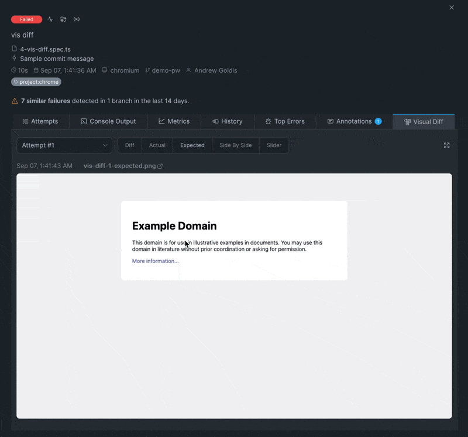
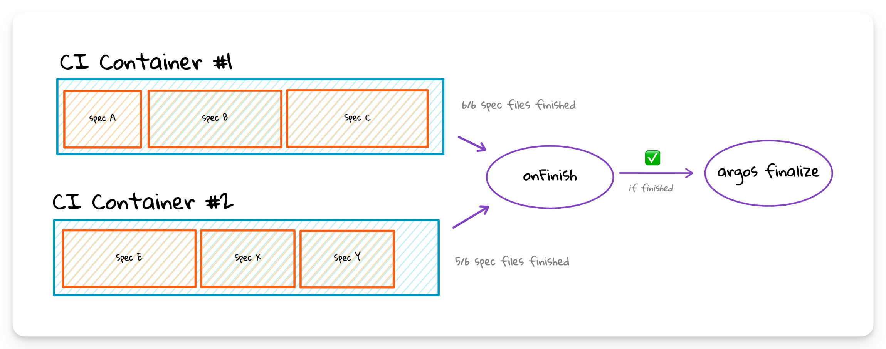

# Playwright Visual Testing

### Native Playwright Visual Comparison

Playwright has a built-in support for [Visual Comparisons](https://playwright.dev/docs/test-snapshots), allowing generation of screenshots and failing a test in case reference screenshots differ from the actual ones.

Here's an example of a test that includes visual comparison:

```typescript
test('example test', async ({ page }) => { 
  await page.goto('https://playwright.dev'); 
  await expect(page).toHaveScreenshot({ maxDiffPixels: 100 });}
);
```

Currents automatically detects  tests with visual comparison enabled and shows a dedicated widget for the relevant tests:

<figure><figcaption><p>Current Visual Comparison Widget for Playwright Tests</p></figcaption></figure>

### Playwright Visual Testing with Argos

While Native Playwright Visual Comparison is a good start as a basic tool, a more advanced and dedicated visual testing solution can greatly improve the effectiveness of your testing suite. Our friends at [Argos](https://argos-ci.com/) offer a comprehensive, open-source (and loved) visual testing platform that takes care of the difficult parts of visual testing:

* stabilization: prevent visual testing flakiness by preventing font and styling changes
* test across various resolutions: ensuring every detail is captured without missing a thing
* pull request comments and status checks

Argos is 100% compatible with Playwright Sharding and Currents Reporting + Orchestration, allowing effective and painless CI setup, continuous reporting, debugging with supercharged visual testing.

#### Argos + Currents Reporter

Argos and Currents natively support Playwright Sharding for parallel CI executions - follow [the setup instructions](https://argos-ci.com/docs/quickstart/playwright) and configure both reporters to see the visual testing artifacts reported to Argos and the rest of test results reported to Currents.

<details>

<summary>Playwright configuration</summary>

```typescript
// playwright.config.ts
import { currentsReporter } from "@currents/playwright";
import { devices, PlaywrightTestConfig } from "@playwright/test";

const config: PlaywrightTestConfig = {
// ...
  reporter: [
    currentsReporter(), // explicitly activate Currents Reporter
    [
      // See https://argos-ci.com/docs/quickstart/playwright
      "@argos-ci/playwright/reporter",
      {
        uploadToArgos: true, 
      },
    ],
  ],
  use: {
    actionTimeout: 0,
    trace: "on",
    video: "retain-on-failure",
    screenshot: "only-on-failure",
  },
// ...
}
```

</details>

<details>

<summary>GitHub Actions Workflow</summary>

```yaml
strategy:
  fail-fast: false
  matrix:
  shard: [1, 2, 3] # run 3 parallel containers
# ...
- name: Currents Sharding + Argos
  working-directory: ./argos
  env:
    ARGOS_TOKEN: ${{ secrets.ARGOS_TOKEN }} 
    CURRENTS_PROJECT_ID: bnsqNa
    CURRENTS_RECORD_KEY: ${{ secrets.CURRENTS_RECORD_KEY }}
  run: | # start playwright
    npx playwright test --shard=${{ matrix.shard }}/${{ strategy.job-total }}
```

</details>

#### Argos + Currents Orchestration

Using Argos with [playwright-orchestration.md](ci-optimization/playwright-orchestration.md "mention") requires an additional step - notifying Argos after run's completion. This is necessary because Currents Orchestration can have an arbitrary number of CI machines participating in an execution and the allocation of tests to CI machines is dynamic.


Requires @currents/playwright 1.6.0+


<figure><figcaption><p>Currents Orchestration onFinish callback finalizes Parallel Argos build</p></figcaption></figure>

See the [example repository](https://github.com/currents-dev/playwright-gh-actions-demo/tree/example-argos-currents-orchestration/argos) which showcases using GitHub Actions with 3 parallel containers + Currents Orchestration + Argos.&#x20;

<details>

<summary><a href="https://github.com/currents-dev/playwright-gh-actions-demo/blob/example-argos-currents-orchestration/argos/playwright.config.ts">Playwright Configuration</a></summary>

```typescript
// playwright.config.ts
import { currentsReporter } from "@currents/playwright";
import { devices, PlaywrightTestConfig } from "@playwright/test";

const config: PlaywrightTestConfig = {
// ...
  reporter: [
    currentsReporter(), // explicitly activate Currents Reporter
    [
      // See https://argos-ci.com/docs/quickstart/playwright
      "@argos-ci/playwright/reporter",
      {
        uploadToArgos: true, 
      },
    ],
  ],
  use: {
    actionTimeout: 0,
    trace: "on",
    video: "retain-on-failure",
    screenshot: "only-on-failure",
  },
// ...
}
```


</details>

<details>

<summary><a href="https://github.com/currents-dev/playwright-gh-actions-demo/blob/example-argos-currents-orchestration/.github/workflows/argos-example.yml#L40">GitHub Actions Workflow</a> </summary>

```yaml
strategy:
      fail-fast: false
      matrix:
        shard: [1, 2, 3] # run 3 parallel containers
# ...
- name: Orchestrated PW + Argos
  working-directory: ./argos
  env:
    ARGOS_PARALLEL: 1
    ARGOS_PARALLEL_TOTAL: -1 # important to set to -1 to enable "finalize" call.
    ARGOS_TOKEN: ${{ secrets.ARGOS_TOKEN }} 
    CURRENTS_PROJECT_ID: bnsqNa
    CURRENTS_RECORD_KEY: ${{ secrets.CURRENTS_RECORD_KEY }}
  run: | # start Currents Orchestration
    npx pwc-p 
```

</details>

<details>

<summary><a href="https://github.com/currents-dev/playwright-gh-actions-demo/blob/example-argos-currents-orchestration/argos/currents.config.ts">Currents Configuration</a></summary>


```typescript
// currents.config.ts

import type { CurrentsConfig, OrchestrationStatus } from "@currents/playwright";
import { $ } from "execa";

// OrchestrationStatus has the latest status reported by Currents API - it contains data from all the machines participating in a run
async function onFinish(status: OrchestrationStatus) {
  // run `argos finalize` after all machines 
  if (status.specs.completed === status.specs.overall) {
    try {
      const finalize = await $`npx argos finalize`;
      console.log(finalize.stderr);
    } catch (e) {
      console.error(e);
    }
    return;
  }
}

const config: CurrentsConfig = {
  recordKey: assertEnvVariable("CURRENTS_RECORD_KEY"),
  projectId: assertEnvVariable("CURRENTS_PROJECT_ID"),
  ciBuildId: `${process.env.GITHUB_RUN_ID}-${process.env.GITHUB_RUN_ATTEMPT}`,
  orchestration: {
    skipReporterInjection: true, // mandatory for integration with Argos
    onFinish, // mandatory step for finalizing Argos Build
  },
};

export default config;


function assertEnvVariable(name: string) {
  if (!process.env[name]) {
    throw new Error(`Missing environment variable ${name}`);
  }
  return process.env[name];
}
```


* set `orchestration.skipReporterInjection` to `true`&#x20;

- note the use of `onFinish` lifecycle hook - the corresponding function will run and receive `OrchestrationStatus` object that can be used to determine run's completion

</details>

### Applitools, Percy and other visual testing tools

You can use the same concept to send a "finalize" command to other visual testing tools like Applitools and Percy.

* Applitools - refer to [Closing the Batch](https://applitools.com/tutorials/guides/advanced-use-cases/parallel-test-suites#step-3-closing-the-batch) section the Parallel Test Suites guide
* Percy - refer to `percy build:finalize` step in [Percy documentation](https://www.browserstack.com/docs/percy/integrate/parallel-test-suites)
