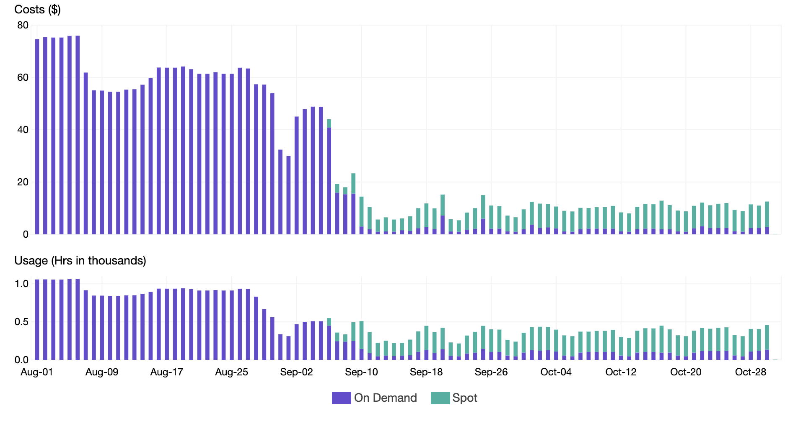
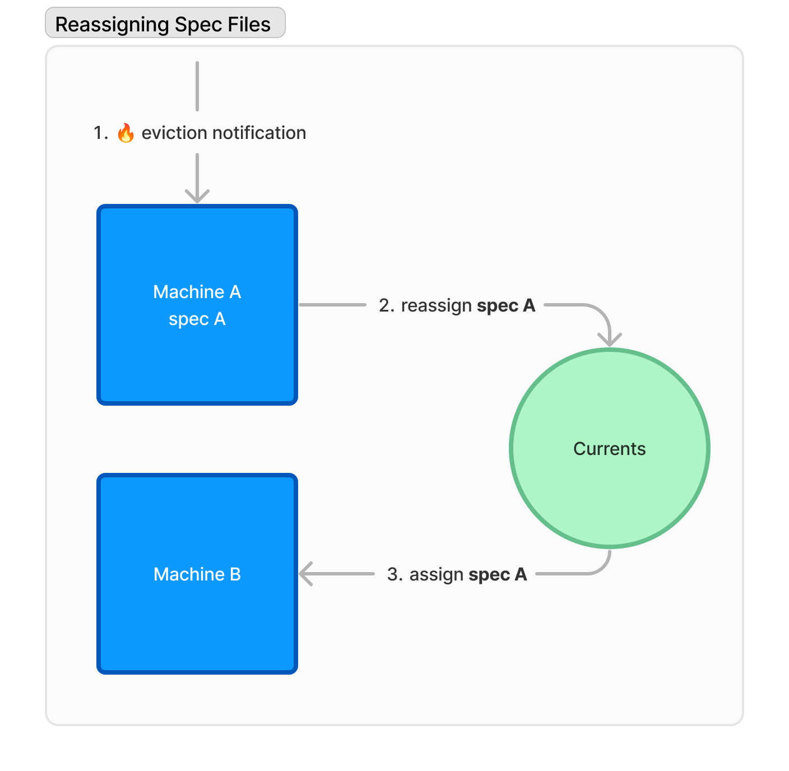

# CI Tests on Spot Instances



* Get familiar with [playwright-orchestration.md](playwright-orchestration.md "mention")
* Requires `@currents/playwright@1.3.0+`


### Cost Efficiency of Spot Instances

Many cloud providers have an option to use [Spot Instances](https://aws.amazon.com/ec2/spot/) for running workloads. Using Spot Instances can cost up to 90% lower, compared to the traditionally allocated resources.

<figure><figcaption><p>Cost optimization with Spot Instances. Source: https://aws.amazon.com/blogs/containers/cost-optimization-for-kubernetes-on-aws/</p></figcaption></figure>

However, spot instances can be terminated at any time, which can cause the loss of the test results.&#x20;

Currents Orchestration can automatically reassign the tests from to-be-terminated instance to another machine. This way, the execution can continue without manual intervention.

### How it works

Imagine a scenario when you have two machines running a testing suite consisting of two spec files.&#x20;

* Machine A - running specA
* Machine B - running specB

When a spot instance is just about to be terminated (let's say Machine A),  Currents will identify the affected spec files and reassign them a different machine.&#x20;

<figure><figcaption><p>Reassigning tests in case of spot instance termination</p></figcaption></figure>

### Setup and&#x20;


Only tests orchestrated with `pwc-p` can be dynamically reassigned. Read more about [playwright-orchestration.md](playwright-orchestration.md "mention").


Starting from version `1.3.0` of `@currents/playwright,` you can specify a `pwc-p` option:

```
pwc-p .... --pwc-reset-signal SIGUSR1|SIGUSR2
```

When specified, `pwc-p` will start listening to POSIX signal (`SIGUSR1` or `SIGUSR2`). After receiving the signal, the tool will send a request to Currents servers with the details of the tests that need to be reassigned.&#x20;

Currents will update the run status accordingly and will send the affected tests to the first available CI machine.

An example output you're expected to see upon termination:


```
$ npx pwc-p --key XXX --project-id YYY --ci-build-id reset-001 --pwc-reset-signal SIGUSR1

🚥 Will reset tests on SIGUSR1. PID: 66640
🚀 Starting orchestration session...
📦 Currents reporter: 1.3.0 recording CI build reset-001 for project YYY
🎭 Playwright: 1.44.0 1 test in 1 project [chromium] 

🌐 Executing orchestrated task: [chromium] test.spec.ts 
🌐 Run URL: https://app.currents.dev/run/c11610c6e1644913

================================================================

2024-05-15T23:31:57.336Z starting test attempt #1: [chromium] › test.spec.ts:15:5 › A

# in another terminal: kill -SIGUSR1 66640

🚥 Received SIGUSR1
🚥 Resetting tests: machineId: 3SN5zz9Mhl2ALzzB, runId: c11610c6e1644913
🚥 Success resetting tests: machineId: 3SN5zz9Mhl2ALzzB, runId: c11610c6e1644913


```


Refer to the following documentation for capturing the eviction notice for various cloud providers:

* [AWS - Spot Instance interruption notice](https://docs.aws.amazon.com/AWSEC2/latest/UserGuide/spot-instance-termination-notices.html)
* [Azure - Simulate Spot Virtual Machine eviction](https://learn.microsoft.com/en-ca/azure/virtual-machines/windows/spot-powershell#simulate-an-eviction)
* [GCP - Spot VM preemption process](https://cloud.google.com/compute/docs/instances/spot#preemption-process)


It is your responsibility to capture the eviction notice, detect the PID and send the signal to the`pwc-p` process before an eviction.&#x20;

* `usr1` normally activates the node debugger, but this ability is disabled when we listen on usr1
* `usr2` normally treated as a exit in node, so if you pass it WITHOUT turning on our listener, you will immediately kill the process
* You must signal the `pwc-p` node process, and **not the npx or wrapper process**. The parent process will just behave as noted above and not pass the signal down to our process.

