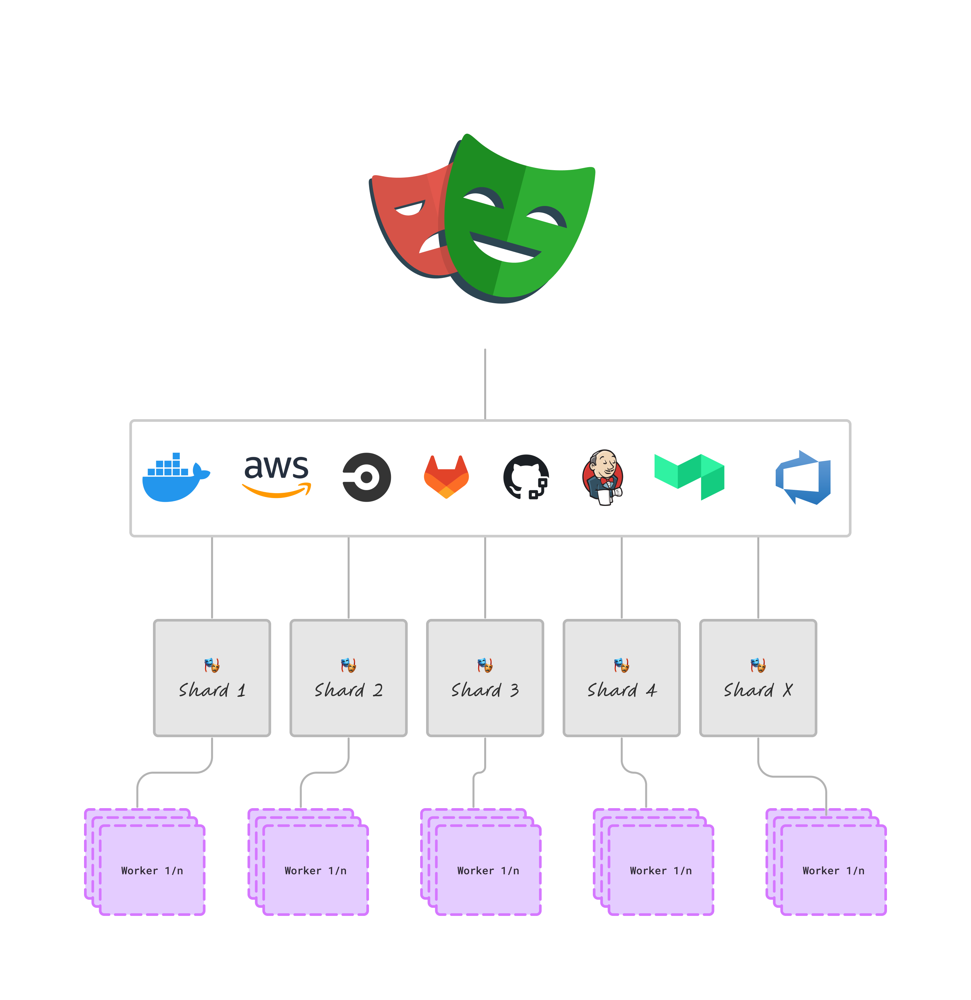
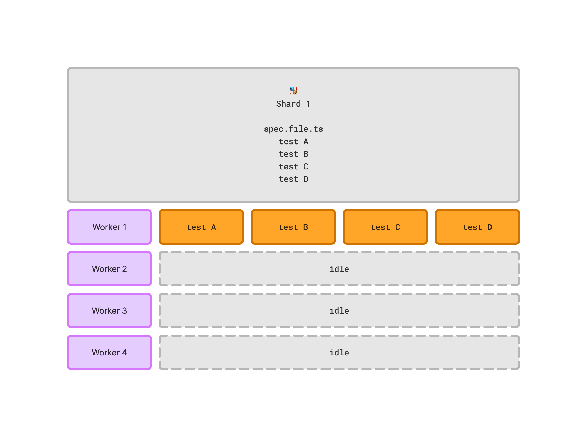
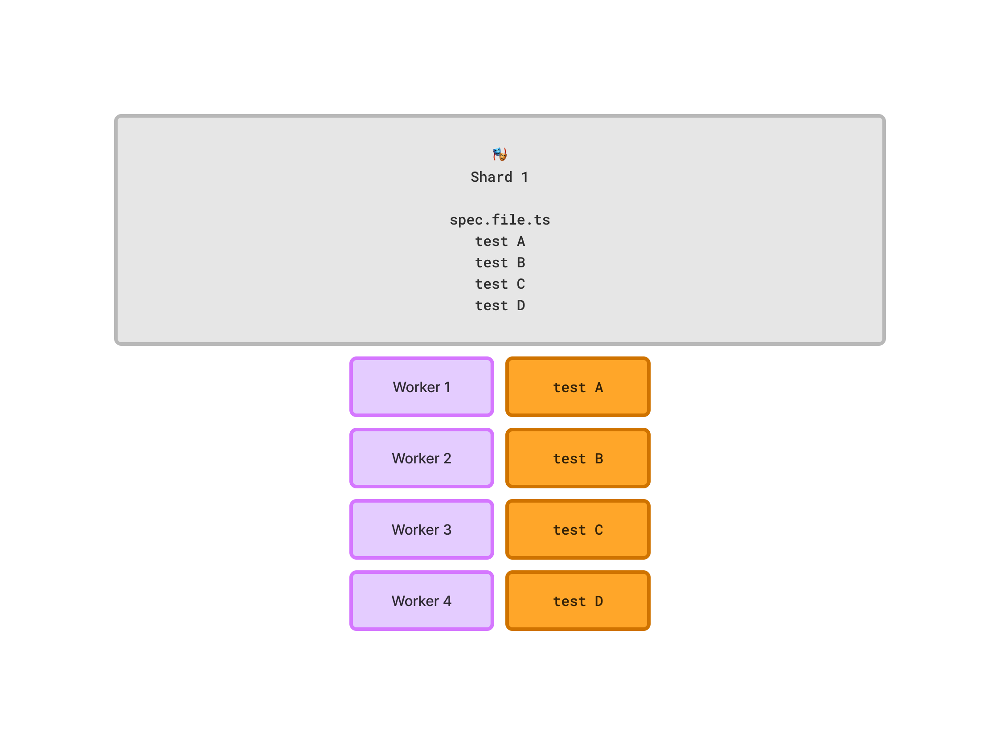

# Fully Parallel Mode

Playwright supports multiple levels of concurrency:

* a test suite can be split between different machines using [sharding](https://playwright.dev/docs/test-sharding#sharding-tests-between-multiple-machines).
* each machine can have [multiple workers](https://playwright.dev/docs/api/class-testconfig#test-config-workers) (according to CPU performance or explicit configuration).

<figure><figcaption>
Visual representation of Playwright shards, workers and parallel execution
</figcaption></figure>

The workers will run the tests in parallel, allowing for a speedup in execution and full utilization of a machine's resources.

However, by default, Playwright runs the tests of the **same spec file serially** — one after another. So, even if you have a powerful machine capable of supporting multiple workers, it can be underutilized. For example, if your machine has 4 workers and sharding assigns only one spec file, the tests will be executed one by one, and only one worker will be utilized at a time.

<figure><figcaption>
Example of underutilizing workers in Playwright
</figcaption></figure>

Enabling `fullyParallel: true` ([see configuration details](https://playwright.dev/docs/api/class-testconfig#test-config-workers)) allows running tests from the **same spec file in parallel** on different workers. This way, all available workers can be utilized, and the tests will be executed faster.

<figure><figcaption>
Enabling fullyParallel mode uses all available Playwright workers
</figcaption></figure>

Note that the tests are required to be isolated and not shared in any state. Playwright will run the tests on different workers or even on different machines (a.k.a shards).

To enable running individual tests from the [same spec file on different workers](https://playwright.dev/docs/api/class-testproject#test-project-fully-parallel), set `fullyParallel: true` in your configuration file.

Version 1.0.0+ of the reporter is compatible with fully parallel mode and will collect the results of concurrent parallel executions from distributed shards and workers. Moreover, the reporter will display the results of each step, which is crucial for debugging failed CI executions.
