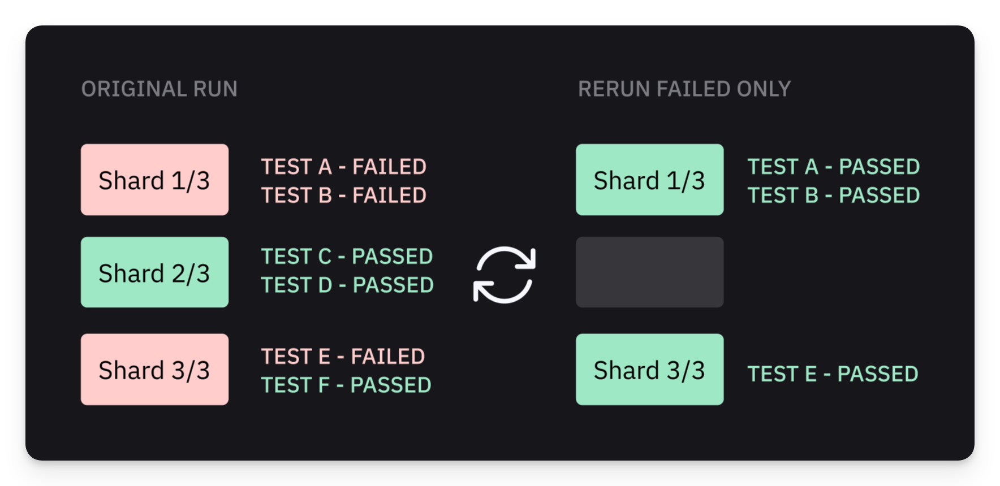
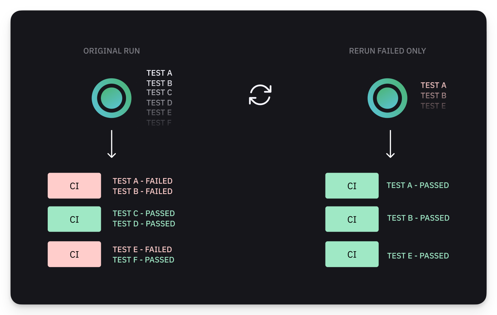
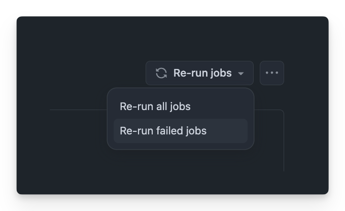

# Re-run Only Failed  Tests

Rerunning only failed tests in CI is one of the most popular way to unblock CI pipelines - indeed, often the tests pass on a rerun, unblocking pending Pull Requests and marking all the checkmarks green.

Speaking strictly, the tests that randomly fail and then pass without any change to the tests, the application under test or the environment, are considered flaky (see [flaky-tests.md](../dashboard/tests/flaky-tests.md "mention")). Even if tests pass after a rerun, it is recommended to explore the failures and eliminate the flakiness.&#x20;

<figure><figcaption><p>Rerunning Failed Only Playwright Tests</p></figcaption></figure>

However there are plenty of pragmatic reasons why teams defer the investigation and just want to unblock the CI pipeline, for example:

* skipping a known flaky tests that is currently under investigation
* fixing an infrastructure component or CI environment
* temporary outage of the CI environment
* urgent deployment of a hot fix

Starting from version [1.44](https://playwright.dev/docs/release-notes?ref=playwrightsolutions.com#version-144) Playwright supports [running only the failed test from the last run](https://playwrightsolutions.com/how-to-run-failures-only-from-the-last-playwright-run/) using `--last-failed` CLI flag, for example:

```
playwright test --last-failed
```

While this feature works well for local environments, there are a few challenges related to rerunning the failed only tests in CI that are related to how Playwright implements parallel execution with shards.

### Re-run Failed Playwright Tests - Playwright Shards in CI

Rerunning only failed Playwright tests in CI requires maintaining cumbersome configuration and custom scripts - those are necessary to deal with potential issues related to Playwright sharding (see [#challenges-related-to-rerunning-failed-only-playwright-tests-in-ci](re-run-only-failed-tests.md#challenges-related-to-rerunning-failed-only-playwright-tests-in-ci "mention")).

We have created a set of tools that unlock rerunning only the failed Playwright tests in CI, including sharded parallel CI runs and run created by Currents Orchestration.&#x20;

The suggested templates do not require maintaining complex CI configurations and scripts - they are compatible with popular CI providers and can be used even without Currents reporter.

<details>

<summary>GitHub Actions</summary>

See our step-by-step guide to [Setting up Re-runs with GitHub Actions](../getting-started/ci-setup/github-actions/playwright-github-actions.md#playwright-sharding). And check out the example workflows:&#x20;

* [https://github.com/currents-dev/playwright-gh-actions-demo/blob/main/.github/workflows/rerun-shards-pwc.yml](https://github.com/currents-dev/playwright-gh-actions-demo/blob/main/.github/workflows/rerun-shards-pwc.yml)

<!---->

* [https://github.com/currents-dev/playwright-gh-actions-demo/blob/main/.github/workflows/rerun-shards-reporter.yml](https://github.com/currents-dev/playwright-gh-actions-demo/blob/main/.github/workflows/rerun-shards-reporter.yml)

</details>

<details>

<summary>GitLab CI</summary>

See our step-by-step guide to [Setting up retries of failed job with GitLab CI](../getting-started/ci-setup/gitlab/playwright-gitlab-ci-cd.md#playwright-sharding). And check out the example workflows:

* [https://gitlab.com/currents.dev/gitlab-playwright-currents/-/blob/main/.gitlab/ci/with-reruns-pwc.yml?ref\_type=heads](https://gitlab.com/currents.dev/gitlab-playwright-currents/-/blob/main/.gitlab/ci/with-reruns-pwc.yml?ref\_type=heads)
* [https://gitlab.com/currents.dev/gitlab-playwright-currents/-/blob/main/.gitlab/ci/with-reruns-reporter.yml?ref\_type=heads](https://gitlab.com/currents.dev/gitlab-playwright-currents/-/blob/main/.gitlab/ci/with-reruns-reporter.yml?ref\_type=heads)

</details>

### Re-run Failed Playwright Tests - Currents Orchestration


When rerunning failed orchestrated CI runs, you'd select "Rerun All Jobs" instead of "Rerun Failed Only"


Currents orchestration for Playwright (see [playwright-orchestration.md](parallelization-guide/pw-parallelization/playwright-orchestration.md "mention")) improves CI execution time by up to 40%, compared to the native Playwright Sharding. It eliminates the need to maintain and update CI configuration and automatically balances the tests between available CI machines in the most optimal way.

Orchestrated runs are conceptually different from the native playwright shards. Currents assigns the tests dynamically to **all the available machines -** i.e. the more machines are available, the better (also, there's no need to provide the overall number of CI machines in advance).

<figure><figcaption><p>Rerunning Failed Only Playwright Tests using Currents Orchestration</p></figcaption></figure>

That's why when rerunning failed orchestrated CI runs, you'd select "Rerun All Jobs" instead of "Rerun Failed Only":

* The CI provider will spin up all the containers
* Currents will dynamically assign the failed tests to all the available containers
* More available containers will run the tests in parallel faster

<details>

<summary>GitHub Actions</summary>

See our step-by-step guide to [Setting up Re-runs with GitHub Actions](../getting-started/ci-setup/github-actions/playwright-github-actions.md#currents-orchestration). And check out the example workflow:&#x20;

* [https://github.com/currents-dev/playwright-gh-actions-demo/blob/main/.github/workflows/reruns-or8n.yml](https://github.com/currents-dev/playwright-gh-actions-demo/blob/main/.github/workflows/reruns-or8n.yml)

</details>

<details>

<summary>GitLab CI</summary>

See our step-by-step guide to [Setting up retries of failed job with GitLab CI](../getting-started/ci-setup/gitlab/playwright-gitlab-ci-cd.md#currents-orchestration). And check out the example workflow:

* [https://gitlab.com/currents.dev/gitlab-playwright-currents/-/blob/main/.gitlab/ci/with-reruns-pwcp.yml?ref\_type=heads](https://gitlab.com/currents.dev/gitlab-playwright-currents/-/blob/main/.gitlab/ci/with-reruns-pwcp.yml?ref\_type=heads)

</details>

### Challenges related to re-run only failed Playwright tests in CI


For some CI environment, the [currents cache command](../resources/reporters/currents-cmd.md#cache-test-artifacts) has some preset integration helpers that can automatically determine when to use the `--last-failed` flag, and adjust the `--shard` flag.


**Problem #1: Adding `--last-failed` finds no tests**

Simply adding `--last-failed` to the CI command wouldn't work - Playwright immediately stops with an error message:

```sh
$ npx playwright test --last-failed
Error: No tests found
```

Why is that?&#x20;

Behind the scenes Playwright creates `.last-run.json` file in [output directory](https://playwright.dev/docs/api/class-testproject#test-project-output-dir) (defaults to `<package.json-directory>/test-results)`after every run. When Playwright `--last-failed` CLI flag is present, Playwright first scans the output directory and uses `.last-run.json` file to run only the failed tests. If the file is not present, Playwright has no tests to run and stops immediately.

That means you need to conditionally add `--last-failed` flag for reruns only and make the file from the previous runs available on the newly created containers.


**Problem #2: CI reruns only a subset of failed tests**

Typically you'd use `--shard x/n` command to split tests between the available containers - each container will only run a subset of the tests. Imagine a scenario when some tests fail - a few containers will pass and others fail.

Popular CI providers (like GitHub Actions, GitLab CI etc) allow rerunning **only the failed containers** - i.e. a rerun will have less containers, compared to the original run. That "breaks" the sharding mechanism and as a result only a subset of the failed tests will be included in a rerun.

<figure><figcaption><p>Rerunning only the failed jobs in GitHub Actions</p></figcaption></figure>

As an example, consider the following scenario of GitHub Actions Matrix job with 3 containers (see [GHA matrix strategy documentation](https://docs.github.com/en/actions/writing-workflows/choosing-what-your-workflow-does/running-variations-of-jobs-in-a-workflow#about-matrix-strategies)). A typical CI command would look like this:

`playwright test --shard ${{ matrix.shard }}/${{ strategy.job-total }}`

Let's say the original run has the following commands and results:

<table><thead><tr><th width="107">Shard</th><th>Command</th><th>Outcome</th></tr></thead><tbody><tr><td>1/3</td><td>playwright test --shard 1/3</td><td><mark style="color:red;">failed</mark></td></tr><tr><td>2/3</td><td>playwright test --shard 2/3</td><td><mark style="color:green;">passes</mark></td></tr><tr><td>3/3</td><td>playwright test --shard 3/3</td><td><mark style="color:red;">failed</mark></td></tr></tbody></table>

Rerunning only the failed jobs will start 2 containers. However `${{ matrix.shard }}/${{ strategy.job-total }}` still refers to the total number of nodes in the matrix configuration, not the actual number of containers. As a result we end up with following commands:

<table><thead><tr><th width="105">Shard</th><th>Command</th><th>Notes</th></tr></thead><tbody><tr><td>1/3</td><td>playwright test --shard 1/3 --last-failed</td><td>runs 1/3 of all the discovered tests 😕</td></tr><tr><td>2/3</td><td>--</td><td>doesn't run</td></tr><tr><td>3/3</td><td>playwright test --shard 3/3 --last-failed</td><td>runs 1/3 of all the discovered tests 😕</td></tr></tbody></table>

Remember that we also need to restore `.last-failed` file of the original run - the caveat is the it contains only results from the same shard, so each container will run only 1/3 of the tests that failed on the corresponding shard.
