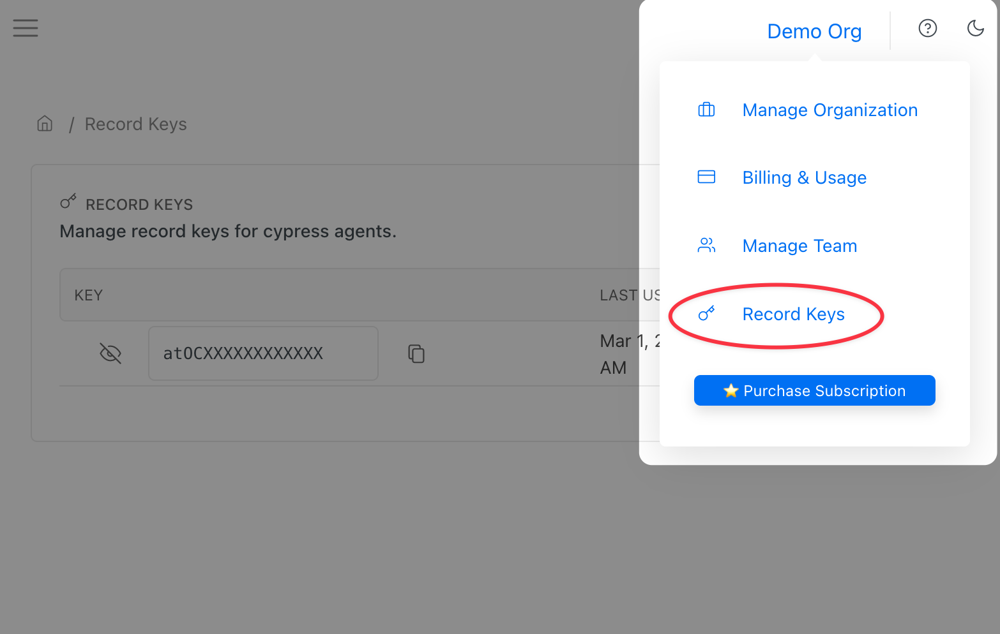
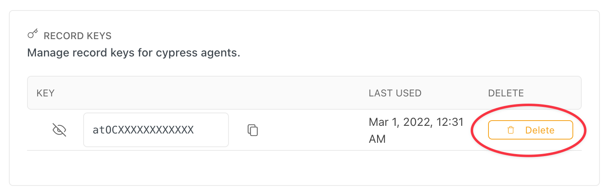

# Record Key

### What is Record Key?

Record key is a secret you use to associate runs with your organization in Currents dashboard.

When running tests in parallel using Currents dashboard, provide your Record Key as `--key` argument.

### Can I publish my Record Key?

You'd treat your Record Key as a secret and not publish it. Having your Record Key would allow creating new runs on behalf of your organization.

### Where is my Record Key?

You can obtain your record key by navigating to "Record Keys" section of your organization menu.

### Can I rotate my Record Key?

Yes, in "Record Keys" section of your organization menu, delete the existing key and create a new key.


Please note: requests to create a run for non-existing or deleted Record Key will be rejected

