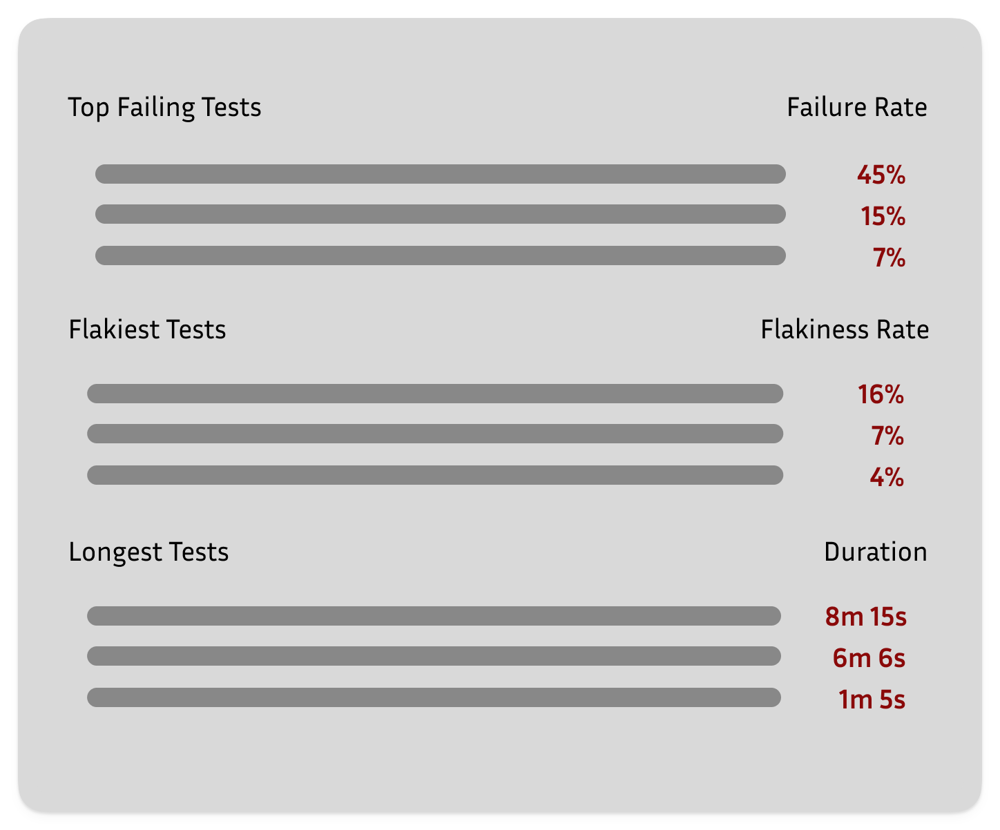
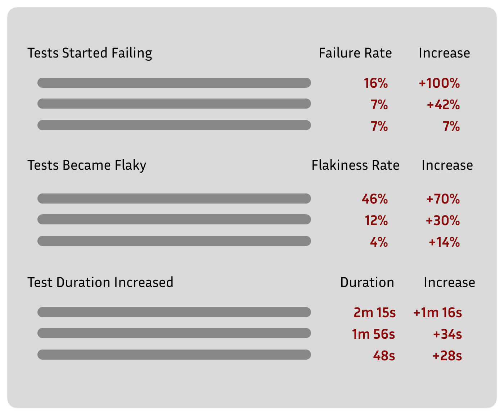
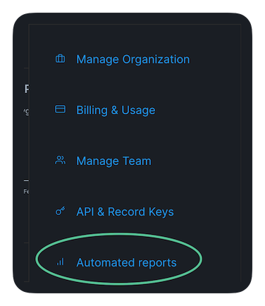
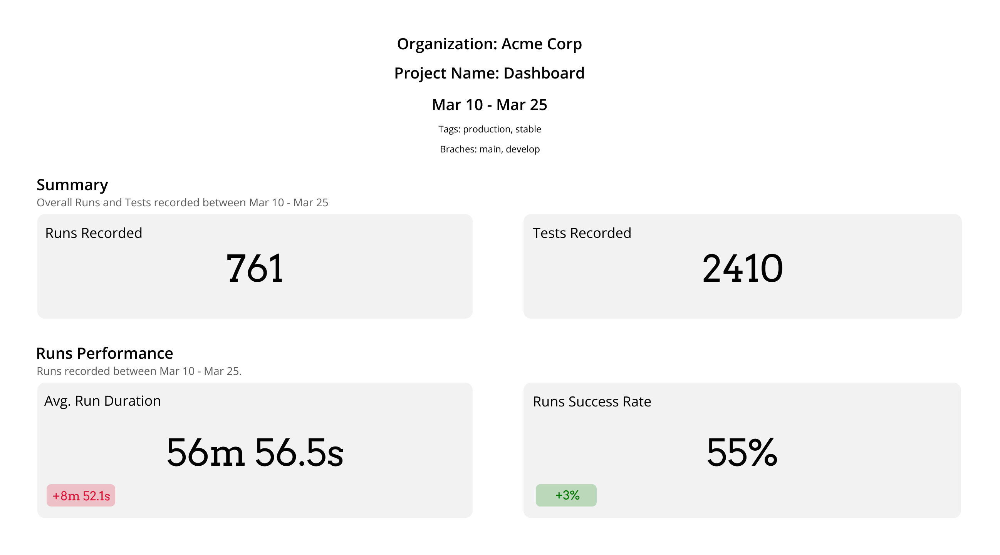
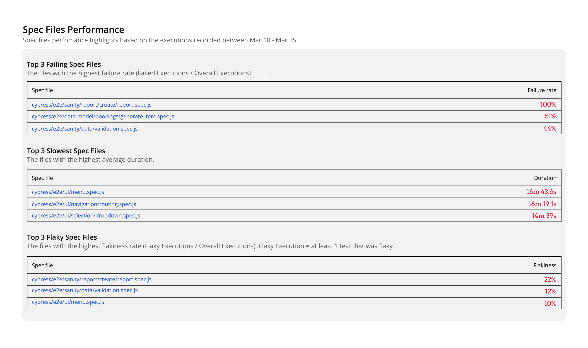
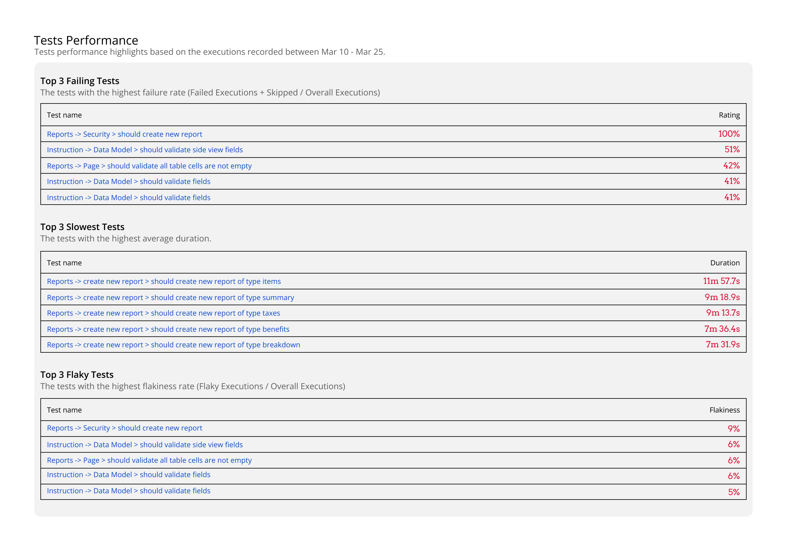
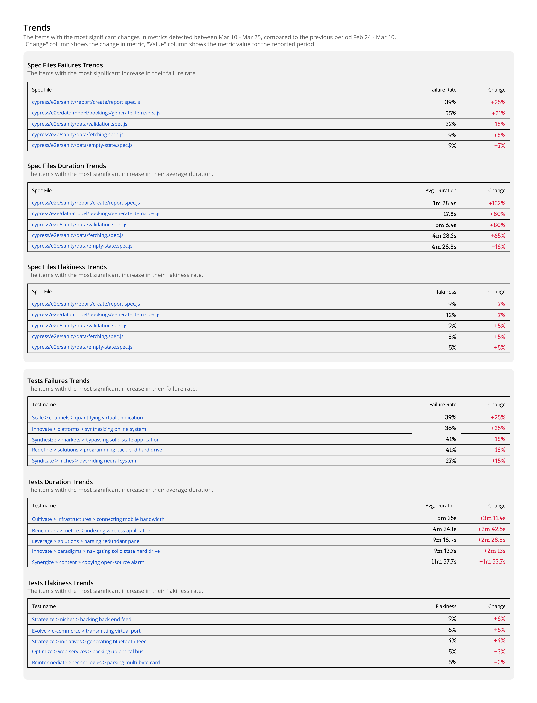

# Automated Reports

✨ Currents **Automated Reports** help teams to proactively identify regressions in test performance and take an action:

* Prevent problems that go unnoticed for weeks
* Reduce the waste of CI resources caused by failed or flaky tests
* Avoid your team's frustration from rerunning unreliable and flaky tests again and again

An unwanted change in a test performance can go unnoticed for a long time, especially for larger teams where multiple contributors change the tests often.&#x20;

When a duration, flakiness, or failure rate change, it can often pass days or weeks before the regression in performance can be noticed. Meanwhile, teams waste time waiting for CI test results to appear, dealing with flaky, non-reliable, or often failing results.

When you integrate your Cypress or Playwright tests suite with Currents, we will start tracking the following metrics:

* The **failure rate** for each spec and test
* Spec files and individual test **duration**
* Spec files and individual tests' **flakiness rate**

With automated reports sent directly to your inbox, you can quickly identify the most expensive tests that waste CI resources and frustrate your team.

* Items with the **highest duration**
* Items with the **highest flakiness rate**
* Items with the **highest failure rate**

<figure><figcaption></figcaption></figure>

In addition, the report includes spec files and tests that showed a decline in performance compared to the previous period (usually a week):

* Specs / tests with the most significant increase in duration
* Specs / tests with the most significant increase in failure rate
* Specs / tests with the most significant increase in flakiness rate

<figure><figcaption></figcaption></figure>

### Enabling Automated Reports

To enable the reports open the **Automated Reports** section in the org menu.

<figure><figcaption>
Access to the Automated Reports
</figcaption></figure>

You will then be able to configure the report for each project within the organization.

1. Click “Enable/Disable” to activate the report for the project.
2. Add the emails of report recipients.
3. Add a comma-separated list of tags - only records matching the filter will be included in the report.
4. Add a comma-separated list of author emails - only records matching the filter will be included in the report.
5. Add a comma-separated list of branches - only records matching the filter will be included in the report.
6. Select the preferred time and day for sending the report. The report will be sent weekly on the selected day / time.
7. Click “Save” to apply the changes.


Automted Reports Configuration


Use **Send Test Report** section to send a preview of a report for the selected period.

<figure><figcaption>
Automated Reports Configuration
</figcaption></figure>

### Report Structure

The report structure includes essential data about the report, summaries of overall items recorded during the period, a section focused on individual cypress spec files, and another section focused on individual cypress tests. The report also shows items with the most significant changes in metrics during the reported period compared to the previous period.

#### Header

Essential data - the dates, organization, project details, and filters applied.

#### Summary

Review of overall items recorded during the period: runs and tests.

**Runs Performance**

Both metrics contain a changing trend, indicating how the metrics changed compared to the previous period.

* The Average Run Duration of **+8m 52s** means that the duration of the average runs increased.
* Success Rate of **+3%** means that the success rate increased compared to the previous period.

<figure><figcaption>
Report example: Header and Summary
</figcaption></figure>

#### Spec Files Performance

Spec Files Performance section focuses on individual cypress spec files, detecting the worst-performing spec files in your suite based on the executions recorded during the reporting period.

Each line item has the following format:

| Spec File                                                                     | Metric                                              |
| ----------------------------------------------------------------------------- | --------------------------------------------------- |
| \<Spec file name> - a link to the detailed performance view for the spec file | The metric value calculated for the reported period |

*   **Top 3 Failing Spec Files**

    It presents the files with the highest failure rate. The failure rate is determined by the formula `Failed Executions / Overall Executions.` The `Failed Execution` status is described on the [Spec File Status documentation](https://currents.dev/readme/spec-files/spec-file-status).

    Having spec files with a high failure rate can have a negative impact on the overall development process, increase the risk of regression, and negatively affect confidence in the codebase.
*   **Top 3 Slowest Spec Files**

    It presents the files with the longest duration. Break down those tests to reduce the overall duration of your runs with parallelization.
*   **Top 3 Flaky Spec Files**

    It presents the files with the highest flakiness rate. The flakiness rate is determined by the formula `Flaky Executions / Overall Executions.` A `Flaky Execution` has at least 1 test detected as flaky, according to the [Flaky Tests Documentation](https://currents.dev/readme/tests/flaky-tests).

<figure><figcaption>
Spec Files performance report example
</figcaption></figure>

#### Tests Performance

Tests Performance section focuses on **individual cypress tests** and shows the worst performers based on the executions reported within the period.

Each line item has the following format:

<table><thead><tr><th width="373.5">Test Title</th><th>Metric</th></tr></thead><tbody><tr><td>&#x3C;Test Title> - a link to the detailed performance view for the test</td><td>The metric value calculated for the reported period</td></tr></tbody></table>

*   **Top 3 Failing Tests**

    It presents he tests with the highest failure rate. The failure rate is determined by the formula `Failed Executions + Skipped / Overall Executions.` The `Failed` and `Skipped` statuses are determined according to the [Test Status Documentation](https://currents.dev/readme/tests/test-status).
*   **Top 3 Slowest Tests**

    It presents the tests with the longest average duration. Break down those tests to reduce the overall duration of your runs with parallelization.
*   **Top 3 Flaky Tests**

    It presents the tests with the highest flakiness rate. The flakiness rate is determined by the formula `Flaky Executions / Overall Executions.` A `Flaky` execution ihas at least 1 test detected as flaky, according to the [Flaky Tests Documentation](https://currents.dev/readme/tests/flaky-tests).

<figure><figcaption>
Tests Performance report example
</figcaption></figure>

#### Trends Section

The “Trends” section shows the items with the most significant changes in metrics during the reported period compared with the previous period. Currents will detect the items with the highest negative change and list them in the report. For example, when a test’s duration, flakiness rate, or failure drastically increases during the reported week, it will appear in the “Trends” section.

<figure><figcaption>
Trends report example
</figcaption></figure>

Each line item has the following format:

| Spec File / Test Title                                                             | Metric                                              | Change                                                           |
| ---------------------------------------------------------------------------------- | --------------------------------------------------- | ---------------------------------------------------------------- |
| Spec name / Test title - a link to the detailed performance view for the spec file | The metric value calculated for the reported period | The change in the metric’s value compared to the previous period |

Clicking on the item (spec file name or test title) will open the Currents dashboard with a detailed performance view for further investigation.

*   **Spec File / Test Failures Trends**

    Lists the spec files with the most significant increase in their **failure rate**. For example:

    | Spec File / Test Title | Failure Rate | Change |
    | ---------------------- | ------------ | ------ |
    | item                   | 29%          | +23%   |

    It means: the _item_ had a failure rate of **29%** during the reported period (usually a week), which is a **23%** increase in its failure rate compared to the previous week.
*   **Spec File / Test Duration Trends**

    Lists the spec files with the most significant increase in their **average duration**. For example:

    | Spec File / Test Title | Avg. Duration | Change |
    | ---------------------- | ------------- | ------ |
    | item                   | 20.4s         | +16.7s |

    It means: the _item_ had an average duration of **20.4 seconds** during the reported period, which is a **+16.7s** increase compared to the previous week.
*   **Spec File / Test Flakiness Trends**

    Lists the spec files with the most significant increase in their **flakiness rate**. For example:

    | Spec File / Test Title | Flakiness Rate | Change |
    | ---------------------- | -------------- | ------ |
    | item                   | 61%            | +57%   |

    It means: the _item_ had a flakiness rate of 61% during the reported period and is a **+57%** increase, i.e., the flakiness rate increased from 4% to 61% compared to the previous week.

