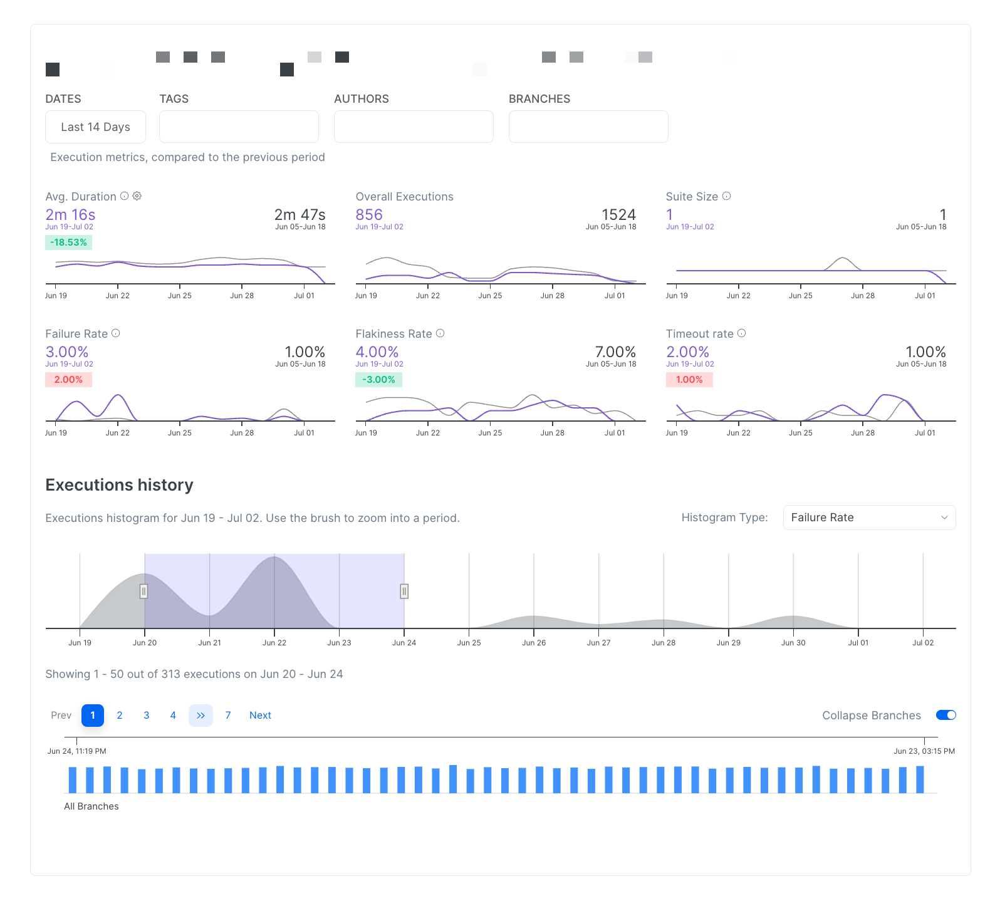
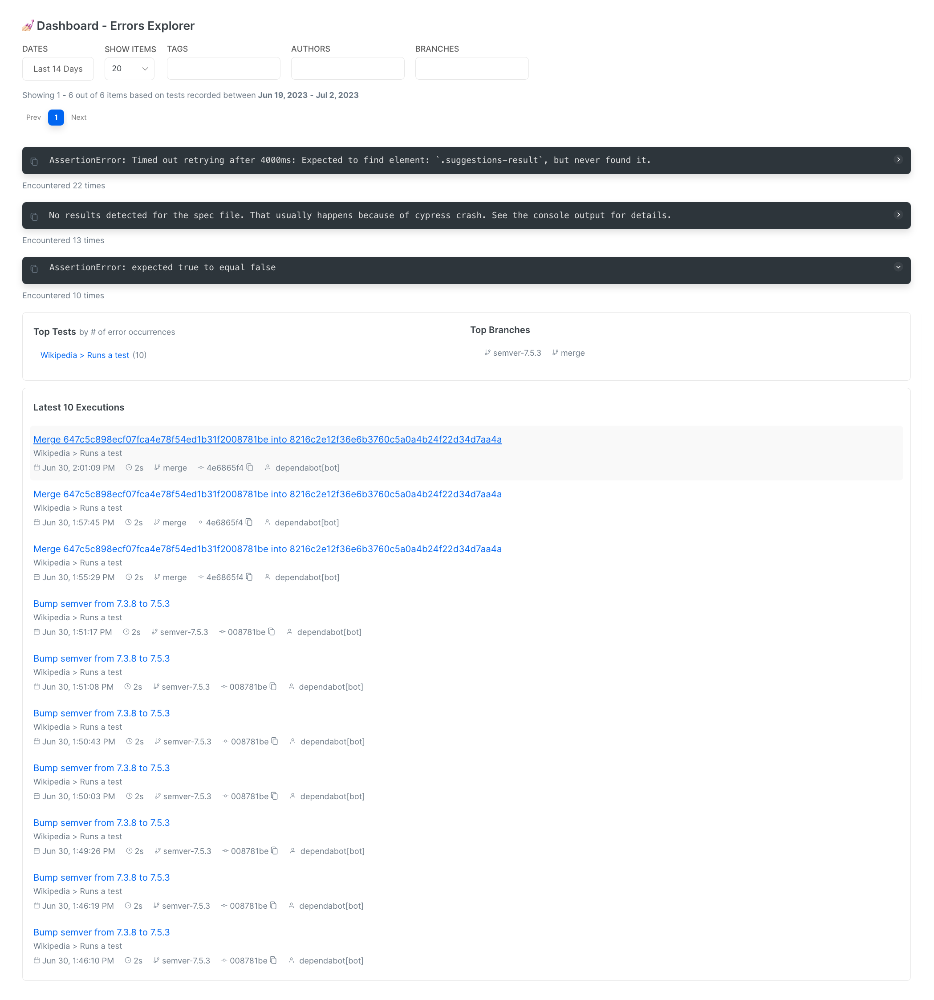

# Test Suite Performance Explorer

Test Suite Performance Explorer is a test management and analytics tool that enables users to examine, track and troubleshoot the performance of their test suite on a spec or individual test level.

<figure><figcaption>
Test Suite Performance Explorer
</figcaption></figure>

Together with [automated-reports.md](../automated-reports.md "mention"), the Test Suite Performance Explores allow teams to proactively detect changes in tests flakiness, failure rate or duration and to effectively discover the root cause of regressions in performance.

In addition, an aggregated view of cross-run top errors, filtered by specified criteria, facilitates the identification of potential bottlenecks in test execution and streamlines the troubleshooting process.

<figure><figcaption>
Top Errors Preview
</figcaption></figure>

By offering improved visibility and organization of test results, Test Suite Explorer helps teams to identify the tests that started to be flaky, and increased their failure rate or duration.\
