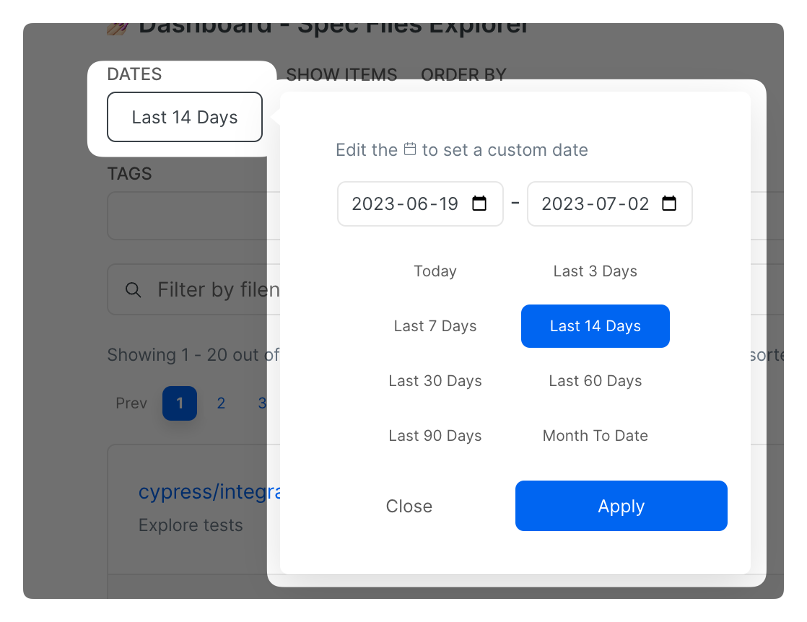
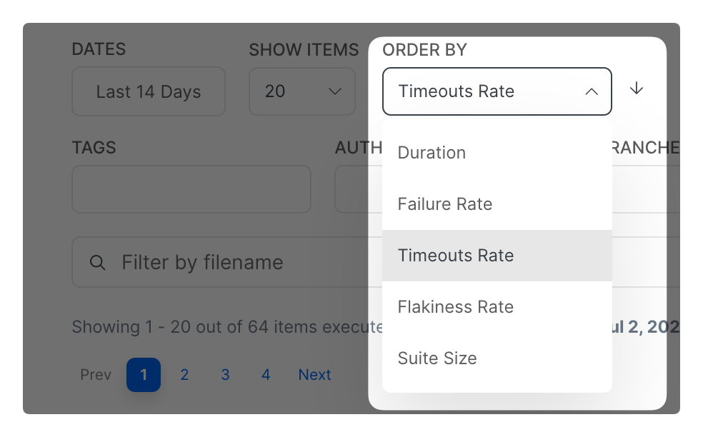
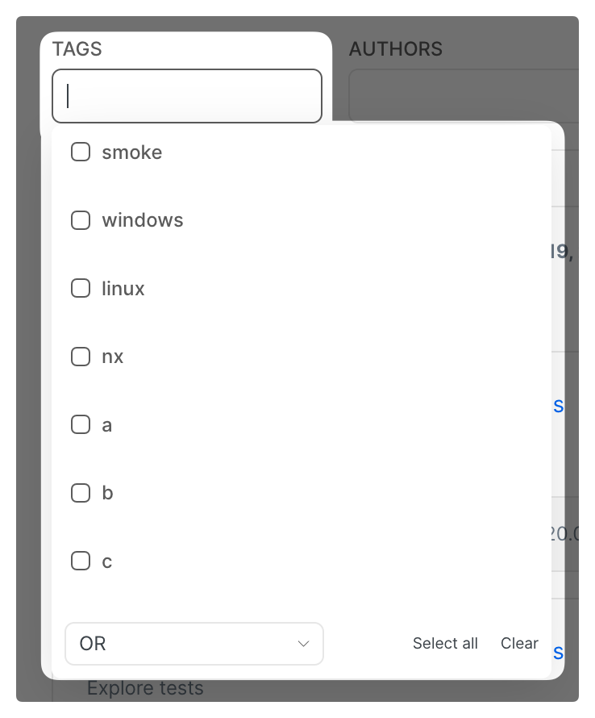

# Spec Files Explorer

The Spec Files Explorer allows users to track and analyze spec files performance using various metrics like:

* Duration
* Failure Rate
* Flakiness Rate
* Timeout Rate
* Suite Size

A typical use case is to detect or monitor the performance of the spec files that cause the degraded performance of the overall test suite - e.g. spec files with the highest flakiness rate, longest duration etc.

Currents will calculate the metrics based on the executions recorded during the provided date range and the defined filters.&#x20;

The following sections - [**Controls Overview**](./#controls-overview)**,** [**Metrics Description**](./#metrics-description)**,** [**List Item Description**](./#list-item-description), and [**Use Cases**](./#use-cases) - provide a comprehensive understanding of the feature, its components, and how they can leverage it to perform advanced analysis and gain valuable insights from their spec file executions.


Spec Files Explorer


## Controls Overview

The Explorer feature allows users to filter the recordings by [dates](./#dates), [tags](./#tags), [authors](./#authors), [branches](./#branches), and [filename](./#filename).&#x20;


Note: only the Spec File recordings matching the filters will be used for calculating the metrics.


### **Dates**

By adjusting the date range, users can narrow their analysis to a particular timeframe, such as a week, a month, or a custom range. As users modify the dates, the spec files will be automatically organized and filtered accordingly.

<figure><figcaption>
Dates filter
</figcaption></figure>

### Show Items

Users can configure the number of spec files displayed per page. They can set up to 100 items; the default setting is 20.

### Order by

The feature provides [five metrics](./#metrics-description) for sorting the spec files, explained in detail in the following section. The Spec Files Explorer will then rearrange the spec files in the list based on the chosen metric, placing the files with higher metric values at the top respectively.

You can toggle the sorting order by clicking on the arrow next to the list.

<figure><figcaption>
Spec Files list ordering control
</figcaption></figure>

### Tags

If users classify their runs using [Tags](https://currents.dev/readme/runs/run-details#run-tags), they can filter the Spec Files recordings matching the tagged runs. This feature lets users quickly focus their analysis on a specific subset of Spec Files that share common characteristics or attributes defined by the tags.

Please note, you can change the combinator logic between AND / OR.

<figure><figcaption>
Selecting Spec Files Recordings based on Tags
</figcaption></figure>

### Authors

Users also can filter spec files based on the author of the spec file. This allows test managers to track the performance and results of spec files contributed by different authors, helping to identify any variations in quality, efficiency, or issues introduced by specific authors.

### Branches

Users can filter the spec files based on the branch they belong to. This helps in comparing and evaluating the behaviour of different branches, enabling users to identify any specific issues or patterns within each branch.

### Filename

Users can enter a keyword or part of a filename in the filter input field, and the feature will update the list to display only the spec files that match the provided criteria. This filter lets users quickly find and access specific spec files of interest, especially when dealing with many items.

## Metrics Description

The metrics provided by the Spec Files Explorer offer valuable insights into the performance and characteristics of the spec file executions, enabling users to identify areas that can be optimized and improved. The metrics are presented below.

### **Duration**

It determines the average duration of fully completed spec files, excluding timed-out or cancelled recordings. Moreover, you can exclude or include failed executions for calculating the average duration, which can be toggled with a flag at the top right of the list panel.


Note: a spec file is considered fully completed if the test runner (Cypress and Playwright) reported the results for all the tests included in the spec file


### **Failure Rate**

The failure rate represents the percentage of spec file executions that failed - i.e. had 1 or more failed tests during the selected period.&#x20;

### **Timeout Rate**

The timeout rate measures the percentage of spec file executions that timed out, compared to overall recorded executions. A spec file is marked as timed out if we didn't the results from all of its tests before exceeding its run's timeout. See [run-timeouts.md](../../../runs/run-timeouts.md "mention").

### **Flakiness Rate**

The flakiness rate represents the percentage of spec file executions that had 1 or more flaky tests.

### **Suite Size**

The suite size refers to the number of tests presented in a spec file. It indicates a test suite's overall size or complexity within a spec file.


Note: only fully completed recordings of a spec file are considered for counting the suite suze


### Executions

The overall executions metric indicates how many recordings were included during the selected period and used for calculating the metrics.

## List Item Description

The Spec Files Explorer displays a list of spec files along with the five calculated [metrics ](./#metrics-description)beneath each spec file. To facilitate sorting and filtering, the Explorer highlights the metric used on the right side. This visual indicator allows users to quickly identify the metric based on which the list is currently organized. As a result, the feature offers users a comprehensive and convenient way to analyze and compare spec files.

<figure><figcaption>
List Item Description
</figcaption></figure>

## Use Cases

Overall, this feature offers greater flexibility in test management, empowering users to enhance their testing performance and efficiency and facilitating the identification of determined issues on spec files, for example:

* The flakiest Spec Files from the selected period for a specific branch
* The Failure Rate trends for specific branches for the past months
* The most long-running Spec Files and how they changed their duration over time
* The Spec Files that experienced the most timeouts in the past weeks

Clicking on an individual spec file will reveal a detailed drill-down of the selected spec file performance, including a detailed history of execution, top errors, etc.&#x20;

This detailed analysis is described in the [Spec Files Performance ](spec-files-performance.md)section.
