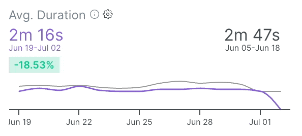
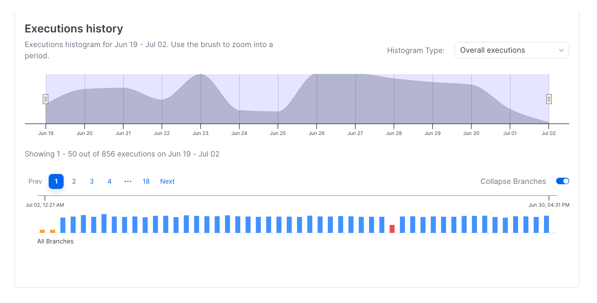

# Spec Files Performance

## Individual Spec File View

Selecting a particular spec file in Spec Files Explorer opens a detailed view of the spec file performance. You can analyze the metrics, including the trend and compare them to the previous period using six graphs that showcase the key metrics.&#x20;

These [**metrics**](./#metrics-description) include

* [**Average Duration**](./#duration)
* [**Overall Executions**](./#executions)
* [**Suite Size**](./#suite-size)
* [**Failure Rate**](./#failure-rate)
* [**Flakiness Rate**](./#flakiness-rate)
* [**Timeout Rate**](./#timeout-rate)

By analyzing these six metrics through the provided graphs, users can understand the spec file's performance, reliability, and characteristics over time.&#x20;

This helps to identify trends, patterns, and areas for improvement, ultimately enhancing the quality and efficiency of testing processes.

<figure><figcaption>
Cypress or Playwright Spec File Performance Overview
</figcaption></figure>

## Controls Overview

The Individual Spec File view allows users to sort and filter spec files by [**dates**](./#dates)**,** [**tags**](./#tags)**,** [**author**](./#author), and [**branches**](./#branches). Only the Spec File recordings matching the filters will be included in the graphs and the metrics calculations.&#x20;

## Reading Performance Charts

Upon selecting the dates period, the charts show two lines:

* The primary <mark style="color:purple;">purple</mark> line shows the metric values for the selected period
* The secondary \[gray] line shows the metric value for the period preceding the selected period

For example, selecting a 14-day period reveals this type of chart:

<figure><figcaption>
Avg. Spec File Duration Chart
</figcaption></figure>

* The purple line shows the metric value for the selected date range (last 14 days)
* The purple amounts are the average value for the selected period - i.e. the average duration of the spec file in the example based on the last 14-day recordings was 2m 16s
* The gray line shows the metric value for the previous date range (28 days ago to 14 days ago)
* The gray amounts are the average value for the preceding period - i.e. the average duration of the spec file in the example based on the recordings from 28 days ago rill 14 days ago was 2m 47s
* The trend change value of <mark style="color:green;background-color:green;">**-18.53%**</mark> indicates that there was an improvement in the metric value for the recent period, compared to the preceding period

Hovering over a particular day would reveal the metric values and the difference between the selected day and the matching day in the preceding period:

<figure><figcaption>
Comparing Spec File performance for specific date
</figcaption></figure>

For instance, let's consider the spec file analyzed in the video below. During the analysis, the peak of the [**average duration**](./#duration) for this spec file occurred on the same day as the highest [**failure rate** ](./#failure-rate)within the selected period.&#x20;


Zoom into one Spec File metrics


It suggests a potential correlation between the duration of the spec file's executions and its failure rate. The fact that the highest average duration aligns with the highest failure rate indicates that longer execution times may be associated with an increased likelihood of failures for this particular spec file.&#x20;

By identifying patterns or trends where these metrics coincide, users can find potential performance bottlenecks that could be causing longer execution times and leading to failures.

A similar analysis can be done on any other metric - the charts provide a visual indication of improvements or regressions in spec file performance, and also, together with Spec Files history allow pinpointing the root cause of change in the performance metrics.

## Executions History

<figure><figcaption></figcaption></figure>

The Executions History shows the recordings matching the selected filters on a timeline - each bar is an execution, its colour is determined by the spec file outcome, and the height is the relative duration of the recording.

Users can use a brush tool to engage with these histograms, enabling them to zoom in and concentrate on executions in a particular period of interest.

### Overview Histogram (Brush)

The upper histogram (the Brush) shows all the executions for the selected period and allows quick navigation and focusing on specific executions. One can change the metric used for the histogram for more efficient navigation.&#x20;

For example, the recording below shows the executions history for a particular spec file. The default settings show 18 pages (or 856 samples) of matching items - it would be cumbersome to go through all 18 pages.&#x20;

By switching the histogram to use "Failure Rate" we quickly visually identify the period with an increased failure rate and adjust executions by dragging the histogram brush handles. In the example below we reduced the number of samples to 147 (3 pages) - that allowed us to quickly find the executions that caused the increase in failure rate.&#x20;

<figure><figcaption></figcaption></figure>

### Executions Timeline

Users can also arrange executions based on branches using the "Collapse branch" flag. This functionality enables a more structured and organized view of the data, grouping the executions according to their respective branches.

The Spec Files Execution History feature also organizes every spec file execution in a timeline format, where colors represent their respective execution status (<mark style="color:red;">**Failed**</mark>, <mark style="color:blue;">**Passed**</mark>**,** and <mark style="color:purple;">**Flaky**</mark>). Each spec file execution entry provides users with essential information such as the date, time, duration, branch, commit message, and author. Additionally, for failed tests, the feature presents an error preview.

Clicking on a recording (the bar) will open the selected recording and the associated run.


Executions History - Spec Files


