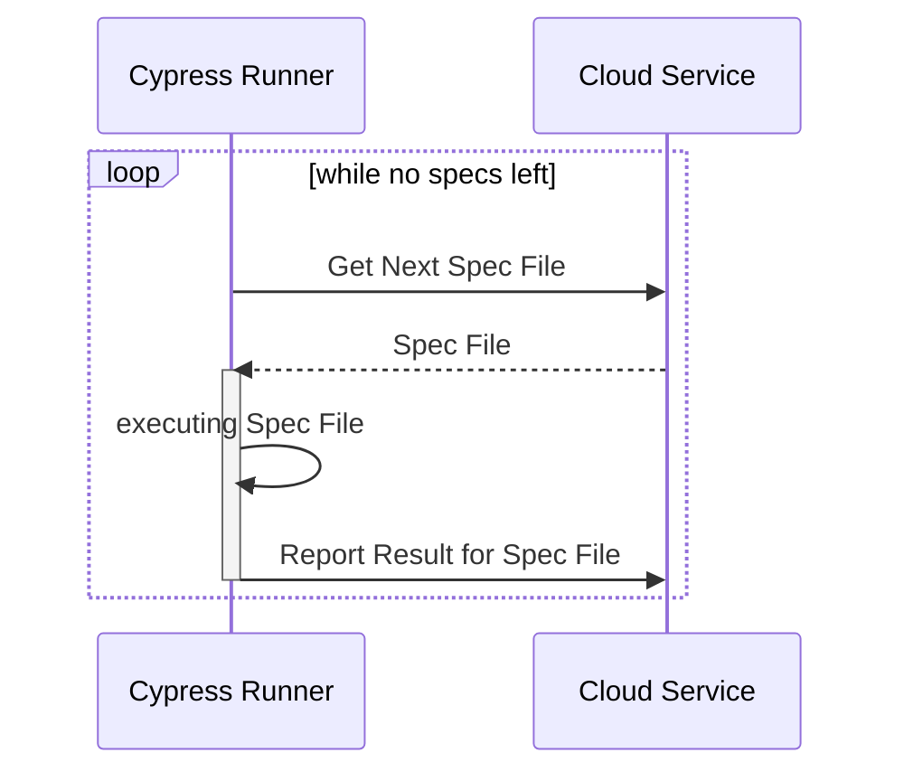
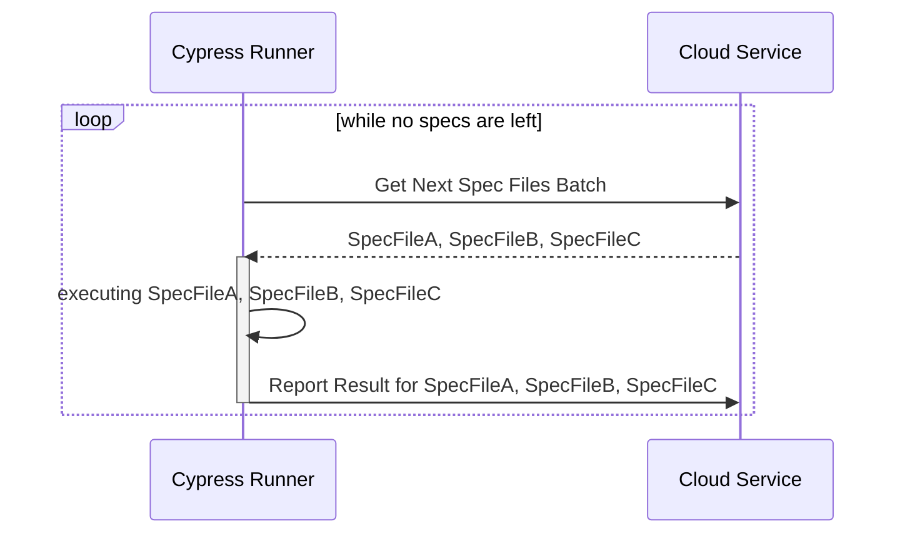

# cypress-cloud

### Requirements

The package requires cypress version 10+ and NodeJS 14.7.0+

### Setup

Install the package:

```sh
npm install cypress-cloud
```

Create a new configuration file: `currents.config.js` in the project’s root, set the `projectId` and the record key obtained from [Currents](https://app.currents.dev/) or your self-hosted instance of Sorry Cypress:

```javascript
// currents.config.js
module.exports = {
  projectId: "Ij0RfK",
  recordKey: "xxx",
  // Sorry Cypress users - set the director service URL
  cloudServiceUrl: "http://cy.currents.dev",
};
```

Add `cypress-cloud/plugin` to `cypress.config.{js|ts|mjs}`

```javascript
// cypress.config.js
const { defineConfig } = require("cypress");
const { cloudPlugin } = require("cypress-cloud/plugin");
module.exports = defineConfig({
  e2e: {
    setupNodeEvents(on, config) {
      return cloudPlugin(on, config);
    },
  },
});
```

### Usage


```sh
npx cypress-cloud --parallel --record --key your_key --ci-build-id hello-cypress-cloud
```


See all the available options `npx cypress-cloud --help`. Learn more about [CI Build ID](https://currents.dev/readme/guides/cypress-ci-build-id).

### Example

See an example in [examples/webapp](https://github.com/currents-dev/cypress-cloud/blob/main/examples/webapp) directory.

### Configuration

```javascript
// currents.config.js
module.exports = {
  projectId: "Ij0RfK", // ProjectID obtained from https://app.currents.dev or Sorry Cypress
  recordKey: "XXXXXXX", // Record key obtained from https://app.currents.dev, any value for Sorry Cypress
  cloudServiceUrl: "https://cy.currents.dev", // Sorry Cypress users - the director service URL
  e2e: {
    batchSize: 3, // orchestration batch size for e2e tests (Currents only, read below)
  },
  component: {
    batchSize: 5, // orchestration batch size for component tests (Currents only, read below)
  },
};
```

Override the default configuration values via environment variables:

* `CURRENTS_API_URL` - sorry-cypress users - set the URL of your director service
* `CURRENTS_PROJECT_ID` - set the `projectId`
* `CURRENTS_RECORD_KEY` - cloud service record key

### API

#### `run`

Run Cypress tests programmatically

```
run(params: CurrentsRunParameters): Promise<CypressCommandLine.CypressRunResult | CypressCommandLine.CypressFailedRunResult>
```

* `params` - [CurrentsRunParameters](https://github.com/currents-dev/cypress-cloud/blob/main/.github/packages/cypress-cloud/types.ts#L123) list of params compatible with Cypress [Module API](https://docs.cypress.io/guides/guides/module-api)
* returns results as a [CypressRunResult](https://github.com/cypress-io/cypress/blob/19e091d0bc2d1f4e6a6e62d2f81ea6a2f60d531a/cli/types/cypress-npm-api.d.ts#L277)

Example:

```javascript
import { run } from "cypress-cloud";

const results = await run({
  reporter: "junit",
  browser: "chrome",
  config: {
    baseUrl: "http://localhost:8080",
    video: true,
  },
})
```

### Batched Orchestration

This package uses its own orchestration and reporting protocol that is independent of cypress native implementation. This approach provides several benefits, including more control and the ability to implement new features that are not supported by the native cypress orchestration. The new approach, however, introduced some challenges. Using cypress runner in "offline" mode requires restarting it often, which slows down the testing process.&#x20;

To improve the performance, the new orchestration protocol allows multiple spec files to be batched together for greater efficiency. You configure the batching in `cypress.config.js` and use different values for different testing types:

```javascript
// currents.config.js
module.exports = {
  // ...
  e2e: {
    batchSize: 3, // orchestration batch size for e2e tests (Currents only)
  },
  component: {
    batchSize: 5, // orchestration batch size for component tests (Currents only)
  },
};

```

Based on our benchmarks, the performance is comparable to that of the native orchestration, however, it can vary depending on your specific configuration and setup. Adjusting the batching configuration can help to achieve optimal results for e2e or component tests.

#### Native Orchestration Diagram



#### Batched Orchestration Diagram



