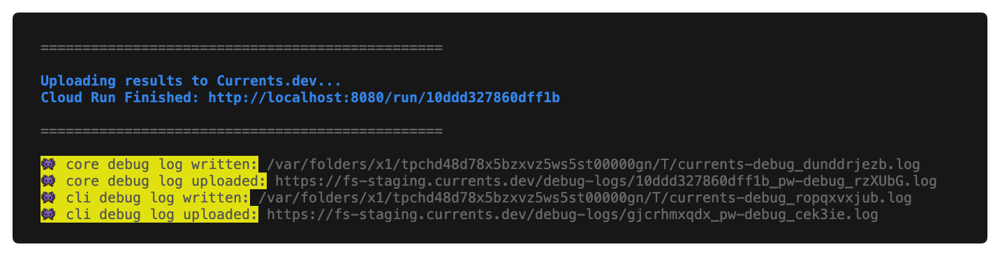

# Troubleshooting

If you are experiencing issues with using `@currents/playwright`, please collect more information about the failure and submit a support request via our support channels.&#x20;


<mark style="color:yellow;">**👇 tl;dr follow the steps below for effective troubleshooting, thank you 🙏🏻**</mark>

Collect environment information

* Affected Run URL
* The exact command used to run Playwright
* Screenshots if applicable

\
Collect and share the debug logs

* `npx pwc --pwc-debug=remote ...`&#x20;
* or set  `debug: "remote"` in Currents reporter configuration


### 1. Collecting Environment Information

Please collect the following information to help us effectively debug the problem:

* The associated dashboard Run URL
* Screenshots if applicable
* Your setup method and configuration files
* The exact command used to run playwright
* Environment information (use the command below)

Use the following command to print information about your CI environment

```bash
npx envinfo --system --binaries --browsers --npmPackages --duplicates --npmGlobalPackages
```

### 2. Activate Debug Mode

#### Debug mode for version `0.11.3` and after

`@currents/playwright` version `0.11.3+` simplifies collecting the debug logs by uploading them remotely to Currents.&#x20;

To enable uploading the debug logs:

* provide `--pwc-debug` flag to `pwc` CLI command, OR
* set `CURRENTS_DEBUG` environment variable, OR
* provide `debug` option to reporter configuration.

The following values will enable uploading the debug logs to our servers:

* `remote` will upload the debug logs to Currents servers.
* `full` will print the logs to stdout and also upload them to Currents.

For example:



```
# on Linux
npx pwc --pwc-debug=remote ... 

# on Windows
cmd /V /C npx pwc --pwc-debug=remote ...
```



```
# on Linux
CURRENTS_PROJECT_ID=PROJECT_ID \ // the projectId from https://app.currents.dev
CURRENTS_RECORD_KEY=RECORD_KEY \ // the record key from https://app.currents.dev
CURRENTS_CI_BUILD_ID=hello-currents \ // a unique CI build ID
CURRENTS_DEBUG=remote \
npx playwright test

# on Windows
## - set the environment variables first
cmd /V /C ^
set CURRENTS_DEBUG=remote ^
set CURRENTS_PROJECT_ID=project_id&& ^
set CURRENTS_RECORD_KEY=record_key&& ^
set CURRENTS_CI_BUILD_ID=unique_build_id

## - the run the command
npx playwright test ...
```



```typescript
import { currentsReporter } from "@currents/playwright";
import { PlaywrightTestConfig } from "@playwright/test";

// Reference: https://playwright.dev/docs/test-configuration
const config: PlaywrightTestConfig = {
  // ...
  reporter: [
    currentsReporter({
      ciBuildId: Date.now().toString(),
      projectId: "bnsqNa",
      recordKey: "***",
      tag: ["playwright", "test"],
      debug: "remote"
    }),
  ],
};
export default config;
```



When enabled, the debug logs will be uploaded to Currents servers and a confirmation message will be shown after the run's completion, for example:

<figure><figcaption><p>Remote debug logs notification example</p></figcaption></figure>

Share the information about the collected remote debug logs with our support team for more effective troubleshooting.

#### Debug mode for versions `0.11.2` and below&#x20;


Please capture and share the **full** debug log - that will help the support person identify the root cause faster




```
# on Linux
npx pwc --pwc-debug ... 

# on Windows
cmd /V /C npx pwc --pwc-debug ...
```



```
# on Linux
CURRENTS_PROJECT_ID=PROJECT_ID \ // the projectId from https://app.currents.dev
CURRENTS_RECORD_KEY=RECORD_KEY \ // the record key from https://app.currents.dev
CURRENTS_CI_BUILD_ID=hello-currents \ // a unique CI build ID
DEBUG=currents* \
npx playwright test

# on Windows
## - set the environment variables first
cmd /V /C ^
set DEBUG=currents* ^
set CURRENTS_PROJECT_ID=project_id&& ^
set CURRENTS_RECORD_KEY=record_key&& ^
set CURRENTS_CI_BUILD_ID=unique_build_id

## - the run the command
npx playwright test ...

## - examine environment variables using "set" command
```


