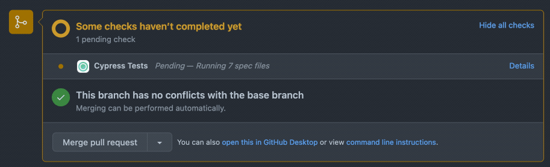

# GitHub App

Currents integration with GitHub allows posting results of your cypress tests as:

* [Commit status checks](https://docs.github.com/en/pull-requests/collaborating-with-pull-requests/collaborating-on-repositories-with-code-quality-features/about-status-checks) and / or
* Pull Request comment


### Activating GitHub Integration

To set up an integration:

* Open your project settings (Manage Project)
* Click “Connect” in “Connect your GitHub repositories” section.

Your browser will be redirected to GitHub; you will need to approve installing “currents.bot” GitHub App for your organization.


During the installation, the following permissions are requested:

* read and write to issues (for posting PR comments)
* read and write to Pull Requests (for posting PR comments)
* read and write to commit statuses (for posting commit status updates)

After approving the permissions, your browser will navigate back to Project Settings screen. To complete the setup, you will need to associate a repository with the project and then save the changes.


To change the GitHub repository associated with a project, select the new repository from the dropdown list and click “Save”

### GitHub Integration Settings

Use the following settings to change the behaviour of your GitHub Integration.

#### PR Comment

Enabling PR comments will post a summary of your run to the associated GitHub PR. The comment will be posted:

* after run’s completion - with the details of test results
* after run’s timeout - with the last known test results

Re-running cypress tests for the same PR will delete the previous comment and post a new one with the most recent result.


#### Commit Status Checks

Enabling Commit Status checks will trigger updates for the associated commit - the status depends on the outcomes of your run:

* “Pending” for on-going runs
* “Failed” for failed or timed out runs
* “Passed” for successful runs



### Deactivating GitHub Integration

To detach a repository from a project, navigate to Project Settings and click “Disconnect Repository”.


To completely remove GitHub integration, navigate to Project Settings, click “Configure” and then uninstall “currents-bot” Github App. Uninstalling the app will automatically detach all the projects from respective repositories.


### Troubleshooting GitHub Integration


**Please note:** your CI environment must expose git commit information in order for cypress agent to send commit details (sha, repository url etc.) and enable the integration.


Cypress agents use [https://github.com/cypress-io/commit-info](https://github.com/cypress-io/commit-info) package to discover git-related information.

* To expose your git information, please make sure that `.git` directory is present in your CI environment
* You can explicitly provide git information via environment variables

```
branch: COMMIT_INFO_BRANCH
message: COMMIT_INFO_MESSAGE
email: COMMIT_INFO_EMAIL
author: COMMIT_INFO_AUTHOR
sha: COMMIT_INFO_SHA
timestamp: COMMIT_INFO_TIMESTAMP
remote: COMMIT_INFO_REMOTE
```

#### I have enabled GitHub integration, but nothing is getting reported to GitHub

Behind the scenes, Currents is using git commit data do to identify the PR (issue) to comment on.&#x20;

The simplified flow is:

1. Get the list of pull requests associated with the commit using an API call: `'GET /repos/{owner}/{repo}/commits/{commit_sha}/pulls',`
2. Select a PR with HEAD commit matching the reported commit sha

Sometimes the commit sha reported for a run is different from PR's HEAD commit - our integration would not be able to detect the Pull Requests and won't post a comment and status checks.

Please contact our support via in-app chat and share:

* Run that is affected
* Commit sha of the affected run
* HEAD commit sha of the associated Pull Request
