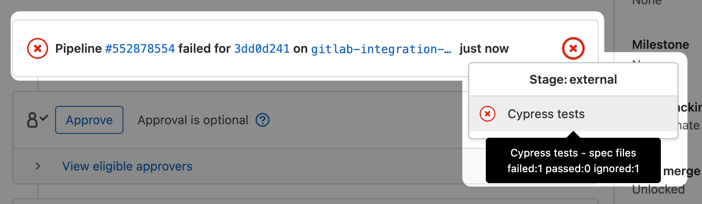
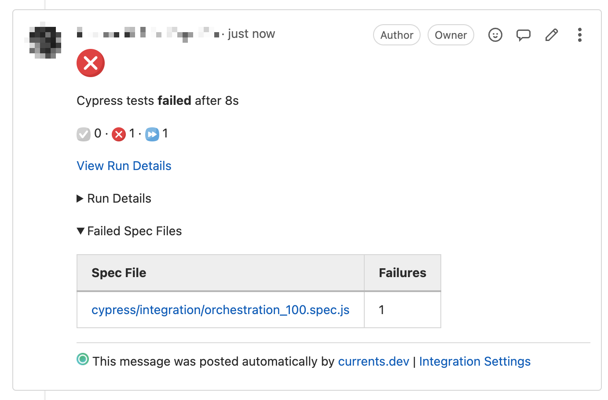
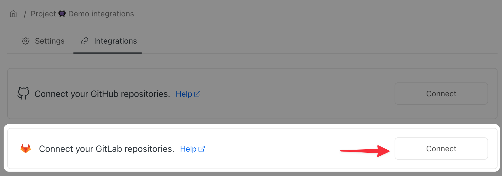
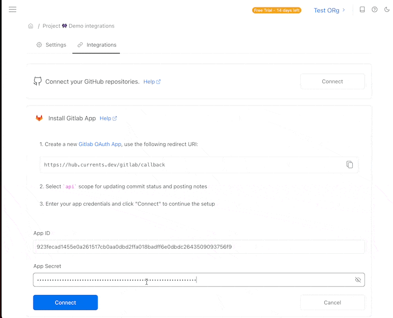

# GitLab Integration

Posting the results of cypress tests to GitLab is a convenient way to augment your Merge Requests with information from the browser automation tests suite.&#x20;

Currents Dashboard integration with GitLab allows posting [commit build statuses](https://docs.gitlab.com/ee/api/commits.html#post-the-build-status-to-a-commit) as well [merge request comments](https://docs.gitlab.com/ee/user/discussions/) with a summary of your cypress tests.

#### Example of GitLab commit status

#### Example if GitLab Merge Request note

### How to enable Cypress integration with GitLab?

In order to install GitLab integration in Currents Dashboard, visit **Project Settings -> Integrations** and click **Connect GitLab repositories**.

Follow on-screen instruction to create a new [GitLab OAuth App](https://docs.gitlab.com/ee/integration/oauth\_provider.html#user-owned-applications) with the following properties:

* `https://hub.currents.dev/gitlab/callback` as **Redirect URI**&#x20;
* `api` scope in the application permissions


**Please note:** `api` scope is required for the integration to work correctly. At the time of implementation GitLab didn't allow setting more granular permissions. Here's the list of API calls that Currents invokes:

* Getting the list of repositories accessible to OAuth token issuer
* Posting commit build status updates
* Posting and deleting Merge Request notes


Enter the details (**App ID** and **App Secret**) of the newly created GitLab OAuth App and click **Connect.**

After a successful connection, you will see a dropdown list of accessible  GitLab projects (repositories)

Select the repository you'd like to integrate with Currents Dashboard project and click **Save.**

Currents Dashboard will start posting [commit build statuses](https://docs.gitlab.com/ee/api/commits.html#post-the-build-status-to-a-commit) and [merge request comments](https://docs.gitlab.com/ee/user/discussions/) with a summary of your cypress tests to new Merge Request.

### Customizing GitLab Integration&#x20;

Toggling GitLab Integration settings changes the type of content that the is being posted to GitLab

* Merge Requests Comment - will toggle on / off posting  run results summary to a merge request
* Commit Status - will toggle on / off updating commit status with run results

### Disabling GitLab Integration

Clicking **Disconnect Project** (1) will detach the integration from the currently selected GitLab project. Disconnecting a project would keep GitLab OAuth App credentials. You would still be able to select a different GitLab project from the list to reactivate the integration.&#x20;

**Uninstalling** (2) the integration removes the associated credentials and the integration altogether.

