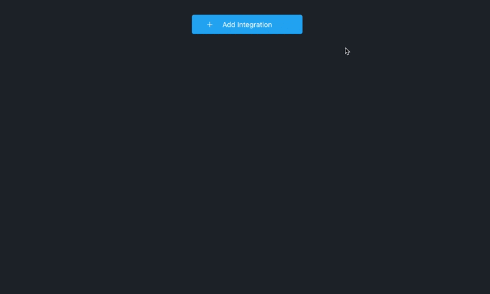

# Slack

Currents integration with Slack allows posting test results of your Cypress tests directly into Slack channels.

### How to enable Slack integration for Cypress tests?

In order to enable Slack integration and share cypress tests results to Slack channels, follow those steps:

* Navigate to "Manager Project" section for the selected project
* Click "Add Integration", select "Slack"
* Enter the details of your Slack Integration and click "Save"

Provide the following details to finalize Slack integration, click "Save" to finish:

* **Slack Webhook URL -** Incoming Webhook URL, e.g. `https://hooks.slack.com/services/XXX/YYY/ZZZ`. Read more about [Slack Incoming Webhooks](https://api.slack.com/messaging/webhooks).
* **Failed Runs Only** - enabling the toggle would only send results for failed, timed out or canceled runs.
* **Events (Optional)** - specify events that will trigger the integration and send the results. Leaving this field blank activates all the events.
* **Branch Name Filter (Optional)** - if specified, only send notifications for runs with branch names matching the pattern. Use [glob patterns ](https://en.wikipedia.org/wiki/Glob\_\(programming\))to specify the filter and test your filtering rules using the [playground](https://currents-branch-filter.stackblitz.io/). Please note, you must provide branch name within the [run-details.md](../runs/run-details.md "mention") to activate filtering.

### What events trigger notifications for Slack // Currents integration?

The following events trigger notifications for Slack integration.

#### **Run Start**

Triggered when a new run starts. If a run contains multiple groups, the notification will be triggered for each group.

#### **Run Finish**

Triggered when a run finishes its execution or when a run times out. If a run contains multiple groups, the notification will be triggered for each group. For timed out runs, the message will contain the last know results for the run or run group.

#### Run Canceled

Triggered when a run gets cancelled. If a run contains multiple groups, the notification will be triggered for each group. The message will contain the last know results for the run or run group.

.png>)

### How to disable Slack integration?

To disable Slack integration, simply delete the integration from the list of integrations.

### FAQ

#### Can I have multiple Slack integration for the same project?

Yes, you can have multiple Slack integrations for the same project.

#### What do notifications status colours mean?

<mark style="color:green;">Green</mark> - passed tests

<mark style="color:red;">Red</mark> - failed + skipped tests

Grey - ignored tests&#x20;

<mark style="color:purple;">Purple</mark> - flaky tests
