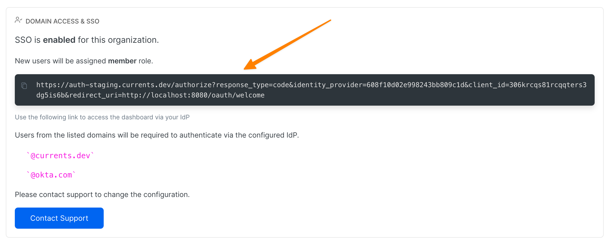

# SSO SAML2.0

Currents supports SSO integration via SAML 2.0. When enabled, authentication will be deferred to your Identity Provider (IdP).


**Please note** SSO integration is only available for customers with an active subscription.


The configuration entries you will need to define on your IdP

* Call-back URL / ACS URL: `https://auth.currents.dev/saml2/idpresponse`
* Audience / Entity ID: `urn:amazon:cognito:sp:us-east-1_Z9TVEnj0k`
* `NameID` format (nameIdentifierFormat) should be `urn:oasis:names:tc:SAML:2.0:nameid-format:persistent` with a limitation of up to 128 characters
* Attribute Mappings

<table><thead><tr><th width="155.5">IdP Attribute</th><th align="right">SAML Response Attribute</th></tr></thead><tbody><tr><td>Email</td><td align="right">http://schemas.xmlsoap.org/ws/2005/05/identity/claims/emailaddress</td></tr><tr><td>Full Name</td><td align="right">http://schemas.xmlsoap.org/ws/2005/05/identity/claims/name</td></tr></tbody></table>

Once you configure your IdP, please contact the support via in-app chat or email, and provide the following details:

* IdP Metadata or publicly available metadata document endpoint URL
* Domains list that your organization members will use to access the dashboard (for example user@**example.com**)

Please note that there are certain limitations to Currents SSO integration:

* Custom Roles for team members are not supported at the moment - the roles need to be manually configured for each user via the dashboard. New accounts will be created with "member" role.
* User Deletion - Currents won't be notified if user access is revoked in IdP. You can delete the users on the team page.
* Enabling SSO will mandate the auth method for all the team members**.**
* IdP-initiated auth requests are not supported, due to lack of support from AWS Cognito 😤. You can use a custom, dedicated link to start an authentication flow. You can get the link in **Manage Team** section at https://app.currents.dev after the SSO is enabled.

<figure><figcaption>
Using a dedicated link to initiate an authentication with your IdP skipping the Currents dashboard login page
</figcaption></figure>

