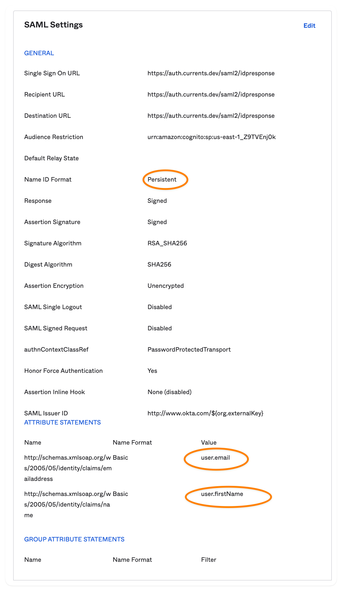

# Okta

### Prerequisites

SAML as the SSO mode with provisioning is available for customers with an active subscription. Please follow the guide below to enable the integration and provide the necessary details to Currents support team.

### Supported Features

* SP-initiated SSO (Single Sign-On)
* IdP-initiated SSO (through [Third-party Initiated Login](https://openid.net/specs/openid-connect-core-1\_0.html#ThirdPartyInitiatedLogin))
* Just-In-Time provisioning

For more information on the listed features, visit the [Okta Glossary](https://help.okta.com/okta\_help.htm?type=oie\&id=ext\_glossary).

### Non Supported Features

* Custom Roles for team members are not supported at the moment - the roles need to be manually configured for each user via the dashboard; new accounts will be created with "member" role
* User Deletion - Currents won't be notified if user access is revoked in IdP. You can delete the users on the team page
* Enabling SSO will mandate the auth method for all the team members**.**
* IdP-initiated auth requests are not supported (due to a lack of support from AWS Cognito)

### Configuration Steps

Install **Currents** application from Okta Integration Network (OIN) application catalogue: **Applications > Applications > Browse App Catalogue.** Type "**Currents**", select the application from the list, then click **Add Integration** and follow on-screen instructions.&#x20;

1. Copy the Metadata URL from the Okta Admin Console, SAML 2.0 Sign on methods section.
2. Contact the **Currents** support team (support@currents.dev) and request that they enable SAML 2.0 for your account. Include the "Metadata URL" value from the previous step. The Currents support team processes your request and provides you with an SSO ID and an encryption certificate.
3. In your Okta Admin Console, select the Sign on tab for the **Currents** SAML app, then click "Edit" and follow the steps below:
   * "Encryption Certificate": Upload the certificate provided by **Currents** support in the previous step.
   * Scroll down to Advanced Sign-on Settings and enter your "SSO ID".
   * Application username format: Select "email".
   * Click "Save".
4. Your SAML configuration for **Currents** is complete. You can start assigning people to the application.

### SP-initiated SSO

The sign-in process is initiated from https://app.currents.dev

1. From your browser, navigate to https://app.currents.dev/login
2. Enter your email, then Continue
3. Enter your Okta credentials (your email and password) and click "Sign in with Okta". If your credentials are valid, you are redirected to the Currents dashboard.

### Manual Setup Instructions

Please use the following settings in your Okta SAML App Integration.&#x20;

* Open **Applications > Applications > Create App Integration**
* Choose **SAML2.0**&#x20;

Use the following settings (copy them from [.](./ "mention"))

<figure><figcaption></figcaption></figure>
