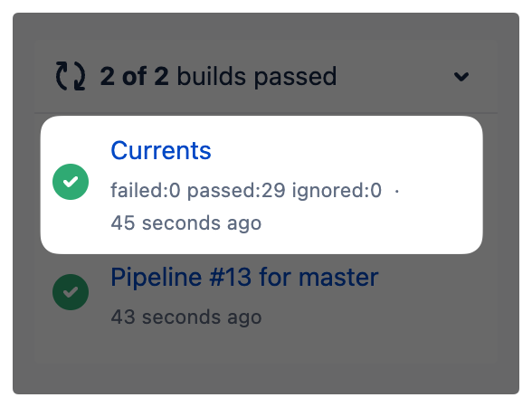

# Bitbucket

Currents integration with Bitbucket allows updating [Bitbucket Pipeline build status](https://developer.atlassian.com/server/bitbucket/how-tos/updating-build-status-for-commits/) with additional data from Cypress or Playwright test executions.

<figure><figcaption>
Example of a buld status update from Currents
</figcaption></figure>

### Enabling Bitbucket Integration

* Navigate to the project that integrates with Bitbucket
* Select **Manage Project > Integrations** and then click **+ Add Integration > BitBucket**
* Enter the details as appears on the screen, then click **Save**
  * **URL -** repository URL, make sure you have write permissions to this repository
  * **Username** - your username
  * **App Password** - Bitbucket App Password with `repo:write` access. [Create One](https://bitbucket.org/account/settings/app-passwords/)
  * **Build Name (Optional)** - the label for posting build status updates

<figure><figcaption>
Bitbucket integration configuration
</figcaption></figure>

When enabled, Current will post Cypress test results to the corresponding pipeline execution. You

&#x20;can have multiple Bitbucket integrations configured for the same project. Currents will use git commit data (repo name, commit sha) for posting the results.

### Disabling Bitbucket Integration

To disable Bitbucket integration, choose the integration you want to delete in **Project > Manage Project > Integrations**, and then expand the integration card and click **Remove**.
