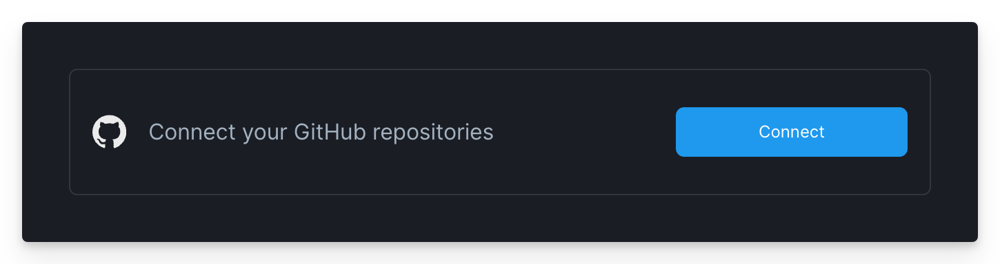
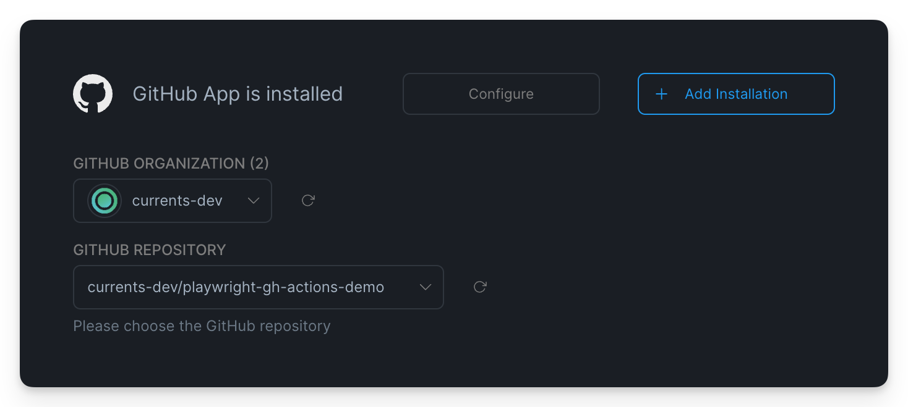
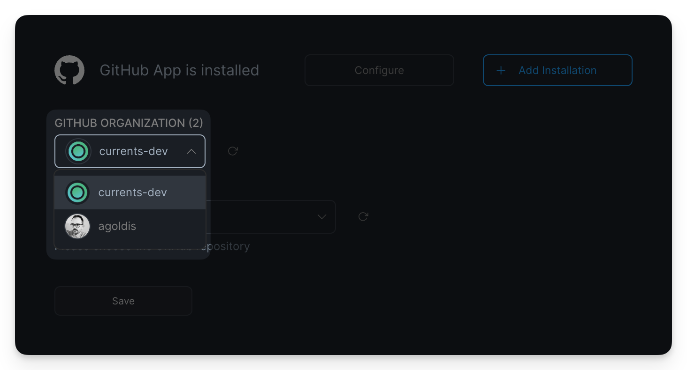
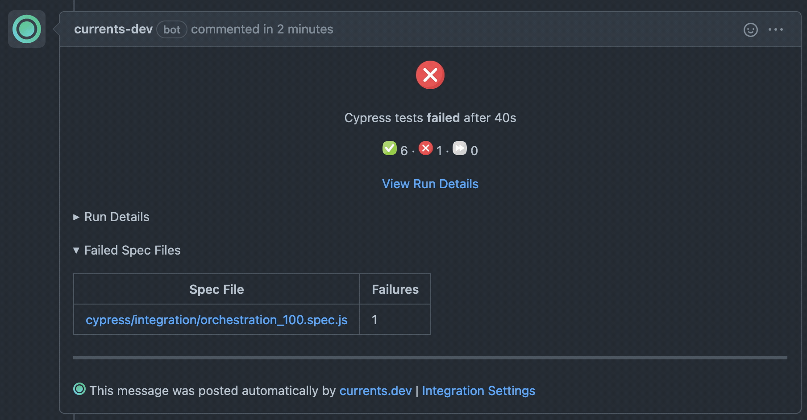
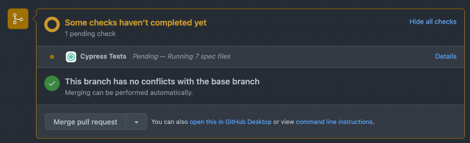

# GitHub App

Currents integration with GitHub allows posting results of your Playwright and Cypress tests as:

* [Commit status checks](https://docs.github.com/en/pull-requests/collaborating-with-pull-requests/collaborating-on-repositories-with-code-quality-features/about-status-checks) and / or
* Pull Request comment

### Activating GitHub Integration

To set up an integration:

* Open your project settings s**elect a Project > Settings > Integrations**
* Click “Connect” in the “Connect your GitHub repositories” section.

<figure><figcaption><p>Creating a new Currents integrations with GitHub</p></figcaption></figure>

Your browser will be redirected to GitHub. Approve the new installation for [currents-bot](https://github.com/apps/currents-bot) or request an approval from your GitHub organization admin.


Currents **doesn't** have access to the source code 🙈

We only user the following permissions:

* read and write to issues (for posting PR comments)
* read and write to Pull Requests (for posting PR comments)
* read and write to commit statuses (for posting commit status updates)


After approving the installation you'll be able to see the list of repositories. To finish the setup select a repository and click “Save” to reveal the integration settings (see below).

<figure><figcaption><p>Selecting repository for GitHub integration with Currents</p></figcaption></figure>

#### Connecting multiple GitHub organizations

You can have multiple GitHub organizations connected to Currents. Click **+ Add Installation** to restart the approval process for a new organization.&#x20;

After the new approval is complete, you will be able to switch the GitHub organizations and select a new repository.

<figure><figcaption><p>Switching GitHub Organizations</p></figcaption></figure>

### Deactivating GitHub Integration

To detach a repository from a project, navigate to **Project Settings > Integration > GitHub** and click “Disconnect Repository”.

To completely remove GitHub integration open **Project Settings > Integration > GitHub > Configure** and then uninstall “currents-bot” Github App. Uninstalling the app will automatically detach all the projects from their respective repositories.

## GitHub Integration Settings

### PR Comments

Enabling PR comments will post a summary of your run to the associated GitHub PR. The comment will be posted:

* after run’s completion - with the details of test results
* after run’s timeout - with the last known test results



Re-running tests for the same PR will delete the previous comment and post a new one with the most recent result unless **Keep Old Results** option is enabled

#### Failed Runs Only

Enabling the "Failed Runs Only" toggle would prevent posting a comment for successful runs - i.e. runs that have 0 failed or skipped tests.

**Events Selection**

You can customize what event can trigger posting a PR comment:

* Run Finish - will post a comment when a run completes its execution without cancellation or a timeout
* Run Cancelled - will post a comment upon the run's cancellation, due to [fail-fast-strategy.md](../../../guides/ci-optimization/fail-fast-strategy.md "mention")or cancellation via the Dashboard. See more at [cancel-run.md](../../../dashboard/runs/cancel-run.md "mention")
* Run Timeout - will post a comment after a run's timeout is detected. Read more about [run-timeouts.md](../../../dashboard/runs/run-timeouts.md "mention").

#### Keep Old **Results**

When enabled, old results posted as a PR comment will be preserved, i.e. the integration will keep the comments with the results of the previous runs.

### Commit Status Checks

Enabling Commit Status checks will trigger updates for the associated commit - the status depends on the outcomes of your run:

* “Pending” for on-going runs
* “Failed” for failed or timed out runs
* “Passed” for successful runs



#### Commit Status Label

Set the commit status label to distinguish the GitHub status checks one from another. For example, when multiple Current Dashboard projects are connected to the same repository, setting the Commit Status label will conveniently display the status check for each project separately.


Using the same status label for the same repo across different projects can create a conflict - runs from both projects will overwrite the associated status check item.


#### Run one check per framework

If you are reporting tests from multiple frameworks in the same job, you can enable this option to make sure the commit status check has a prefix with the framework label. This will guarantee that each testing framework gets their own status check.&#x20;


Make sure to update any repository rules that makes it mandatory for the commit status check to pass, as enabling this option will change the commit status title.&#x20;


#### Grouping commit status event into a single comment

Single Notification for all groups (Optional) – enabling will update GitHub commit status once per run event, regardless of the number of groups.

<figure><figcaption><p>Single notification for all groups</p></figcaption></figure>

### Troubleshooting GitHub Integration

Commit information must be available for GitHub integrations (PR comments, commit status updates). See [commit-information.md](../../../dashboard/runs/commit-information.md "mention").

* To expose your git information, please make sure that `.git` directory is present in your CI environment
* You can explicitly provide git information via environment variables

```
branch: COMMIT_INFO_BRANCH
message: COMMIT_INFO_MESSAGE
email: COMMIT_INFO_EMAIL
author: COMMIT_INFO_AUTHOR
sha: COMMIT_INFO_SHA
timestamp: COMMIT_INFO_TIMESTAMP
remote: COMMIT_INFO_REMOTE
```

#### I have enabled GitHub integration, but nothing appears in GitHub

Behind the scenes, Currents is using git commit data to identify the PR (issue) to comment on.&#x20;

The simplified flow is:

1. Get the list of pull requests associated with the commit using an API call: `'GET /repos/{owner}/{repo}/commits/{commit_sha}/pulls',`
2. Select a PR with HEAD commit matching the reported commit sha

Sometimes the commit SHA reported for a run is different from PR's HEAD commit - our integration would not be able to detect the Pull Requests and won't post a comment and status checks.

Please contact our support via in-app chat and share:

* Run that is affected
* Commit sha of the affected run
* HEAD commit sha of the associated Pull Request

Read more about [commit-data-for-github-actions.md](../../../getting-started/ci-setup/github-actions/commit-data-for-github-actions.md "mention").
