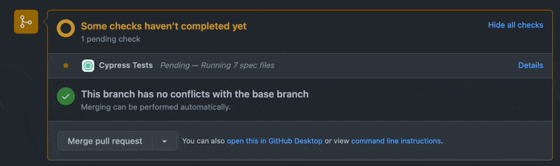

# GitHub OAuth

GitHub OAuth integration allows connecting you GitHub repos to Currents dashboard for sharing Playwright test results as GitHub [Commit Status checks](https://docs.github.com/en/pull-requests/collaborating-with-pull-requests/collaborating-on-repositories-with-code-quality-features/about-status-checks).


GitHub OAuth uses  GitHub personal token-based authentication to send the results of your Playwright runs to GitHub.

### Activating Legacy GitHub Integration

For share your Playwright test results as a GitHub status check item:

* Open Project Settings screen and click “+ Add Integration”
* Select “GitHub (legacy)”


You will need to provide the following details to activate the integration:

* Full URL of your GitHub / GitHub Enterprise repository, for example `https://github.com/currents-dev/dashboard`
* An [OAuth GitHub token](https://docs.github.com/en/authentication/keeping-your-account-and-data-secure/creating-a-personal-access-token) with `repo:status` permission for the selected repository
* **Optional:** Status label that will be used to identify the status check item

When activated and configured properly, Currents will start sending status check updated for the associated commits.



### Deactivating GitHub OAuth Integration

To deactivate GitHub integration, simply remove the integration item from the list.

### Troubleshooting GitHub OAuth Integration


**Please note:** your CI environment must expose git commit information in order for cypress agent to send commit details (sha, repository url etc.) and enable the integration.


Cypress agents use [https://github.com/cypress-io/commit-info](https://github.com/cypress-io/commit-info) package to discover git-related information.

* To expose your git information, please make sure that `.git` directory is present in your CI environment
* You can explicitly provide git information via environment variables

```
branch: COMMIT_INFO_BRANCH
message: COMMIT_INFO_MESSAGE
email: COMMIT_INFO_EMAIL
author: COMMIT_INFO_AUTHOR
sha: COMMIT_INFO_SHA
timestamp: COMMIT_INFO_TIMESTAMP
remote: COMMIT_INFO_REMOTE
```
