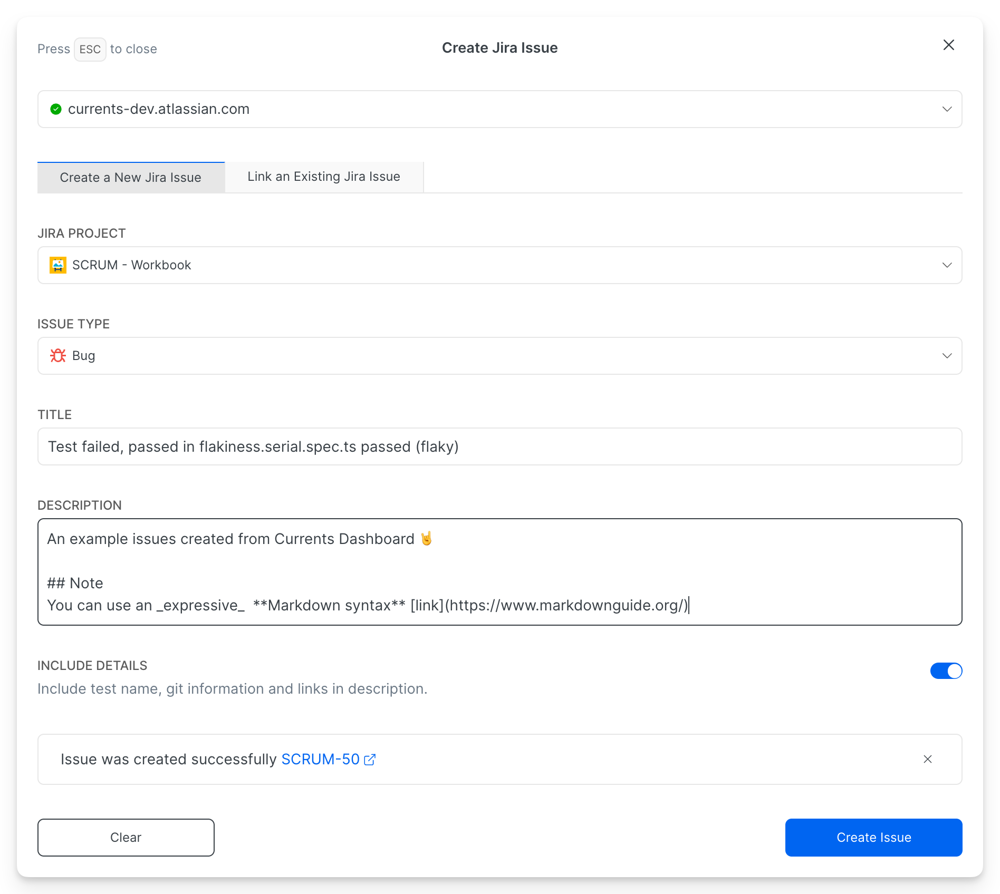

# Jira

Currents integration with Jira allows teams to create and link test failure details directly from the Currents dashboard. Team members can create new or add comments to existing Jira issues with full context:

* error messages,
* stack traces,
* metadata,
* and test history

without leaving Currents, eliminating context switching.

<figure><figcaption></figcaption></figure>

The integration is powered by <a href="https://marketplace.atlassian.com/apps/1238333">Currents for Jira Application</a> that runs on Jira Cloud.

### Setup

1. Enable Jira Integration in project settings
2. Install Currents for Jira from Atlassian Marketplace
3. Link the accounts with installation token

See the [Setup Guide](jira/setup.md) for complete instructions.

### Usage

* Create Issues from test failures with full failure details
* Link test failures to existing issues

See the [Usage Guide](jira/usage.md) for details.

#### Limitations

See [#limitations](jira/usage.md#limitations "mention")

### Security & API Access

The Jira integration is designed so that programmatic access - including through the [REST API](https://app.gitbook.com/o/-MT4mUcrnbXWgd1xvl_x/s/lcxad7NaXT7D2V6owvHN/) and the [MCP Server](../../ai/mcp-server.md) - never grants more capability than the dashboard itself:

* **Strictly contained to dashboard functionality.** API and MCP access to Jira is limited to the same operations available in the Currents dashboard: listing Jira projects and issue types, and creating or linking issues. There are no additional or privileged Jira operations exposed through the API.
* **Jira credentials are never disclosed.** The Jira access tokens used by the integration are stored encrypted and are never exposed through the API, the MCP server, or any response. Requests are proxied through Currents using the organization's configured Jira installation - clients never receive the underlying Jira API keys or tokens.
* **Governed by Currents API key permissions.** Jira write operations (creating or linking issues) require a **Read & Write** [Currents API key](../../dashboard/administration/api-keys.md). A **Read Only** key can list Jira projects and issue types but cannot create or link issues (requests return HTTP 403).

#### Requested Jira scopes

The [Currents for Jira](https://marketplace.atlassian.com/apps/1238333) application requests the following Atlassian scopes, which apply to the organization integration as a whole (dashboard, REST API, and MCP alike):

* `read:jira-work`
* `read:jira-user`
* `write:jira-work`
* `manage:jira-project`
* `read:app-system-token`

The integration does not grant any Jira permissions beyond these, and the API cannot expand its own access beyond what the installed Jira app already permits.
