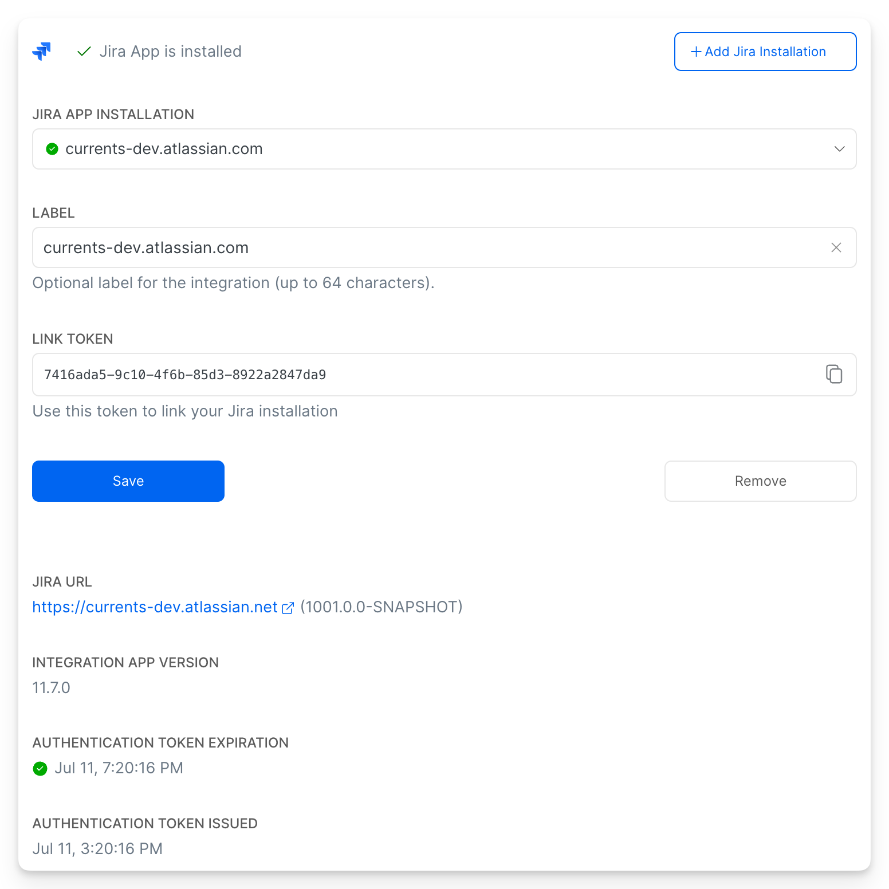

# Setup

Requirements:

* The installation must be performed by a user with Admin permission in Currents
* The installation must be performed by Jira App admin one that can install and configure applications

Create new Jira Installation in Currents

* Open Project Integrations section (select a **Project > Integrations**)&#x20;
* Click **Jira App > Add Integration**
* Click **+ Add Jira Installation**
  * You can have up to 3 Installations
* Change the intallation label, we commend setting it to your Jira App name e.g. `currents-dev.atlassian.com`
* After creating an installation you will get an **Installation Link Token** - you will need it later to link Currents for Jira to your organization.

Install Currents for Jira in your Jira Site

Open [Currents for Jira App](https://marketplace.atlassian.com/apps/1238333) on [Atlassian Marketplace](https://marketplace.atlassian.com) (or search for `Currents` )

* Click **Get It Now, follow the on-screen instructions to complete the installation**

Link the newly created installation

Once installed, you need to Link the newly installed application to your Currents organization

* Open **Setting (upper right corner) > Apps**&#x20;
* Open **Manage Apps** (usually `https://<namespace>.atlassian.net/plugins/servlet/upm`)
* Open **User-installed** section expand **Currents for Jira** and click **Configure**
* Enter the **Installation Link Token** and click **Link Installation**

<figure><figcaption></figcaption></figure>

🎉 Congratulations!  

A successfully linked installation details will show up in Currents Dashboard.

<figure><figcaption></figcaption></figure>
