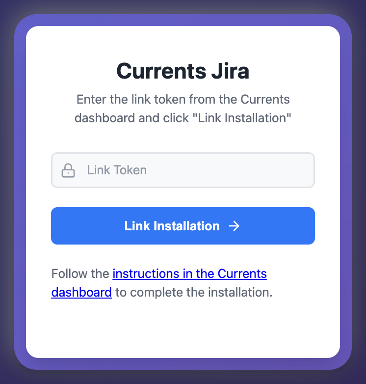

# Setup

## Requirements

You need:

* A Jira Cloud account
* An account with Currents Admin permissions
* An account with [Jira Admin](https://www.atlassian.com/software/jira/guides/permissions/overview#what-are-users-and-groups) permissions

## Enable Jira Integration

1. In Currents, navigate to your **Project > Integrations**
2. Click **Jira App > Add Integration**
3. Click **+ Add Jira Installation** (you can have up to 3 installations)
4. Set the Installation label to your Jira namespace (e.g., `currents-dev.atlassian.com`)
5. Copy the **Installation Link Token** - you'll need this to complete the connection

## Install Currents for Jira App

1. Go to [Currents for Jira](https://marketplace.atlassian.com/apps/1238333) on Atlassian Marketplace
2. Click **Get It Now**
3. Follow the installation wizard to complete the installation

## Link Jira App

Now connect the app to your Currents organization:

1. In Jira, go to **Settings** (upper right) **> Apps**
2. Open **Manage Apps** (`https://<your-domain>.atlassian.net/plugins/servlet/upm`)
3. Find the **User-installed** section
4. Expand **Currents for Jira** and click **Configure**
5. Paste your **Installation Link Token** and click **Link Installation**

<figure><figcaption>
Link Jira App to your Currents Organization
</figcaption></figure>

🎉 Congratulations!  

When successful, you'll see the linked installation details in your Currents Dashboard:

<figure><figcaption>
Example of successfully linked Currents app for Jira
</figcaption></figure>

