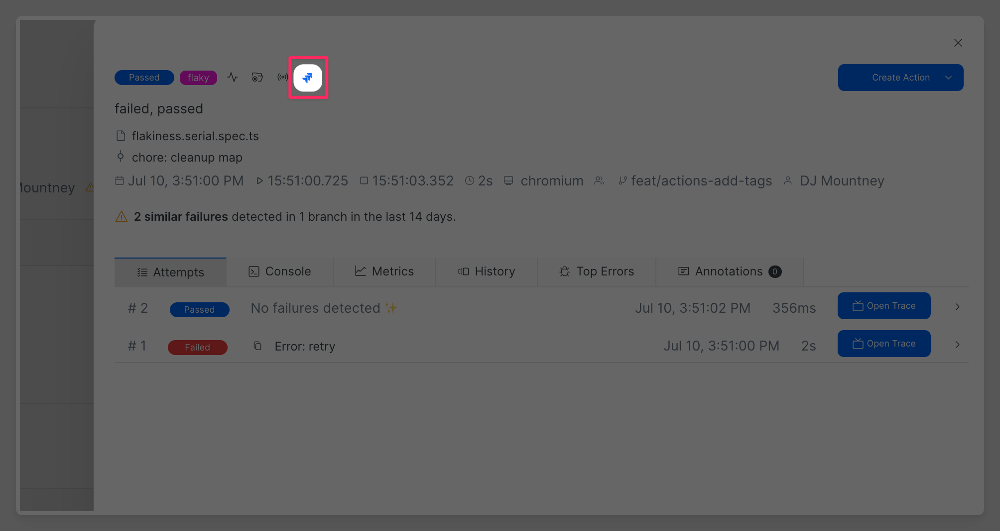
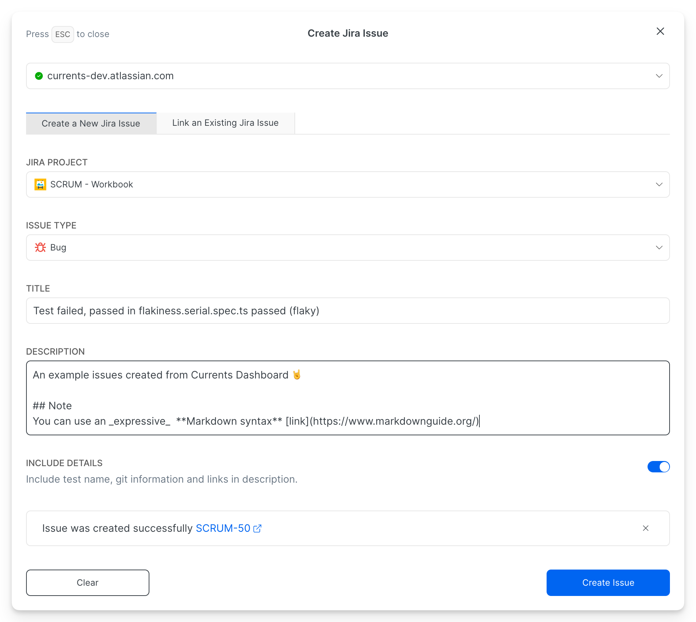

# Usage

Once Currents integration with Jira is installed, you can create new issues or add comments to existing Jira issues directly from currents dashboard.&#x20;

## Open Jira Modal

Open the desired test execution details and note the **Jira** ico&#x6E;**,** the icon only appears if there Jira intergration is enabled.

<figure><figcaption></figcaption></figure>

Clicking on the icon open a window where you can:

* Create a New Jira Issue&#x20;
* Link an Existing Jira Issue

## Create a New Jira Issue

To create a new Jira Issue

* Select **Jira Project** and **Issue Type**
* Enter **Issue Title** and optional **Description**
* Enable **Include Details** toggle to add contextual information about the currently presented text.

Here's an example of an newly created issue.

<figure><figcaption></figcaption></figure>

<figure><figcaption></figcaption></figure>

## Link to an Existing Jira Issue

To create a new Jira Issue

* Select **Jira Project**
* Select an existing issue by typing its title and selecting it (the output is limited to 50 items, type a more specific issue title to reduce the number of results)
* Add comment content and click Add Comment
* Enable **Include Details** toggle to add contextual information about the currently presented text.

Here's an example of new comment for an existing issue

<figure><figcaption></figcaption></figure>

<figure><figcaption></figcaption></figure>
