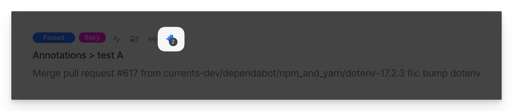
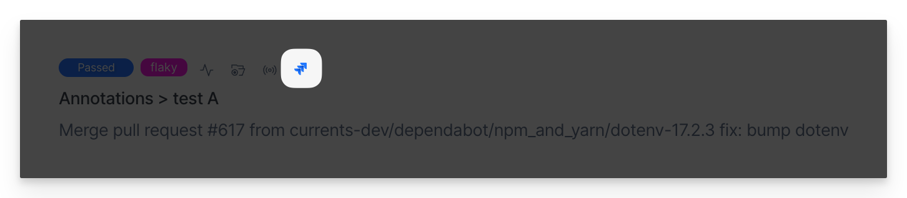
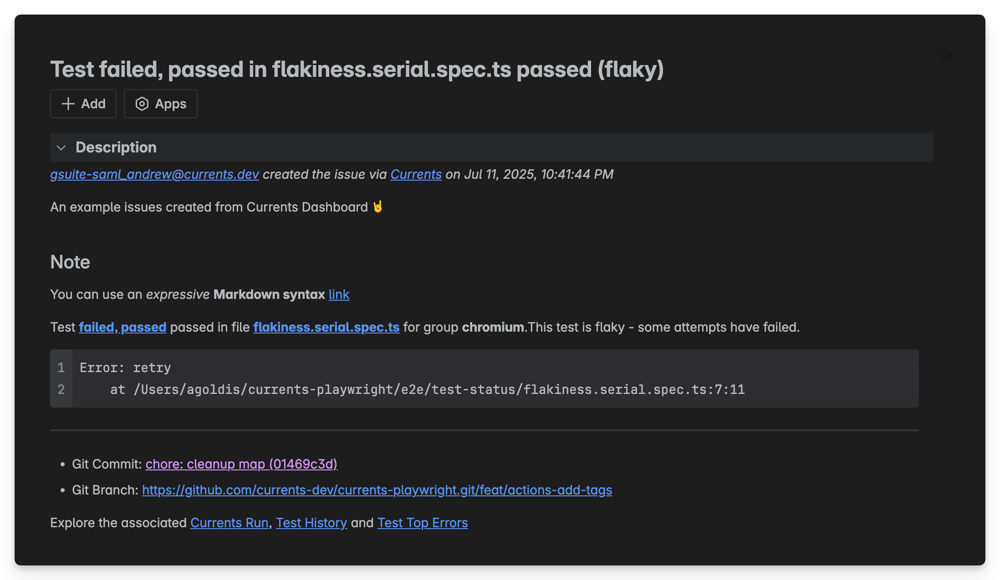
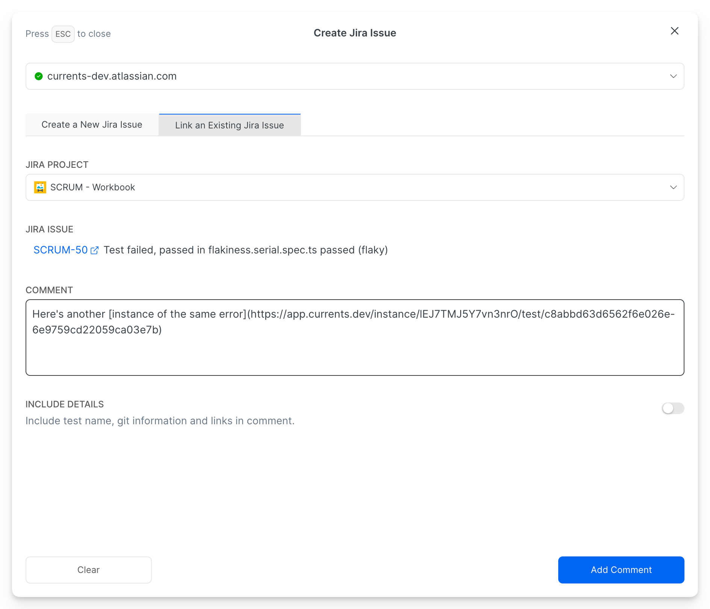
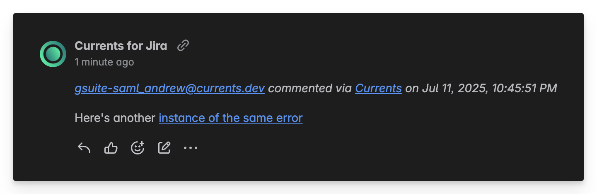
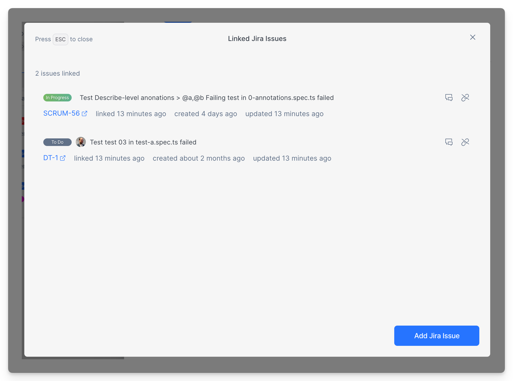

# Usage

Once enabled, you can create new or link an existing Jira issue directly from test execution details in Currents. You can also explore previously created or linked issues that are linked to the current test.

## Browse Linked Jira Issues

1. Open any test execution details in Currents
2. Look for the **Jira** icon (only visible when integration is enabled). If there existing (previously linked) Jira Issues related to the test, you will see a counter next to Jira icon.

<figure><figcaption>
A test has 2 linked Jira Issues
</figcaption></figure>

<figure><figcaption>
A test has no existing Jira Issues
</figcaption></figure>

By clicking on the icon you can:

* Explore linked Jira Issues
* Create a new Jira Issue
* Link an additional existing Issue

## Create a New Jira Issue

To create a new issue:

1. Select the **Jira Project** and **Issue Type**
2. Enter **Issue Title** and **Description** (optional)
3. Toggle **Include Details** to automatically add test context (error messages, stack traces, etc.)
4. Click **Create Issue**

Example of a newly created issue:

<figure><figcaption>
Example of New Jira Issue creation form
</figcaption></figure>

<figure><figcaption>
Example of an new Jira issue created from Currents
</figcaption></figure>

## Link an Existing Jira Issue

To link and comment on an existing issue:

1. Select a **Jira Project**
2.  Search for the issue by typing its title (results limited to 50 items)

    _Note: For more specific results, use more detailed search terms._
3. Enter your comment text
4. Toggle **Include Details** to add test context
5. Click **Add Comment**

Example of commenting on an existing issue:

<figure><figcaption>
Example of linking test failure to an existing Jira issue
</figcaption></figure>

<figure><figcaption>
Example of a Jira issue comment originating from Currents
</figcaption></figure>

### Browsing Linked Jira Issues

Open Jira dialog to list existing Jira Issues linked to the current test.

* Click on the Jira Issue ID to explore its details (opens a new tab)
* Click 💬  to add a new comment to an existing issue
* Click ⛓️‍💥 to unlink Jira Issue from the test
* Click **Add Jira Issue** to create new or link an additional Jira Issue&#x20;

<figure><figcaption>
Listing Jira Issues related to the test 
</figcaption></figure>

### Notes

* The integration creates one-way links from Currents to Jira
* Deleting or closing Jira Issue do not remove those issues in Currents - you will need to do that manually
* Comments include a link back to the relevant test in Currents

### Limitations

#### Required Jira issue custom properties

**Problem**: Jira issues allows _required_ custom properties when an issue is created depending on the _issue type_. This is currently **not supported** in our integration, as we can't send custom payload to the create issue endpoint.

**Solution**: Two options are available to overcome this issue. First,&#x20;

* Don't enforce custom properties as required.
* Use a different issue type that has no required custom properties.
