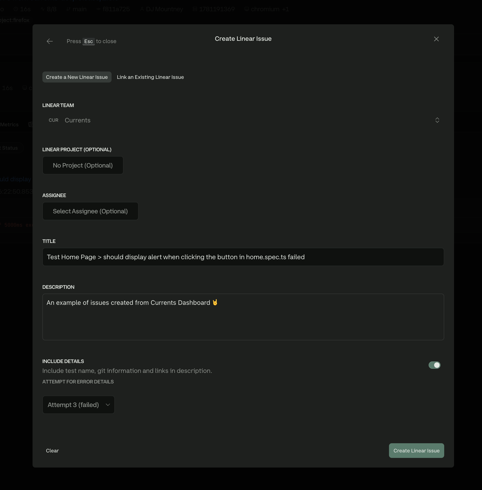

# Linear

Connect Currents to your Linear workspace to create and track issues from test failures without leaving the dashboard. From a failing test, you can create a new issue or comment on an existing one with context such as:

* error messages and stack traces
* run and test metadata
* git information and links back to Currents

<figure><figcaption>
Creating an issue from a test failure
</figcaption></figure>

The integration uses OAuth to connect one Linear workspace per Currents organization.

### Setup

1. Connect your Linear workspace from **Project > Integrations**
2. Enable the integration for each Currents project that needs it

See the [Setup Guide](linear/setup.md) for complete instructions.

### Usage

* Create issues from test failures
* Link failures to existing issues and post comments with test context
* View and manage all issues linked to a test

See the [Usage Guide](linear/usage.md) for details.

#### Limitations

See [#limitations](linear/usage.md#limitations "mention")
