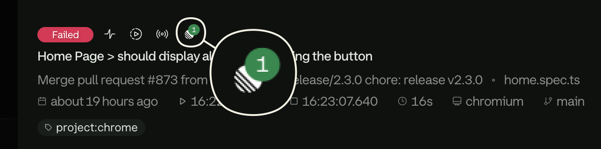
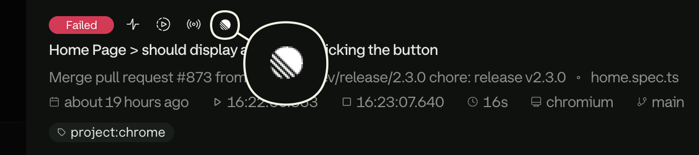
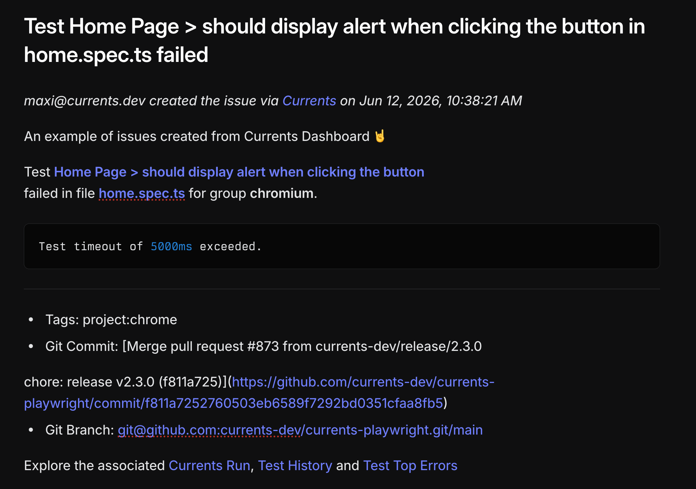
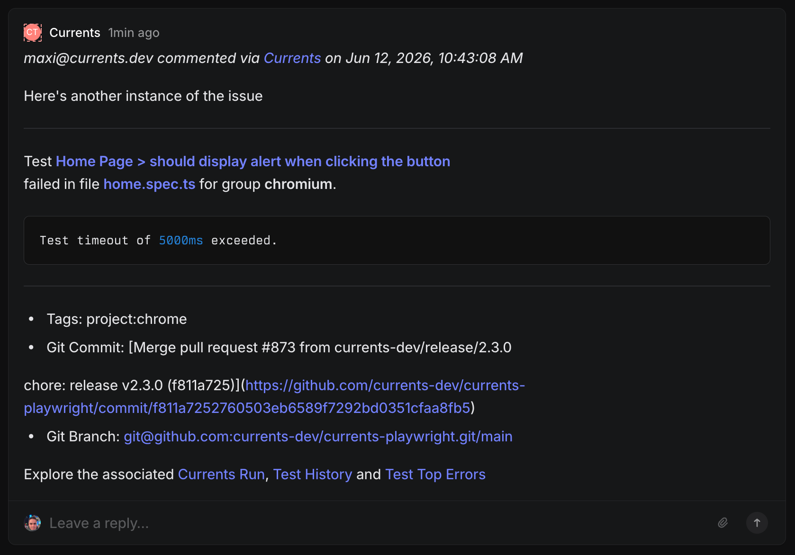
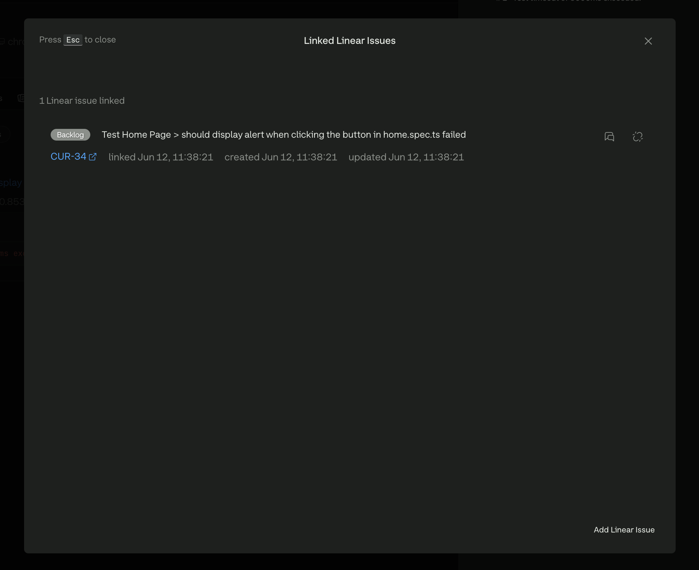

# Usage

With the integration enabled for your project, open any test execution in Currents to create issues, link existing ones, or review what is already associated with that test.

## Open the issues panel

1. Open a test execution
2. Click the **Linear** icon in the test details toolbar

The icon appears only when Linear is enabled for the project. A badge shows how many issues are already associated with the test.

<figure><figcaption>
A test has linked Linear issues
</figcaption></figure>

<figure><figcaption>
A test has no existing Linear issues
</figcaption></figure>

From the panel you can list linked issues, create a new one, or search for an existing issue to link.

## Create a new issue

| Field | Required | Notes |
| --- | --- | --- |
| **Team** | Yes | Linear team that owns the issue |
| **Project** | No | Optional in Linear — issues can be created without one |
| **Title** | Yes | Prefilled from the failing test |
| **Description** | No | Empty by default |
| **Assignee** | No | Dropdown of members on the selected team |
| **Include Details** | — | Adds test name, git information, and Currents links to the description |
| **Attempt** | — | Shown when **Include Details** is on; picker for which failing attempt to reference |

Steps:

1. Select a **Team**
2. Optionally select a **Project**
3. Adjust the **Title** or **Description** if needed
4. Optionally choose an **Assignee**
5. Toggle **Include Details** to append test context to the description
6. If **Include Details** is on, pick the failing **Attempt**
7. Click **Create Issue**

Example of a newly created issue:

<figure><figcaption>
Example of New Linear Issue creation form
</figcaption></figure>

<figure><figcaption>
Example of a new Linear issue created from Currents
</figcaption></figure>

## Link an existing issue

Linking adds a comment on the Linear issue and stores the association in Currents.

| Field | Notes |
| --- | --- |
| **Project** filter | Optional; narrows search before you type |
| **Search** | Matches issue title and description |
| **Comment** | Your message on the Linear issue |
| **Include Details** | Appends test name, git information, and Currents links to the comment |
| **Attempt** | Shown when **Include Details** is on; which failing attempt to reference |

Steps:

1. Optionally filter by **Project**
2. Search by title or description
3. Select the issue
4. Write your **Comment**
5. Toggle **Include Details** if you want test context in the comment
6. If **Include Details** is on, pick the failing **Attempt**
7. Click **Add Comment**

Example of commenting on an existing issue:

<figure><figcaption>
Example of linking test failure to an existing Linear issue
</figcaption></figure>

<figure><figcaption>
Example of a Linear issue comment originating from Currents
</figcaption></figure>

## Manage linked issues

The issues panel lists every issue associated with the current test:

* Click the issue ID to open it in Linear (new tab)
* Click 💬 to add another comment
* Click ⛓️‍💥 to remove the association in Currents
* Click **Add Linear Issue** to create or link another issue

<figure><figcaption>
Listing Linear issues related to the test
</figcaption></figure>

### Notes

* Links are one-way: Currents tracks the association; changes in Linear do not automatically update Currents
* Deleting or closing an issue in Linear does not remove it from Currents — unlink manually if needed
* Comments posted from Currents include a link back to the test

### Limitations

* One Linear workspace per Currents organization
* Only the fields listed above are available when creating or linking issues; other Linear properties (custom fields, labels, priority, and so on) must be set in Linear
