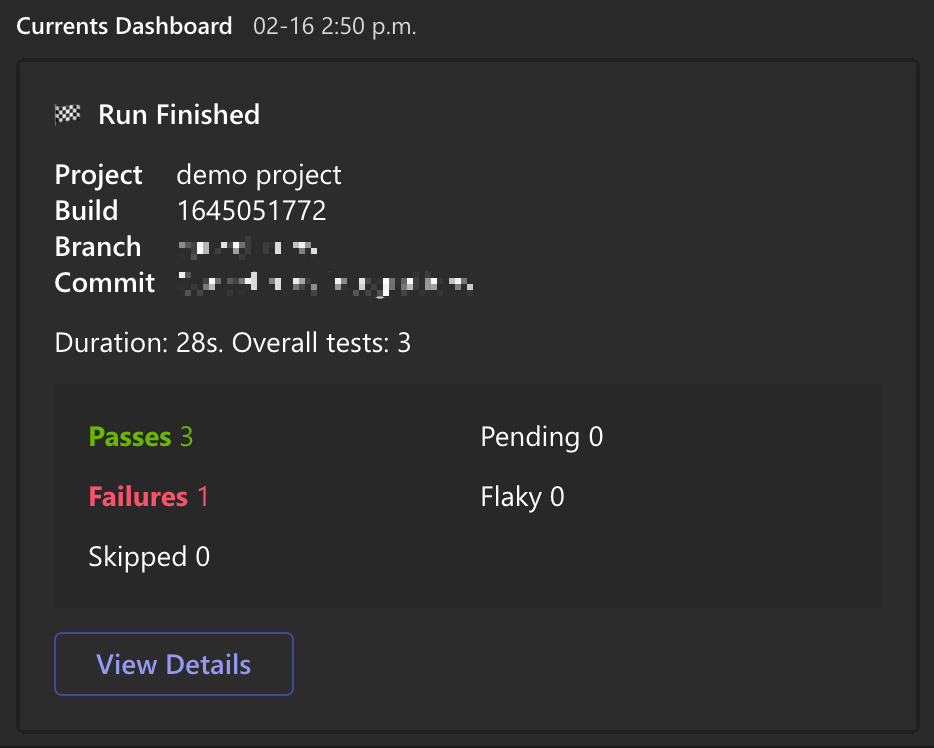
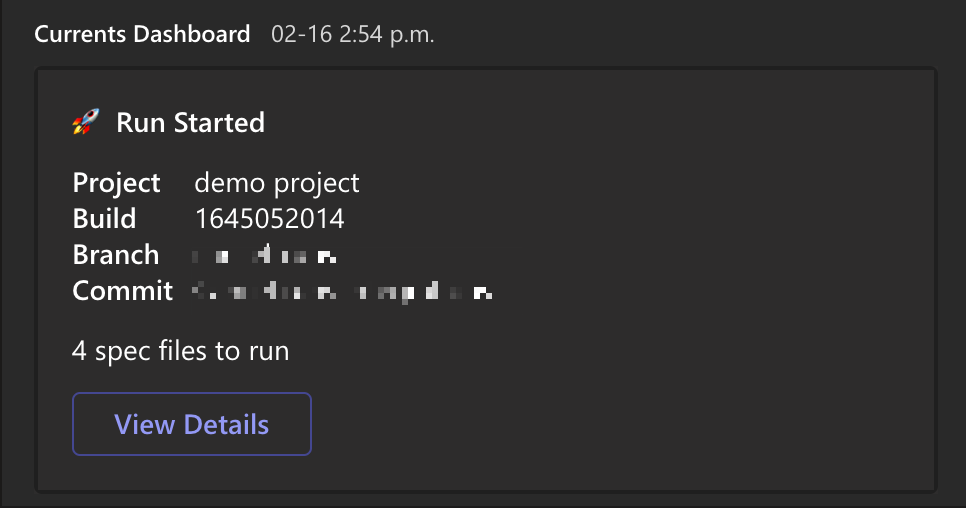
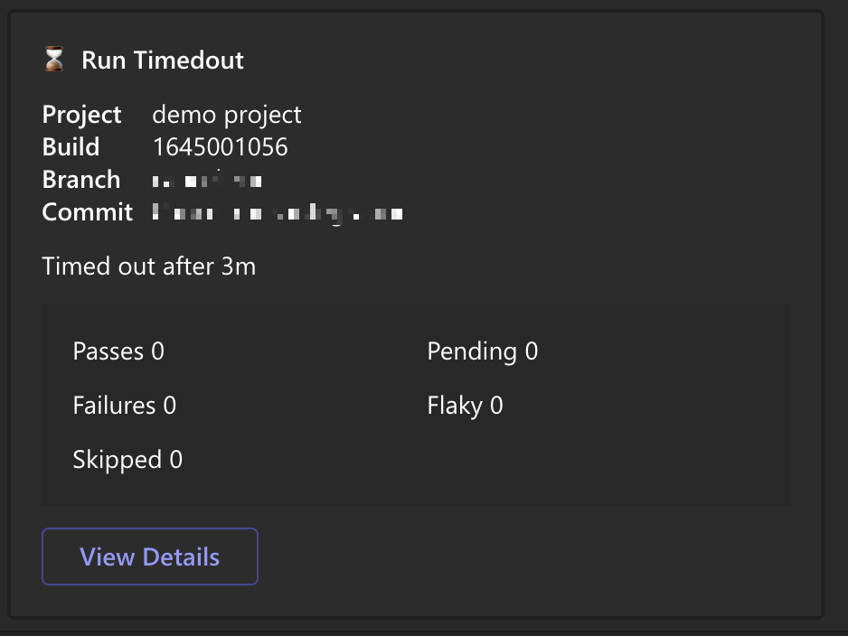
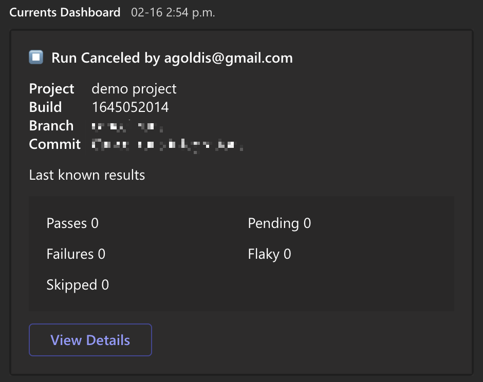

# Microsoft Teams

Currents integration with Microsoft Team allows posting test results of your Cypress tests directly into MS Teams channels.

### How to enable Microsoft Teams integration for Cypress tests?

In order to enable MS Teams integration and share cypress test results to Teams channels, follow the steps:

* Navigate to "Manage Project" section for the selected project
* Click "Add Integration", and select "Microsoft Teams"
* Enter the details of your Slack Integration and click "Save"

Provide the following details to finalize Slack integration, click "Save" to finish:

* **Incoming Webhook URL -** Incoming Webhook URL, e.g. `https://hooks.slack.com/services/XXX/YYY/ZZZ`. [Read the guide](https://docs.microsoft.com/en-us/microsoftteams/platform/webhooks-and-connectors/how-to/add-incoming-webhook) to generate the URL.
* **Failed Runs Only** - enabling the toggle would only send results for failed, timed out or cancelled runs.
* **Events (Optional)** - specify the event that triggers the integration and sends results. Leaving this field blank activates all the events.

### What events trigger notifications for MSTeams // Currents integration?

The following events trigger notifications for Microsoft Teams integration.

#### **Run Start**

It is triggered when a new run starts. If a run contains multiple groups, the notification will be triggered for each group.

#### **Run Finish**

It is triggered when a run finishes its execution or when a run times out. If a run contains multiple groups, the notification will be triggered for each group. For timed out runs, the message will contain the last know results for the run or run group.

.png>)

#### Run Canceled

Triggered when a run gets cancelled. If a run contains multiple groups, the notification will be triggered for each group. The message will contain the last know results for the run or run group.

### How to disable MS Teams integration?

To disable Microsoft Teams integration, simply delete the integration from the list of integrations.

### FAQ

#### Can I have multiple MS Teams integration for the same project?

Yes, you can have multiple Microsoft Teams integrations for the same project.
