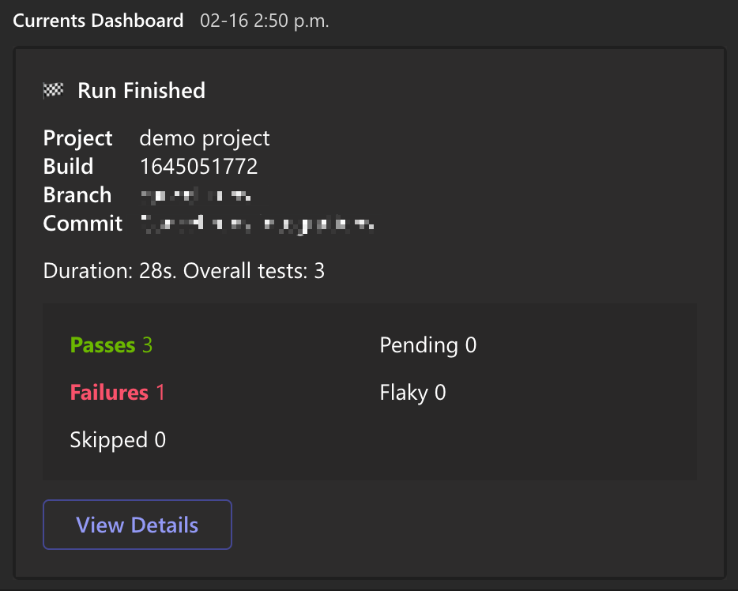
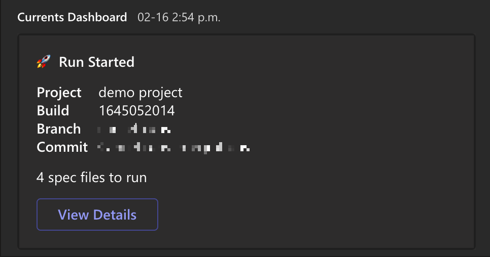
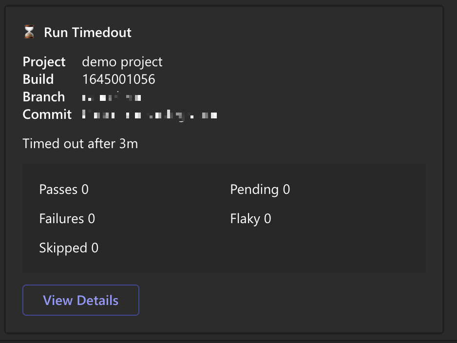
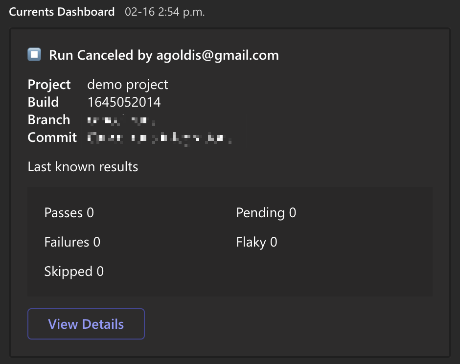

# Microsoft Teams

Currents integration with Microsoft Team allows posting test results of your Cypress tests directly into MS Teams channels.

### How to enable Microsoft Teams integration for Cypress tests?

In order to enable MS Teams integration and share cypress test results to Teams channels, follow the steps:

* Navigate to **Manage Project > Integrations**
* Add Microsoft Teams integration and provide the details:
  * **Microsoft** **Teams Webhook URL -** Incoming Webhook URL, e.g. `https://currents463.webhook.office.com/XXX/YYY/ZZZ`. [Read the guide](https://support.microsoft.com/en-us/office/create-incoming-webhooks-with-workflows-for-microsoft-teams-8ae491c7-0394-4861-ba59-055e33f75498) to generate the URL.
  * **Failed Runs Only** - enabling the toggle would only send results for failed runs.
  * **Events (Optional)** - specify events that will trigger the integration and send the results. Leaving this field blank activates all the events.
* Click **Save** to preserve the changes

<picture><source srcset="../../.gitbook/assets/Screenshot 2026-03-05 at 3.09.45 PM.png" media="(prefers-color-scheme: dark)"></picture>

### Filtering MS Teams notifications based on Tags


**Please note:** We use [glob patterns](https://www.npmjs.com/package/micromatch) to evaluate the filters. Test your filtering rules using the [playground](https://currents-branch-filter.stackblitz.io/). See examples for some popular filter patterns:

* Include only **`tagA`** or **`tagB`**: `(tagA|tagB)`
* Exclude **`tagA`** an&#x64;**`tagB`**`: !(tagA|tagB)`
* Include only tags starting with **`production`**: `production*`
* Include only tags starting with **`smoke-`** or **`prod-`**`: (smoke-*|prod-*)`


### What events trigger notifications for MSTeams // Currents integration?

The following events trigger notifications for Microsoft Teams integration.

#### **Run Start**

It is triggered when a new run starts. If a run contains multiple groups, the notification will be triggered for each group.

#### **Run Finish**

It is triggered when a run finishes its execution or when a run times out. If a run contains multiple groups, the notification will be triggered for each group. For timed out runs, the message will contain the last know results for the run or run group.

.png>)

#### Run Canceled

Triggered when a run gets cancelled. If a run contains multiple groups, the notification will be triggered for each group. The message will contain the last know results for the run or run group.

### How to disable MS Teams integration?

To disable Microsoft Teams integration, simply delete the integration from the list of integrations.

### FAQ

#### Can I have multiple MS Teams integration for the same project?

Yes, you can have multiple Microsoft Teams integrations for the same project.
