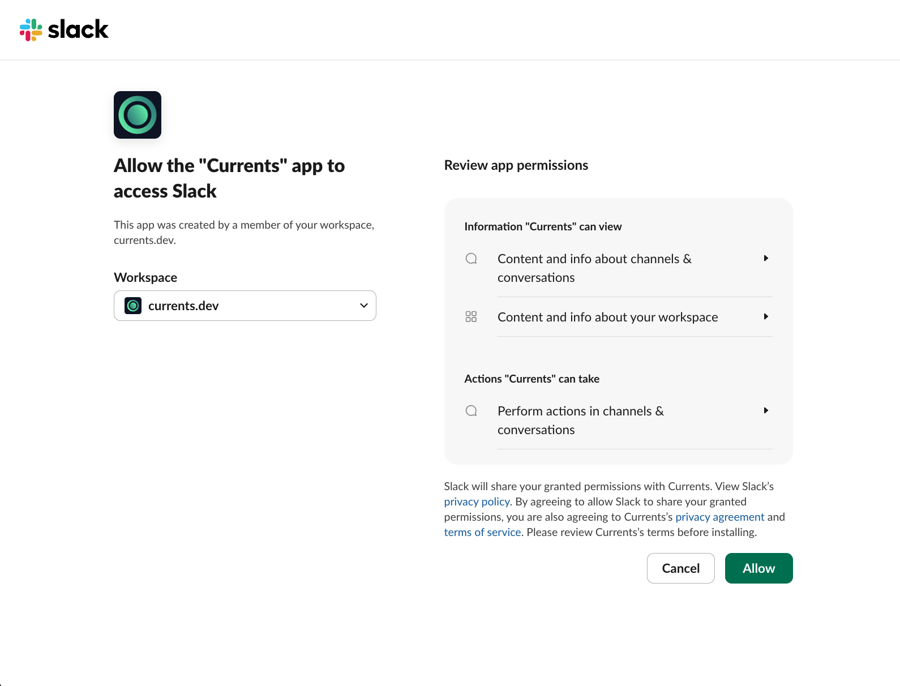
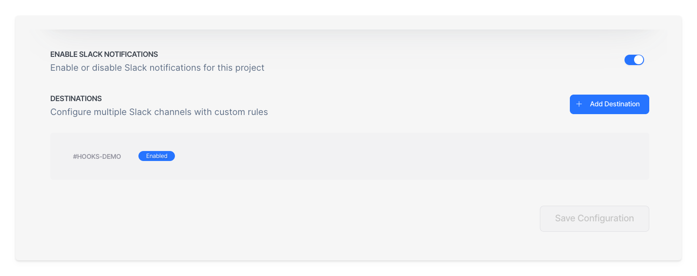
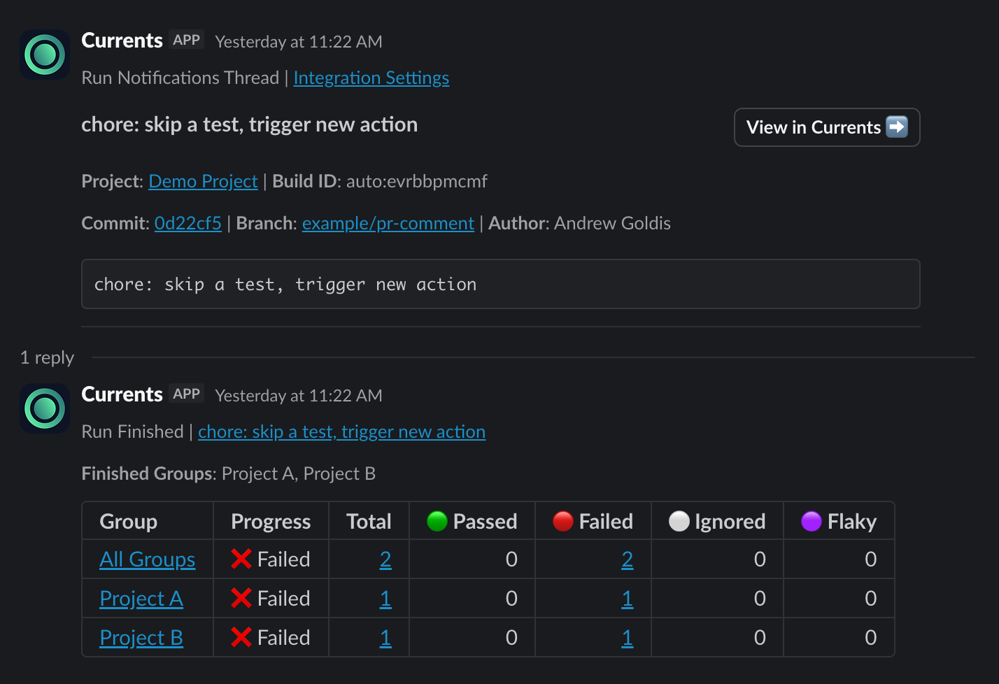
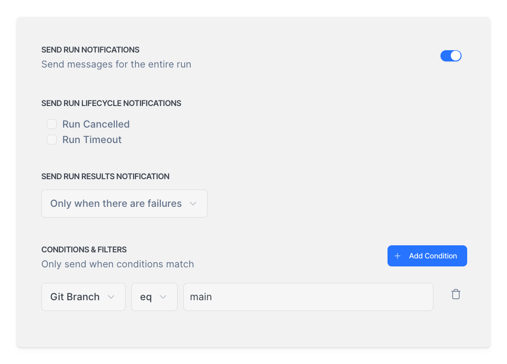
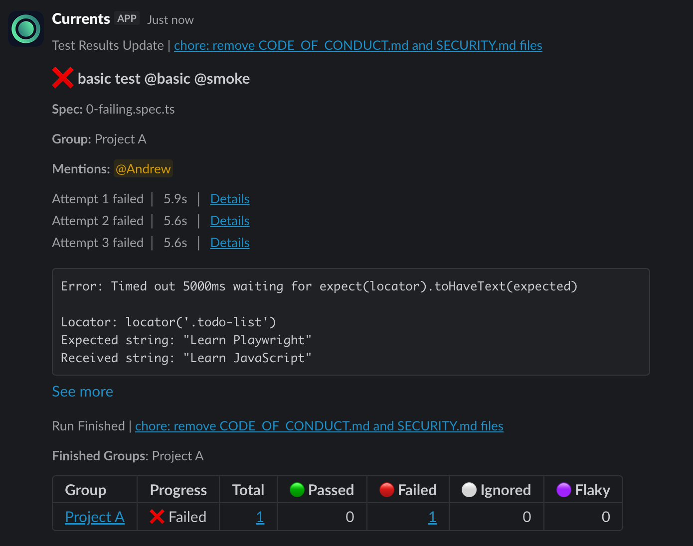
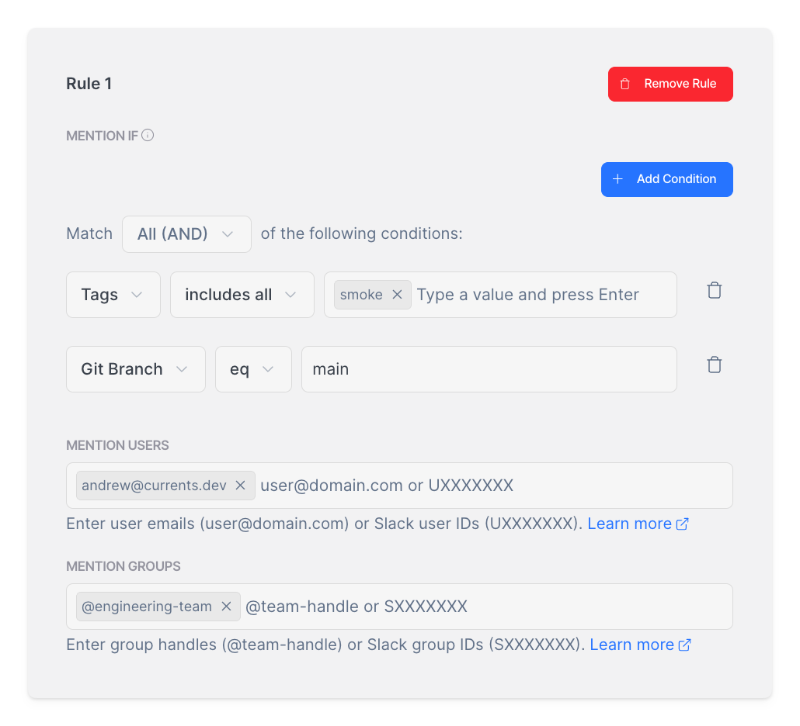

# Slack App

Integrate Slack with Currents to receive real-time test notifications and failure alerts directly in your team's channels. The Slack App helps engineering teams stay informed about test results without leaving their workflow.

## Use Cases

- **Instant failure alerts**: Get notified immediately when tests fail, allowing your team to respond quickly before issues reach production.
- **Flaky test detection**: Receive Slack alerts when tests exhibit flaky behavior, helping maintain test suite reliability.
- **Team routing**: Automatically mention the right team members based on which tests failed - route checkout failures to the payments team, API failures to backend engineers.
- **Release gating**: Send notifications to release managers when smoke tests or critical tests fail on main or release branches.
- **On-call escalation**: Page on-call engineers when critical tests fail in production environments.

The integration supports organization-level installation, per-project configuration, multiple notification destinations, and advanced filtering options.

## Requirements and permissions

Currents and Slack permissions are separate:

| Role | Access |
| --- | --- |
| **Currents organization administrator** | Connect, re-authenticate, disconnect, and change the Slack App settings in Currents |
| **Slack administrator** | Authorize the Currents app in Slack; the exact role depends on whether Slack uses a single workspace or Enterprise Grid |

A Currents organization administrator starts the connection from Currents. The Slack authorization step must be completed by a user with the correct Slack administrator permissions:

| Slack setup                                    | Who must install the app                                                                   |
| ---------------------------------------------- | ----------------------------------------------------------------------------------------- |
| **Single workspace**                           | A **Workspace Owner** or **Workspace Admin**                                               |
| **Enterprise Grid (multiple workspaces / org)** | An **Org Owner** or **Org Admin** (workspace-level admins are not sufficient on their own) |


**When the Slack account belongs to an Enterprise Grid organization, the app must be installed by an Org Owner or Org Admin.**

If a workspace-level admin installs the app while the workspace is part of a larger Slack organization, the installation may appear to succeed and Currents will store the access token, but Slack can later invalidate that token. When this happens, Currents receives an [`account_inactive`](https://docs.slack.dev/reference/methods/admin.apps.uninstall/#errors) error from the Slack API and notifications silently stop working.

This occurs because, in an Enterprise Grid organization, apps are managed and approved at the org level. Tokens tied to a workspace-only installation can be deactivated when the installation is not authorized by an Org Owner/Admin. See Slack's documentation on [managing apps in an Enterprise organization](https://slack.com/help/articles/360000281563-Manage-apps-in-an-Enterprise-organization) and [org-level app policies](https://slack.com/help/articles/360038559694-Set-organisation-level-policies-for-apps) for details.


### Installation checklist

1. Determine whether the Slack account is a single workspace or part of an **Enterprise Grid** organization. A Slack administrator can confirm this if it's unclear.
2. For a single workspace, the Currents Slack App must be installed by a **Workspace Owner/Admin**.
3. For an Enterprise Grid organization, an **Org Owner/Admin** must perform the installation (or approve and complete it). A workspace-level admin alone is not enough.
4. If the app was already installed and notifications stopped working with an `account_inactive` error, the integration should be **disconnected** and reinstalled by an Org Owner/Admin. Reinstalling generates a new, valid token.


The `account_inactive` error generally means the stored bot token is no longer valid - typically because the app was uninstalled or the installation was not authorized at the right level. The fix is to reinstall the app with an account that has the required permissions. See Slack's note on [deactivated members' apps and integrations](https://slack.com/help/articles/360000446446-Manage-deactivated-members-apps-and-integrations).


## Installation

### Connecting Slack to Your Organization

The Slack App integration is installed at the organization level and can be configured for individual projects.

1. Navigate to **Project Settings > Integrations**
2. Find the **Slack** section and click **Connect**
3. You'll be redirected to Slack to authorize the Currents app
4. Click **Allow** to install the application in your Slack workspace

<figure><figcaption><p>Review and authorize the Currents app in Slack.</p></figcaption></figure>

After installation, you'll receive a welcome message in Slack confirming the connection.


The Slack installation is organization-wide. Once connected, you can enable Slack notifications for any project within your organization.


### Enabling Notifications for a Project

After connecting Slack to your organization:

1. Navigate to **Project Settings > Integrations > Slack**
2. Click **Enable Notifications** to create a Slack configuration for the project
3. Configure your notification preferences (see sections below)
4. Click **Save** to apply your settings

You can enable or disable Slack notifications for each project independently without affecting the organization-level installation.

<figure><figcaption><p>Enable Slack notifications independently for each project.</p></figcaption></figure>

## Installation Status and Recovery

The Slack integration page reports installation and configuration issues and provides the appropriate recovery action.

| Status | Recommended action |
| --- | --- |
| **Credentials expired** | Select **Re-authenticate** |
| **Installation archived** | Re-authenticate or reinstall |
| **Installed but not configured** | Enable notifications and save the project settings |
| **Project notifications disabled** | Enable the project-level toggle |
| **Destination has no channel** | Select or manually enter a channel |
| **All destinations disabled** | Enable at least one destination |

Re-authenticating normally preserves the existing project configuration. If Slack continues returning `account_inactive`, [disconnect](#disconnect-slack) the integration and reinstall it using the required Slack administrator role.

## Notification Destinations

The dashboard shows the destination limit for your organization; the default is **10**. Destinations let you send notifications to different Slack channels based on your needs.

### Adding a Destination

1. In the Slack integration settings, click **Add Destination**
2. Select a Slack channel from the dropdown, or enter the channel details manually
3. Configure the notification settings for this destination
4. Click **Save**


**Manual Channel Entry:** For organizations with many channels, you can manually enter the Channel ID and Channel Name instead of selecting from the dropdown. This is useful when Slack's API limitations prevent listing all channels.


### Public and Private Channels

The channel picker can return public channels and private channels that are visible to the Currents Slack App, even if the dashboard label says **Slack Channel (Public Only)**.

The Currents app must be invited to a private channel before it can post there. If an accessible channel does not appear in search, select **Manual Input** and enter its Channel ID and Channel Name.

### Managing Destinations

Each destination can be:

- **Enabled/Disabled individually** - Toggle notifications for specific channels without deleting the configuration
- **Configured independently** - Each destination has its own notification settings, filters, and mention rules

### Message Threading

Each destination has a **Message Threading** toggle that controls how notifications are organized in Slack:

| Setting      | Behavior                                                                                    |
| ------------ | ------------------------------------------------------------------------------------------- |
| **Enabled**  | Messages related to the same run are grouped in a single thread, keeping channels organized |
| **Disabled** | Each notification is sent as a standalone message in the channel                            |

Message threading is enabled by default for new destinations. Disable it if your team prefers individual messages or if you're using Slack workflows that process messages independently.

## Run Notifications

Run notifications provide a summary of the entire test run. These are sent when a run completes and can use Slack threads to organize related messages.

<figure><figcaption><p>A run summary and its detailed results grouped in a Slack thread.</p></figcaption></figure>

### How Threading Works

When **Message Threading** is enabled for a destination, Currents organizes notifications as follows:

1. A **main message** is posted indicating notifications are available for the run
2. **Detailed results** are added as replies in a thread
3. Subsequent updates (like individual test failures) appear in the same thread

This keeps your Slack channels organized and prevents notification overload.

When **Message Threading** is disabled, each notification is sent as a standalone message in the channel.

### Notification Modes

Configure when run notifications are sent:

| Mode                    | Description                                             |
| ----------------------- | ------------------------------------------------------- |
| **Always send**         | Send notifications for every run, regardless of outcome |
| **Only when there are failures** | Send notifications only when there are failed tests |
| **Only when there are failed or flaky tests** | Send notifications when failed or flaky tests are detected |
| **Only when all tests are passing** | Send notifications only when all tests pass |

### Additional Run Events

You can also enable notifications for:

- **Run Canceled** - When a run is canceled manually or via fail-fast strategy
- **Run Timeout** - When a run times out before completion

### Filtering Run Notifications

Apply conditions to control which runs trigger notifications:

| Filter                 | Type   | Description                                   |
| ---------------------- | ------ | --------------------------------------------- |
| **Git Branch**         | String | The git branch name for the test run          |
| **Git Commit Message** | String | The git commit message that triggered the run |
| **Tags**               | Array  | The tags associated with the test run         |

**Example:** To only receive notifications for production deployments:

- Set **Tags** `includes any`: `production`

Or to notify only for main branch runs:

- Set **Git Branch** `matches`: `main`

<figure><figcaption><p>Configure run-result delivery and optional conditions for each destination.</p></figcaption></figure>

## Individual Test Notifications

Individual test notifications provide detailed information about failed or flaky tests.

<figure><figcaption><p>An individual failed-test notification with retry and error details.</p></figcaption></figure>

### Enabling Individual Test Notifications

1. In your destination settings, find the **Individual Tests** section
2. Toggle **Enable** to activate individual test notifications
3. Select the notification mode
4. Optionally, add conditions to filter which tests trigger notifications

### Notification Modes

| Mode                          | Description                                        |
| ----------------------------- | -------------------------------------------------- |
| **Notify on failed**          | Send notifications only for failed tests           |
| **Notify on flaky**           | Send notifications only for flaky tests            |
| **Notify on failed or flaky** | Send notifications for both failed and flaky tests |

### Filtering Test Notifications

Filter individual test notifications based on test and run properties:

| Filter                 | Type   | Description                                   |
| ---------------------- | ------ | --------------------------------------------- |
| **Git Branch**         | String | The git branch name for the test run          |
| **Git Commit Message** | String | The git commit message that triggered the run |
| **Tags**               | Array  | The tags associated with the test             |
| **Test Title**         | String | The title of the test                         |
| **Test File Path**     | String | The file path of the test                     |

**Example:** To only receive notifications for checkout tests:

- Set **Test File Path** `matches`: `checkout/.*`

Or to notify for critical tests:

- Set **Tags** `includes any`: `critical, smoke`

### Message Content

Individual test notifications include:

- Test name and file location
- Failure reason and error message
- Attempt details (for retried tests)
- Direct link to the test in Currents dashboard
- Mentioned users (if configured)

Messages display up to five test results. When more tests require attention, the message includes the number of omitted tests, mentions collected from the omitted tests, and a **View in Currents** button.

### Fix with AI

Failed-test messages include a **Fix with AI** button. It opens a modal where you can:

- Open the failure context directly in Cursor
- Open it in GitHub Copilot
- Copy a prompt for Claude, Codex, Zed, Conductor, or another AI tool
- Install the [Currents MCP server](../../../ai/mcp-server.md) so an agent can retrieve additional test and run context

See [AI-powered test troubleshooting](../../../ai/overview.md) for other Fix with AI entry points.

## Annotation-Based Mentions

The Slack App integration supports mentioning users directly in notifications based on test annotations. When a test fails, the configured users or groups are notified in the Slack message.

### Enabling Annotation Mentions

1. In your destination settings, find the **Annotation Mentions** section
2. Toggle **Enable** to activate annotation-based mentions
3. Notifications will now include mentions based on test annotations

Add annotations to your tests to trigger Slack mentions using the `notify:slack` annotation type. See [Mention Formats](#mention-formats) for supported formats.

#### Example

```typescript
test(
  "critical test",
  {
    annotation: {
      type: "notify:slack",
      description: "@engineering-team, miguel@currents.dev",
    },
  },
  async ({ page }) => {
    // test code
  }
);
```


See [Playwright Annotations](../../../guides/playwright-annotations.md#annotation-slack-notifications) for more details on using annotations, including how to combine `notify:slack` with other annotation types like `owner`.


## UI-Based Mention Rules

In addition to code annotations, you can configure mention rules directly in the Currents UI. This allows you to set up notification routing without modifying your test code.

<figure><figcaption><p>Route matching test notifications with UI-based mention rules.</p></figcaption></figure>

### Creating Mention Rules

1. In your destination settings, find the **Mention Rules** section
2. Click **Add Rule**
3. Configure conditions using the available filters
4. Add the users and groups to mention (see [Mention Formats](#mention-formats) for supported formats)
5. Click **Save**


If no conditions are defined in a rule, the specified users and groups will be mentioned for all matching test notifications.


### Available Conditions

Mention rules support the following filters:

| Filter                 | Type   | Description                                   |
| ---------------------- | ------ | --------------------------------------------- |
| **Git Branch**         | String | The git branch name for the test run          |
| **Git Commit Message** | String | The git commit message that triggered the run |
| **Tags**               | Array  | The tags associated with the test             |
| **Test Title**         | String | The title of the test                         |
| **Test File Path**     | String | The file path of the test                     |

### Rule Examples

| Condition                               | Mentions                          | Use Case                                    |
| --------------------------------------- | --------------------------------- | ------------------------------------------- |
| Test File Path `matches` `.*checkout.*` | `@payments-team`                  | Route checkout failures to payments team    |
| Tags `includes any` `critical`          | `@oncall`, `eng-lead@company.com` | Escalate critical test failures             |
| Git Branch `eq` `main`                  | `@release-managers`               | Notify release team of main branch failures |

## Mention Formats

Both [Annotation-Based Mentions](#annotation-based-mentions) and [UI-Based Mention Rules](#ui-based-mention-rules) support the following formats for specifying users and groups to mention:

| Format                | Description                                 | Example Value                                             |
| --------------------- | ------------------------------------------- | --------------------------------------------------------- |
| **User Email**        | Email address associated with Slack account | `andrew@currents.dev`                                     |
| **User ID**           | Slack user ID                               | `user:U01RWNBFGER`                                        |
| **User Group (Team)** | Slack user group ID                         | `team:S07JCUP81EG`                                        |
| **Slack Handle**      | Slack username or group handle              | `@engineering-team`                                       |
| **Multiple Mentions** | Comma-separated combination of formats      | `user:U01RWNBFGER, team:S07JCUP81EG, miguel@currents.dev` |


**Finding Slack IDs:** See [Slack's documentation](https://slack.com/help/articles/360057541954-Get-user-and-group-IDs) for instructions on finding user and group IDs.


## Disabling Slack Integration

### Disable for a Project

To disable Slack notifications for a specific project:

1. Navigate to **Project Settings > Integrations > Slack**
2. Toggle off **Enable Notifications**

The project configuration is preserved but notifications are paused.

### Disconnect Slack

To completely remove the Slack integration:

1. Navigate to **Project Settings > Integrations > Slack**
2. Click **Disconnect**

This removes the organization-level Slack installation and disables notifications for all projects.

## FAQ

### Can I send notifications to multiple channels?

Yes. The dashboard shows the destination limit for your organization; the default is 10. Each destination can target a different Slack channel with its own configuration.

### Why am I not receiving notifications?

Check the following:

1. **Project-level toggle** - Ensure "Enable Notifications" is turned on
2. **Destination toggle** - Ensure the specific destination is enabled
3. **Notification mode** - Confirm the selected run-result mode matches the outcome you expect
4. **Filters** - Check if any tag or branch filters are excluding your runs
5. **Mention rules** - Ensure conditions match your test properties
6. **Installation permissions** - If notifications stopped entirely, the Slack token may have been invalidated (`account_inactive`). See [Why did notifications stop with an `account_inactive` error?](#why-did-notifications-stop-with-an-account_inactive-error)

### Why did notifications stop with an `account_inactive` error?

This usually means the Slack access token was invalidated because the app was installed without the required administrator permissions. In an Enterprise Grid organization, apps must be installed (or approved) by an **Org Owner/Admin** - a workspace-level admin alone is not sufficient, and Slack may later deactivate that installation's token.

The fix is to [disconnect](#disconnect-slack) the integration and reinstall it with an Org Owner/Admin (or a Workspace Owner/Admin for single-workspace accounts). See [Requirements](#requirements) for the full breakdown.

### Can I use both annotation mentions and UI rules?

Yes, both methods work together. Annotation-based mentions take precedence and are combined with UI-configured rules.

### What happens when a run has multiple groups?

By default, notifications are sent when all groups complete. You may still receive multiple notifications if one group finishes before others are discovered. For example, if one group completes before other groups are known, an early notification may be sent.
