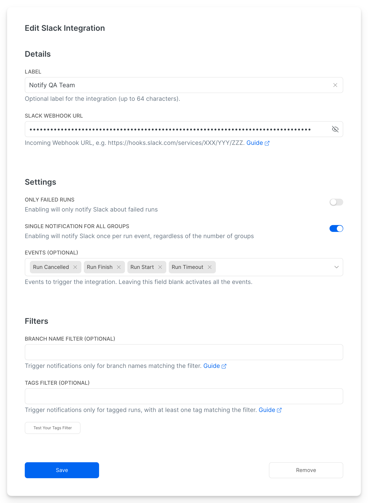
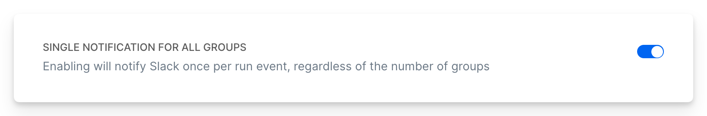
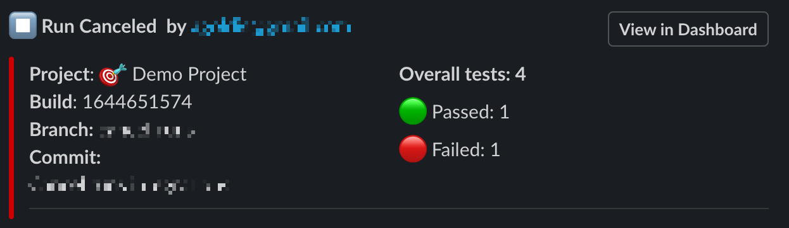

# Slack Webhook (Legacy)


This is the legacy webhook-based Slack integration. For advanced features like multiple destinations, individual test notifications, and annotation-based mentions, see [Slack App](slack-app.md).


Currents integration with Slack allows posting test results of your Playwright or Cypress tests directly into Slack channels.

### Enabling Slack integration

In order to enable Slack integration and share Playwright test results to Slack channels, follow the steps:

- Navigate to **Manage Project > Integrations**
- Add Slack integration and provide the details:
  - **Slack Webhook URL -** Incoming Webhook URL, e.g. `https://hooks.slack.com/services/XXX/YYY/ZZZ`. Read more about [Slack Incoming Webhooks](https://api.slack.com/messaging/webhooks).
  - **Failed Runs Only** - enabling the toggle would only send results for failed runs.
  - **Events (Optional)** - specify events that will trigger the integration and send the results. Leaving this field blank activates all the events.
  - **Branch Name Filter (Optional)** - if specified, only send notifications for runs with branch names matching the pattern. Please note, that you must provide the branch name within the [run-details.md](../../../dashboard/runs/run-details.md "mention") to activate filtering.
- Click **Save** to preserve the changes

<figure><figcaption></figcaption></figure>

### Grouping Slack messages

Enabling the **Single Notification for All Groups** toggle ensures that only one notification is sent per run, regardless of how many groups it includes.

<figure><figcaption></figcaption></figure>

Note: You may still receive multiple notifications if one group finishes before the others were discovered. For example, if one group completes before the other groups are scheduled or detected, a notification may be sent early. 

### Filtering Slack notifications based on Tags


**Please note:** We use [glob patterns](https://www.npmjs.com/package/micromatch) to evaluate the filters. Test your filtering rules using the [playground](https://currents-branch-filter.stackblitz.io/). See examples for some popular filter patterns:

- Include only **`tagA`** or **`tagB`**: `(tagA|tagB)`
- Exclude **`tagA`** an&#x64;**`tagB`**`: !(tagA|tagB)`
- Include only tags starting with **`production`**: `production*`
- Include only tags starting with **`smoke-`** or **`prod-`**`: (smoke-*|prod-*)`
  

### What events trigger notifications for Slack // Currents integration?

The following events trigger notifications for Slack integration.

#### **Run Start**

Triggered when a new run starts. If a run contains multiple groups, the notification will be triggered for each group.

#### **Run Finish**

Triggered when a run finishes its execution. If a run contains multiple groups, the notification will be triggered for each group.&#x20;

#### Run Timeout

Triggered when a time out detected for a run. The message will contain the last known results for the run or run group.

#### Run Canceled

Triggered when a run gets cancelled. If a run contains multiple groups, the notification will be triggered for each group. The message will contain the last known results for the run or run group.

### Disabling Slack integration

To disable Slack integration, simply delete the integration from the list of integrations.

### FAQ

#### Can I have multiple Slack integrations for the same project?

Yes, you can have multiple Slack integrations for the same project.

#### What do notification status colours mean?

<mark style="color:green;">**Green**</mark> - passed tests

<mark style="color:red;">**Red**</mark> - failed + skipped tests

**Grey** - ignored tests&#x20;

<mark style="color:purple;">**Purple**</mark> - flaky tests
