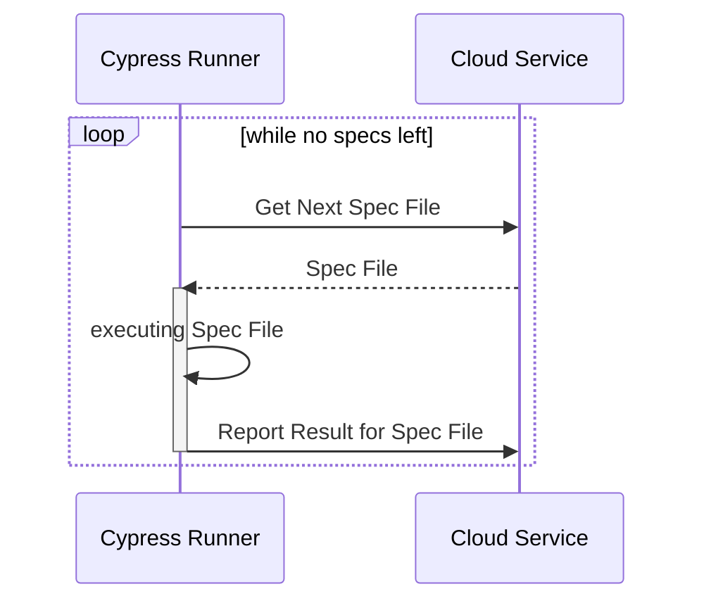
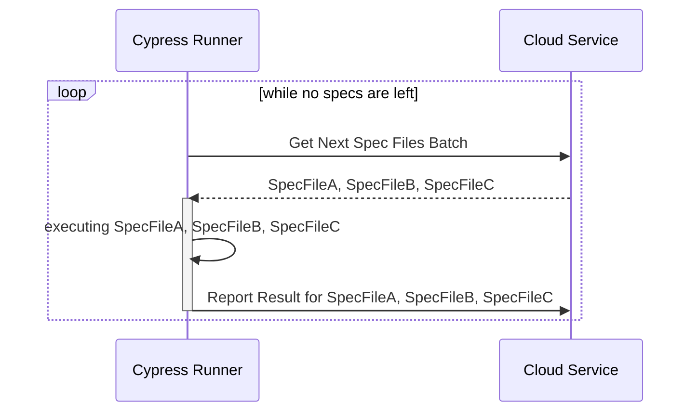

# Batched Orchestration


**We are suspending our support of Cypress test runner version 13+**

We will continue to support [prior versions](../../../getting-started/cypress/integrating-with-cypress/alternative-cypress-binaries.md) of Cypress.

[Read more](https://currents.dev/posts/v13-blocking)


### Batched Orchestration

This package uses its own orchestration and reporting protocol that is independent of cypress native implementation. This approach provides several benefits, including more control, flexibility and the ability to implement new features that are not supported by the native cypress orchestration.&#x20;


Please note: the batched orchestration is not yet available for sorry-cypress users (only for currents.dev)


The new approach can present a slightly different performance compared to the previous integration. To enhance its performance, the new orchestration protocol allows multiple spec files to be batched together for greater efficiency. You configure the batching in `cypress.config.js` and use different values for different testing types:

```javascript
// currents.config.js
module.exports = {
  // ...
  e2e: {
    batchSize: 3, // orchestration batch size for e2e tests (Currents only)
  },
  component: {
    batchSize: 5, // orchestration batch size for component tests (Currents only)
  },
};

```

Based on our benchmarks, the performance is comparable to that of the native orchestration, however, it can vary depending on your specific configuration and setup. Adjusting the batching configuration can help to achieve optimal results for e2e or component tests.

#### Native Orchestration Diagram



#### Batched Orchestration Diagram


